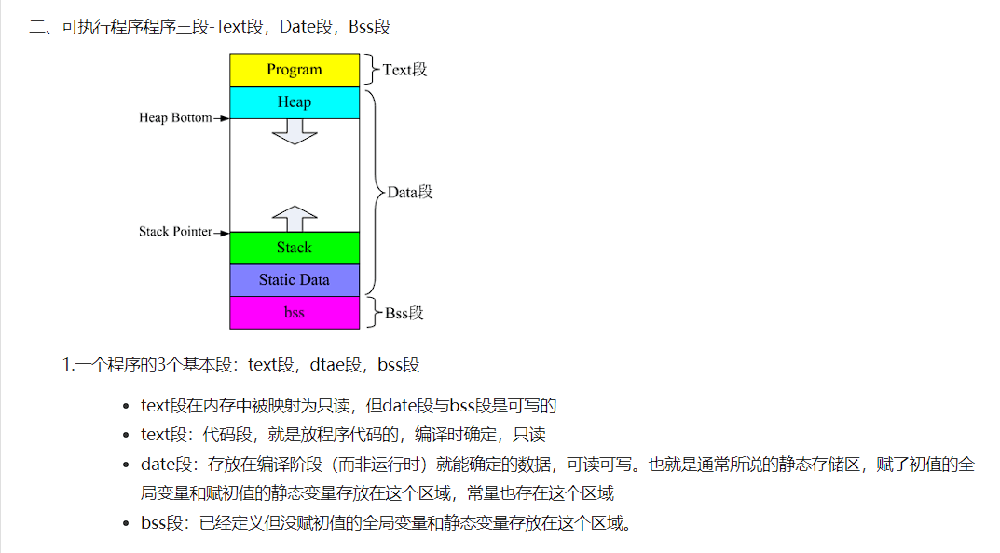
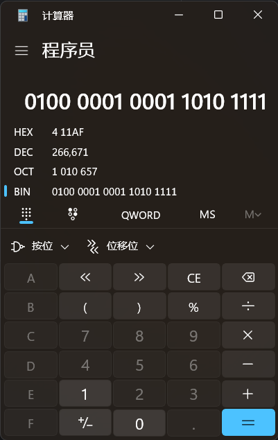
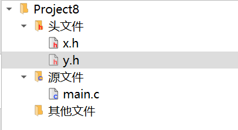

# C语言底层运用

## 一、位段结构

我们都知道在c语言底层中浮点类型的数据储存是分段的，并且每一段都有他自己的特殊含义，那么这些特殊含义是怎么规定的呢？我们可不可以自定义一种特殊的数据类型呢？这个时候就要介绍到**位段结构**了！

首先让我们分析一下*FLOAT*数据类型的底层是怎样存储的：

> float在内存中用指数型式表示，分解为：**数符，尾数，指数符，指数**四部分。
>
> 数符占 1 位二进制，表示数的正负。
>
> 指数占8位二进制，表示指数大小，其中还包括指数为的正负。
>
> 尾数占23位，表示浮点数有效数字，0.xxxxxxx, 但不存开头的 0 和点。

这里我们可以看到，float尽然没有按照一字节一字节的进行存储和运算，这和我们所认识的int、byte、char等都不一样，那么我们是不是也可以来实现同样的功能呢？

这里我们先直接上代码，通过代码解释位段结构

```c
struct{
    unsigned sign:1;//符号位
    unsigned index :8;//指数
    unsigned num : 23;//尾数
} my_float;
```

没错，就是在每一个结构体成员后面制定他所要占的位数。那么可以实现只占20位吗？

答案是可以的，但是这并不会对空间有所节省，应为计算机会自动为你补齐为8的倍数，比如你只使用了20位，但是计算机会自动为你补齐为24位，当然，这也不是一定的，下面几个例子帮助我们理解。

### 位段结构的使用

```c
struct{
    unsigned sign:1;//符号位
    unsigned index :8;//指数
    unsigned num : 23;//尾数
} demo_00;
//4个字节
//==================
struct{
    int sign:1;//符号位
	int num:7;
}demo_01;
//4个字节
//======================
struct{
    char sign:1;//符号位
	char num:7;
}demo_02;
//1个字节
//================
struct{
    int sign : 31;
    char num :3;
}demo_03;
//8个字节
//===============
struct{
    char sign : 7;
    char num :3;
}demo_04;
//2个字节
```

> 一个位段必须存储在同一存储单元中，不能跨两个单元。如果第一个单元空间不能容纳下一个位段，则该空间不用，而从下一个单元起存放该位段。
>
> 还可以制定无名位段，无名位段的作用就是对其后面的位段。
>
> 同时这里还涉及到结构体对其的相关知识：结构体还需要整体对其，也就是和他的最长字段对其。

### 下面几种常见的使用位段结构的错误：

1. ```c
   struct{
       unsigned sign:1;//符号位
       unsigned index :8;//指数
       float num : 23;//尾数
   } demo_00;
   //[Error] bit-field 'sign' has invalid type
   //在这种类型中只允许使用int、char家族的类型，比如long long int、unsigned int
   ```

   

2. ```c
   struct{
       unsigned sign:1;
       unsigned index :8;
       unsigned num : 55;
   } demo_01;
   //[Error] width of 's' exceeds its type
   //制定长度是不可以超出本身的长度
   ```

3. ```c
   struct{
       unsigned sign:1;//符号位
   	int num;
   } demo_02;
   //一般会被当做木马病毒处理
   //每一个字段都有指定的大小
   //但是如果缺省，系统就会按类型本身的大小分配内存
   ```

## 二、字段对其

### 系统默认字段对其

结构体内可以被看做一个整体，那么整体内的各个字段应该如何存放呢？我们从上面的例子知道，数据的开始位只能放在内存地址的整数倍上面。此话怎讲？


这个例子里，我们看到了字段的对其方式，那么在这有什么有呢？举个例子：

```c
#include<stdio.h>
int main(){
    char a;//1byte
    int b;//4byte
    short c;//2byte
    return 0;
}
```

栈内存结构如下

我们发现他有很大一片空间被浪费，那么如果我们调整一下顺序呢？

```c
#include<stdio.h>
int main(){
    char a;//1byte
    short c;//2byte
    int b;//4byte
    return 0;
}
```

没错，只是简单的调整一下顺序，我们的内存就空了很多，这还只是冰山一角，如果实在我们经常使用的复杂的结构体中，那这样的优化带来的效益是十分可观的。不行你可以使用`sizeof`对他进行测试。

那如果想进一步节省内存空间呢，咱们可不可以指定他的对其方式呢？这是就要介绍到`pragma pack()`的用法了

### #pragma pack

首先我们来了解一下系统对其的原理：

在系统底层有一个变量用来存储对其方式的大小，也就是n的倍数中的n，系统是这样规定的：系统内部有一个阈值，用来设定最大的n，默认情况下，分配内存时，会取阈值和变量本身的大小的最小值来对其，以*int*为例，int的大小是4个字节，二我的电脑的阈值是16，那么也就是取4位int的对其方式，同时结构体内取最大的对齐方式。

那么既然是个变量，我们是否可以改变呢？这是就要介绍我们要学的指令了，

```c
#pragma pack(show)
//查看系统的默认值，只适用于vc编译器，gcc自动忽略
//此语句属于message语句，在编译时会自动输出到控制台，gcc不支持message语句
#pragma message("helloworld")
//同一类型的语句还有
#pragma pack()
//回复默认
#pragma pack(1)
//指定对其大小为1位
typedef struct
{
  char s;
  short b;
  int a;

}flo;
//此时flo所占内存为7，中间没有空位，同时结构体也按指定的来（字段的对其大小都变成1了嘛！所以最大也是1）

```

这个字段对齐控制的应用不只是在内存管理上，还有网络传输上。

> 不同的操作系统对于对齐大小的默认值是不一样的，而在二进制网络传输中，发送方和接收方的对其不一，也就导致接收方数据读取异常，因此，在网络传输中必须明确规定发收双方的字段对其大小。为了节省空间，同时在一定程度上提高传输效率，一般设为1。但是要注意，设为1并不是最好的选着，因为在编码解码的时间上会有一定的损耗。

## 三、C语言内存分配

在栈和堆中的内存都是随程序执行动态变化的，那么他的地址是如何分配而保证不冲突的呢？



这是网上博客的。那么我们就用实验来验证一下吧！

首先是一段十分简单的代码。

```c
#include<stdio.h>

static int s_num1 = 1;
static int s_num2 = 2;
int output(int *p){
	printf("0x%-10x:%d\n",p,*p);
	return *p;
}

int main(){
	
	int num1 = 0;
	output(&num1);//0xf09ffab8
	
	int num2 = 3;
	output(&num2);//0xf09ffabc
    //首先知道，局部变量是放在栈里面的，我们可以看到地址是从低地址到高地址分配的
	
	output(&s_num1);//0x6e498014
	output(&s_num2);//0x6e498010
    //对于静态变量，或者全局变量，也就是从高地址向低地址分配
	return 0;
}
```

> 当然，以上只是作为Windows平台的测试，据说不同系统会有不同的分配方式。但是要注意的是，这些都是虚拟地址。

##  四、c语言结构体在内存中的形式

今天尝试对c语言结构体的内存结构进行探索，发现了结构体在内存中的排布方式（实验环境是windows11，arm7）

```c
#include <stdio.h>
struct Node{
    unsigned flag:1;
    unsigned isReadable:1;
    unsigned isChangeable:1;
    unsigned value : 29;
};
typedef struct Node NODE;
int main() {
    printf("%d\n", sizeof(NODE));//4
    NODE  n = {1,1,1,33333};
    printf("%u %u %u %u\n",n.flag,n.isReadable,n.isChangeable,n.value);//1 1 1 33333
    printf("%x",n);//411af

    return 0;
}
/*输出结果
4
1 1 1 33333
411af
*/
```

我们首先定义一个结构体，为了让内部变量分布更加明显，我们使用了一些有关位段结构体的知识

我们开始对于输出结果进行分析，首先可以肯定的是，对于第二行输出结果是毋庸置疑的，因为使我们的复制，那第三行会和第二行有怎样的关联呢？

我们在计算器中对于这个16进制数进行转换等号如下结果



似乎不能直观的看到我们的结果，其实在设置前面几个1位的标志位的时候应该设置的带有某些特征，也就是特定的比特，但是懒得去重新写，而且我很幸运，立马猜到了正确答案。

猜测三个1应该是连一起的，因此就是后面那三个一了，果然，我把后面那三个1去掉以后，前面的数字也就是33333

```makefile
0100 0001 0001 1010 1 ===> 33333
```

那么也就出来了，结构体下定义的在结构体后面，后定义的在结构体前面，

其实也很好理解，栈不是先进后出，那前面先进来的不就在底下么？

说道这里，不妨试试如果变量在堆里会不会一样呢？

```c
#include <stdio.h>
struct Node{
    unsigned flag:1;
    unsigned isReadable:1;
    unsigned isChangeable:1;
    unsigned value : 29;
};
typedef struct Node NODE;
NODE  n = {1,1,1,33333};//其实只需要吧他移到函数外面就可以了
int main() {

    printf("%d\n", sizeof(NODE));
    printf("%u %u %u %u\n",n.flag,n.isReadable,n.isChangeable,n.value);
    printf("%x",n);

    return 0;
}
```

结果还是一样，那也就是说和栈还是堆没有关系，全看编译器。

再往底层走，我们使用ida对他进行反编译可以看到一点的情况（这个只是在第二中情况的代码中）

```c
int __cdecl main(int argc, const char **argv, const char **envp)
{
  unsigned int v4; // [rsp+20h] [rbp-10h]

  _main(argc, argv, envp);
  printf("%d\n", 4i64);
  v4 = (unsigned int)n >> 3;
  printf("%u %u %u %u\n", n & 1, (n & 2) != 0, (n & 4) != 0, v4);
  printf("%x", (unsigned int)n);
  return 0;
}
```

首先可以看到，编译器会将我们没有写出来的代码补全，比如**__cdecl**(函数约定)，并且也会将那些命令行参数补全，也就是说，在底层的main都是一样的

其次，我们看到了一个位运算

```c
v4 = (unsigned int)n >> 3;//去后三位的其余位
n & 1;//最后一位
(n & 2) != 0;//倒数第二位
(n & 4) != 0;//倒数第三位
```

我们可以看到，编译器使用了一种很巧妙的方式取到了每一位的数，这主要归功于编译器的优化。

## 五、C语言中的依赖嵌套

我们知道，c语言在编译时，如果文件中存在`#include`的语句，就会将对应的头文件复制过来，替换掉`#include`语句，那么设想有这么一种情况，如果我们在`x.h`中依赖了`y.h`在`y.h`中有依赖了`x.h`，那么会发生什么？

时间出真理：

1. 新建一个空白项目，生成一下目录

   ​	

然后对于各个文件的内容进行编写

```c
//x.h
#include "y.h"
```

```c
//y.h
#include "x.h"
```

```c
//main.c
#include "x.h"
int main()
{
	return 0;    
}
```

一编译就报错了

> [错误] #include nested depth 200 exceeds maximum of 200 (use -fmax-include-depth=DEPTH to increase the maximum)

这就是说#include嵌套深度超过200.这里不是只有循环循环编译会导致，如果系统设计不够良好，依赖层数过多的话，也会导致产生这样的结果。

今天在看句柄时，突然想到有没有可能`stdio`也是一个句柄。于是开始看c语言源码，发现了一些很奇怪的代码，超出了我的c语言认知范围。

经过一番百度和google过后，逐渐对这些有了些了解.

## 六、\_\_cdecl

直接说吧！这个是c语言在对于编译器的一个语法。他就是**函数调用约定**。

1. 为什么要有函数调用约定？

   这个其实是关系到c语言底层对于栈内存的处理。我们都知道，在c语言中调用函数，需要将参数压入栈中。那么这个压入栈的操作没有规范的话，如何保证传入的参数和函数内部使用的参数意义对应呢？[microsoft参考文档](https://learn.microsoft.com/zh-cn/cpp/cpp/argument-passing-and-naming-conventions?view=msvc-170)

   ```c
   double divide(int a,int b){
       return a/b;
   }
   
   int main(){
       devide(1,2);
       /*
       这里会将参数压入栈中，可是有两个参数，先压哪一个呢？
       一般函数入栈都是从右到左，也就是先压入2，然后压入1
       但是c语言中也存在从左到右入栈的函数，虽然很少。
       那么在编译成汇编语言的时候，编译器到底是先将谁入栈，被调用函数那边有用什么凡是来对应归属变量呢，也就是吧闯入的函数按顺序对应变量
       这时就需要一个声明来表示自己的参数顺序方式了
       */
       return 0;
   }
   
   ```

2. 什么事函数调用约定

   正如上面所说，函数调用约定就是告诉编译器我这个函数在传参是应该的顺序。当然他不只有这些，还有其他功能。

3. 有哪些函数调用约定(直接从微软拿复制过来的)

   | 关键字       | 堆栈清理 | 参数传递                                                   |
   | ------------ | -------- | ---------------------------------------------------------- |
   | __cdecl      | 调用方   | 在堆栈上按相反顺序推送参数（**从右到左**）                 |
   | __clrcall    | 不适用   | 按顺序将参数加载到 CLR 表达式堆栈上（**从左到右**）        |
   | __stdcall    | 被调用方 | 在堆栈上按相反顺序推送参数（**从右到左**）                 |
   | __fastcall   | 被调用方 | 存储在寄存器中，然后在堆栈上推送                           |
   | __thiscall   | 被调用方 | 在堆栈上推送；存储在 ECX 中的 **`this`** 指针              |
   | __vectorcall | 被调用方 | 存储在寄存器中，然后按相反顺序在堆栈上推送（**从右到左**） |

4. 那么我们平常是使用那种呢？

   我们也没有写过这些东西呀？他默认就是按照`__cdecl`来调用的。也就是我们平常说的从右到左。

   以后我们注意了，如果在看到有人说c语言的函数调用都是从右到左传参的，我们就可以反驳他了。直接把这些东西甩她脸上，让他无话可说。但是对于这些东西，我觉得了解即可，也就是看到的时候不至于一脸懵逼就行。

## 七、\_\_attribute\_\_

嘿嘿，终于到我了。首先我们可以看到attribute这个单词是“属性”的意思。那他也就是和属性相关的东西喽！

找到一片宝藏博客，可以参考参考。

([ __attribute__ 机制详解_weaiken的博客-CSDN博客___attribute__](https://blog.csdn.net/weaiken/article/details/88085360))

> GNU C 的一大特色就是__attribute__ 机制。__attribute__ 可以设置函数属性（Function Attribute ）、变量属性（Variable Attribute ）和类型属性（Type Attribute ）。
>
> __attribute__ 书写特征是：__attribute__ 前后都有两个下划线，并切后面会紧跟一对原括弧，括弧里面是相应的__attribute__ 参数。
>
> __attribute__ 语法格式为：__attribute__ ((attribute-list))
>
> 关键字__attribute__ 也可以对结构体（struct ）或共用体（union ）进行属性设置。大致有六个参数值可以被设定，即：*aligned, packed, transparent_union, unused, deprecated 和 may_alias* 。
>
> 在使用__attribute__ 参数时，你也可以在参数的前后都加上“__” （两个下划线），例如，使用__aligned__而不是aligned ，这样，你就可以在相应的头文件里使用它而不用关心头文件里是否有重名的宏定义。

1. 好了，不多解释，直接上例子

   - aligned()

     ```c
     struct s{
     	char b;
     	int a;
     	short s;
     } __attribute__ ((aligned(8)));
     /*如果加了attribute:
     sizeof(struct s)==16;
     如果没有加:
     sizeof(struct s)==12;
     */
     ```

     注意事项：

     1. 注意括号的层数，多一层或者少一层都会出问题
     2. aligned里面的只能是2的多少次方的数，如果是10或者其他会报错，但是1是可以的，虽然没啥用。
     3. 这里和`#pragma pack()`有所区别，这里是对象外部的对齐方式，也就是将这个结构体看成一个整体的数据类型来对齐，对于内部的是没有影响的。也就是说，使用这个只会增大，不会减少。
     4. 如果没有最里面那个括号，也就相当于没有手动设置对齐方式，那么编译器会自己决定。但是不会报错。如果最外两个括号没了就会报错。

   - packed

     > 使用该属性对struct 或者union 类型进行定义，设定其类型的每一个变量的内存约束。就是告诉编译器取消结构在编译过程中的优化对齐（使用1字节对齐）,按照实际占用字节数进行对齐，是GCC特有的语法。这个功能是跟操作系统没关系，跟编译器有关，gcc编译器不是紧凑模式的，我在windows下，用vc的编译器也不是紧凑的，用tc的编译器就是紧凑的。

     ```c
     struct packed_struct
     {
          char c;
          int  i;
          struct unpacked_struct s;
     }__attribute__ ((__packed__));
     /*如果加了attribute:
     sizeof(struct s)==8;
     如果没有加:
     sizeof(struct s)==5;
     */
     ```

     - 注意事项
       1. 这里的`packed`虽然和`#pragma pack()`很像，但是后者是全局的，二前者是局部的，各有利弊。
       2. 这个命令和`aligned`就恰好相反了，他是最大限度的优化存储。
       3. 省空间，但是很麻烦，在网络传输中为了节省网络资源，默认都是使用1字节对齐大端模式的方式传输，为了编写方便，直接使用`#pragm pack(1)`。

   - at

     > 绝对定位，可以把变量或函数绝对定位到Flash中，或者定位到RAM。(注意，这里的flash不是我们常说的flash，而是闪存)

     ```c
     //定位到flash中，一般用于固化的信息，如出厂设置的参数，上位机配置的参数，ID卡的ID号，flash标记等等
     const u16 gFlashDefValue[512] __attribute__((at(0x0800F000))) = {0x1111,0x1111,0x1111,0x0111,0x0111,0x0111};
     //定位在flash中,其他flash补充为00
     const u16 gflashdata__attribute__((at(0x0800F000))) = 0xFFFF;
     //==========
     //上面的已经看得头大了吧，没事，只要了解即可
     //============================================
     //定位到RAM中，一般用于数据量比较大的缓存，如串口的接收缓存，再就是某个位置的特定变量
     u8 USART2_RX_BUF[USART2_REC_LEN] __attribute__ ((at(0X20001000)));
     //接收缓冲,最大USART_REC_LEN个字节,起始地址为0X20001000.
     ```

     - 注意：
       1. 绝对定位不能在函数中定义，局部变量是定义在栈区的，栈区由MDK自动分配、释放，不能定义为绝对地址，只能放在函数外定义。
       2. 定义的长度不能超过栈或Flash的大小，否则，造成栈、Flash溢出。

   - format

     > format的语法格式为：
     > format (archetype, string-index, first-to-check)
     > 其中，“archetype”指定是哪种风格；“string-index”指定传入函数的第几个参数是格式化字符串；“first-to-check”指定从函数的第几个参数开始按上述规则进行检查。
     > 具体的使用如下所示：
     > attribute((format(printf, a, b)))
     > attribute((format(scanf, a, b)))
     > 其中参数m与n的含义为：
     > 　　　　a：第几个参数为格式化字符串(format string);
     > 　　　　b：参数集合中的第一个，即参数“…”里的第一个参数在函数参数总数排在第几。

     ```c
     //首先展示一下printf的函数声明
     __attribute__((__format__ (ms_printf, 1, 2))) __MINGW_ATTRIB_NONNULL(1)
     int __cdecl printf(const char * __restrict__ _Format,...);
     ```

     - 注意事项
       1. 只有是可变参数函数才可以用。
       2. 必须指明format参数
       3. 格式化字符串的形参命名必须是`__restrict__`，然后后面跟着一个`_Format`，严格区分大小写。

   - visibility

     这个字段必须介绍，因为我们可以通过他来时先封装。在不是面向对象的语言里面实现封装不是很酷吗？而且还可以避免符号冲突的情况。

     > visibility_type 类型有4种：
     >
     > 1. default
     >    default 可见性是默认的符号链接可见性，如果我们不指定visibility 属性，那么默认就使用默认的可见性。默认可见性的对象与函数可以直接在其他模块中引用，包括在动态链接库中 ，它属于一个正常，完整的外部连接。相当于*public*
     > 2. hidden
     >    该符号不存放在动态符号表中，因此，其他可执行文件或共享库都无法直接引用它。使用函数指针可进行间接引用。相当于*private*
     > 3. internal
     >    除非由 特定于处理器的应用二进制接口 (psABI) 指定，否则，内部可见性意味着不允许从另一模块调用该函数。
     > 4. protected
     >    该符号存放在动态符号表中，但定义模块内的引用将与局部符号绑定。也就是说，另一模块无法覆盖该符号。相当于*protected*

     ```c
     __attribute__((visibility("hidden")))
     int sum(int a){
     	//TODO
     	return a*2;
     }
     //这样写的话，如果main函数写在其他文件里面，就无法直接调用sum函数。但是可以
     __attribute__((visibility("hidden"))) int s;
     //对变量也可以是设置
     ```

     

   - 如果想多个属性一起设置咋办？

     ```c
     u8 FileAddr[100] __attribute__ ((section ("FILE_RAM"), zero_init,aligned(4)));    
     ```

## 八、句柄（handle）

>  Windows是一个以虚拟内存为基础的操作系统，很多时候，进程的代码和数据并不全部装入内存，进程的某一段装入内存后，还可能被换出到外存，当再次需要时，再装入内存。两次装入的地址绝大多数情况下是不一样的。也就是说，同一对象在内存中的地址会变化。（对于虚拟内存不是很了解的读者，可以参考有关操作系统方面的书籍）那么，程序怎么才能准确地访问到对象呢？为了解决这个问题，Windows引入了句柄。
>
>  系统为每个进程在内存中分配一定的区域，用来存放各个句柄，即一个个32位无符号整型值（32位操作系统中）。每个32位无符号整型值相当于一个指针，指向内存中的另一个区域（我们不妨称之为区域A）。而区域A中存放的正是对象在内存中的地址。当对象在内存中的位置发生变化时，区域A的值被更新，变为当前时刻对象在内存中的地址，而在这个过程中，区域A的位置以及对应句柄的值是不发生变化的。这种机制，用一种形象的说法可以表述为：有一个固定的地址（句柄），指向一个固定的位置（区域A），而区域A中的值可以动态地变化，它时刻记录着当前时刻对象在内存中的地址。这样，无论对象的位置在内存中如何变化，只要我们掌握了句柄的值，就可以找到区域A，进而找到该对象。而句柄的值在程序本次运行期间是绝对不变的，我们（即系统）当然可以掌握它。这就是以不变应万变，按图索骥，顺藤摸瓜。

其实也就是说，在操作系统的封装下，句柄就像是一个数组的索引，你只需要知道索引即可，具体的内容操作系统会帮你完成。

句柄还有一个作用，就是封装。比如window窗口的句柄，他只给你一个长长的数，而具体的内容你看不到，但是你可以操作他。这是为了防止用户恶意篡改系统资源和配置，比如`stdin`作为标准输入是公开的，带式如果他把里面的所有内容暴露出来，岂不是很危险，因此只留下一个句柄个外面，通过句柄找操作系统去完成操作。这样可以有效的防止恶意代码（那种直接危害底层的操作）。

>  所以，我们可以这样理解Windows**句柄**：
>
>  数值上，是一个32位无符号整型值（32位系统下）；逻辑上，相当于指针的指针；形象理解上，是Windows中各个对象的一个唯一的、固定不变的ID；作用上，Windows使用句柄来标识诸如窗口、位图、画笔等对象，并通过句柄找到这些对象。

随便在这里提一下，一般情况下，句柄都是公开的，就相当于公共资源，这也就是为何病毒可以让你的窗口或者桌面“跳舞”。

c语言中的<setjmp.h>可以实现goto的功能，但是远远不是goto；

首先我们来复习一下goto语句吧

## 九、句柄和句柄表

这里我们要讨论的是句柄和句柄表，以及句柄所指向的内核对象，当然不是讨论他们的内容是怎样的，而是这些机制是如何实现内核保护的。

### 句柄

**句柄的引入**

句柄究竟是什么，为什么要用句柄？

我们在Windows编程时，从事会使用到窗口句柄，也知道可以通过句柄完成对窗口的操作，无论是自己的窗口还是别人的窗口。当我们想看看句柄究竟是啥的时候，我们发现他在那里面只是一个数字。

```c
struct HWND__
{ int unused; }
typedef struct HWND__ *HWND;
//在c语言的核心代码里面当然不会这样直接定义，这是笔者通过宏替换得来的简化版
//以上是handle of windows 的定义，从名字上看就是Windows窗口的句柄。
//接下来是handle在c语言的定义
typedef void *HANDLE;
//他竟然是一个没有类型的指针，那他在使用的时候究竟会指向哪里呢？
```

这就很奇怪了，`handle`是一个无类型指针，而`hwnd`是一个含有int类型数据的结构体。难道不应该是同一个吗？

**句柄**

上面的问题想了很久，但是还是找不到答案，于是经过百度得知，句柄本质上只是一个索引。无论他是一个数还是一个空指针，他都是32位的一个数据，而这个数据就是一个索引，对应着一个内核对象。

注意：如果是指针，并不是说他直接指向内核对象，而是一个索引。无论是数还是指针，他们都不直接指向一个内核对象。而是在句柄列表中用来映射的。

随便补充一下，句柄的作用不仅仅是为了保护内核，还有保证资源能被找到。我们都知道，操作系统对上层提供的服务更愿意是透明的，换言之，就是系统更喜欢使用虚拟地址。可是系统下一层使用的是物理地址。这里就需要一个一一对应关系。因此使用句柄来完成对不定资源的使用

### 句柄列表

上面提到句柄是用来指向句柄列表中的映射的。而为了保护内核，映射关系是透明的，也就是只有系统自己知道。

那么这个句柄列表是在哪里呢？他的结构有事如何呢？他有什么规则呢？

### 句柄列表的位置

句柄列表是每个进程自己私有的。每个进程在创立之初都会在堆中有一块内存用来存放这个句柄列表。每一个进程的句柄列表里面的值都是独立且唯一的。

例如有一个内核对象***OUTPUT***那么当A进程需要使用OUTPUT时，系统就会返回个他一个句柄，存放在句柄表中，当B进程也要使用OUTPUT时，系统也会返一个句柄，但是要注意，这两个句柄是不一样的。句柄在整个操作系统中都是唯一的。因此句柄资源是有限的。申请了太多句柄，系统是会崩溃的。但是一般系统都会对此做出限制，保护系统。

其实上面讲的还是有不严谨之初，具体可以看下面的：

1. 进程的句柄表是私有的，每个进程都有一个自己的句柄表
2. 除此之外，系统还有一个全局句柄表：`PsdCidTable`，为 **_HANDLE_TABLE** 结构，所有的进程和线程无论无论是否打开，都在这个表中
3. 每个进程和线程都有一个唯一的编号：**PID**和**CID** 这两个值其实就是全局句柄表中的索引


## 十、setjmp.h

### goto语句

```c
#include <stdio.h>
int main ()
{
    LOOP:
    goto LOOP;//跳转到LOOP
    return 0;
}
/*这是个死循环*/
```

`goto`语句其实就是一个无条件跳转，在计算机底层有相应的指令（jmp指令）。执行效率高，但是他会让程序的结构看起来十分混乱，而且只能在函数内进行跳转。有一定的局限性。

### setjmp语句

> **setjmp.h**是[C标准函数库](https://zh.wikipedia.org/wiki/C標準函數庫)中提供“非本地跳转”的[头文件](https://zh.wikipedia.org/wiki/头文件)：[控制流](https://zh.wikipedia.org/wiki/控制流)偏离了通常的子程序调用与返回序列。互补的两个函数setjmp与longjmp提供了这种功能。
>
> setjmp/longjmp的典型用途是[异常处理](https://zh.wikipedia.org/wiki/异常处理)机制的实现：利用longjmp恢复程序或线程的状态，甚至可以跳过栈中多层的函数调用。
>
> ————wiki百科

| `int setjmp(jmp_buf env)`              | 创建本地的`jmp_buf`缓冲区并且初始化，用于将来跳转回此处。这个子程序[[1\]](https://zh.wikipedia.org/zh-cn/Setjmp.h#cite_note-macro-1) 保存程序的调用环境于`env`参数所指的缓冲区，`env`将被`longjmp`使用。如果是从`setjmp`直接调用返回，`setjmp`返回值为0。如果是从`longjmp`恢复的程序调用环境返回，`setjmp`返回非零值。 |
| -------------------------------------- | ------------------------------------------------------------ |
| `void longjmp(jmp_buf env, int value)` | 恢复`env`所指的缓冲区中的程序调用环境上下文，`env`所指缓冲区的内容是由`setjmp`子程序[[1\]](https://zh.wikipedia.org/zh-cn/Setjmp.h#cite_note-macro-1)调用所保存。`value`的值从`longjmp`传递给`setjmp`。`longjmp`完成后，程序从对应的`setjmp`调用处继续执行，如同`setjmp`调用刚刚完成。如果`value`传递给`longjmp`零值，`setjmp`的返回值为1；否则，`setjmp`的返回值为`value`。 |

> `setjmp`保存当前的环境（即程序的状态）到平台相关的一个数据结构 (`jmp_buf`)，该数据结构在随后程序执行的某一点可被 `longjmp`用于恢复程序的状态到`setjmp`调用所保存到`jmp_buf`时的原样。这一过程可以认为是"跳转"回`setjmp`所保存的程序执行状态。`setjmp`的返回值指出控制是正常到达该点还是通过调用`longjmp`恢复到该点。因此有编程的惯用法: `if( setjmp(x) ){/* handle longjmp(x) */}

wiki都看不懂，那就上代码咯！

```c
#include <stdio.h>
#include <setjmp.h>

static jmp_buf buf;

void second(void) {
    printf("second\n");         // 打印
    longjmp(buf,1);             // 跳回setjmp的调用处 - 使得setjmp返回值为1
}

void first(void) {
    second();
    printf("first\n");          // 不可能执行到此行
}

int main() {   
    if ( ! setjmp(buf) ) {
        first();                // 进入此行前，setjmp返回0
    } else {                    // 当longjmp跳转回，setjmp返回1，因此进入此行
        printf("main\n");       // 打印
    }

    return 0;
}

/*输出结果
second
main
*/
```

讲一下我的理解：

首先这个setjmp就是保存当前的运行环境，也就是一些变量的值。以便在跳转回来时可以直接用。这里和`goto`的区别就在于:`goto`语句不会将运行状态保存，跳转后直接使用之前的环境（跳转语句所在的环境），而且不会退栈；而`setjmp`会将当前状态保存，并且退栈处理。

有人想问了，`jmp_buf`是个啥，是保存的环境吗？对内存进行了探测，发现他其实是一个指针指向内存中的某块地址，在`setjmp`之前，那片地址还是没人用的，但是set之后就有了，有啥了呢？一堆不认识的数据。

重新回到头文件，我们又发现了一个叫`__JUMP_BUFFER`的结构体

```c
  typedef struct __JUMP_BUFFER {
    unsigned long Frame;
    unsigned long R4;
    unsigned long R5;
    unsigned long R6;
    unsigned long R7;
    unsigned long R8;
    unsigned long R9;
    unsigned long R10;
    unsigned long R11;
    unsigned long Sp;
    unsigned long Pc;
    unsigned long Fpscr;
    unsigned long long D[8];
  } _JUMP_BUFFER;
//当然，他并不是直接这样写的，而是写了很多条件编译语句，以满足不同操作系统。
```

这些是啥呢？

如果看过汇编语言的寄存器架构的应该对有些名字很熟悉。比如R4~R11，PC，Sp等等。也就是说，这些是用来保存当时的寄存器信息的咯！

> 这里的结果丢失了

图1、2对应的是同一个变量的值下的寄存器环境。图3对应的是注释部分的寄存器环境。我们发现及时代码相同，这里的值也不相同，why？

```c
#include<stdio.h>
#include <setjmp.h>
static jmp_buf jbf;
void nu(){
	longjmp(jbf,1);
}

int main()
{
	int a = 1,b=2,c= 3,d= 4;
	b = setjmp(jbf);
    //此时a的值为1
	if(b==0){
		a = -111111;//a=111111;
		nu();
	}
	printf("%d\n",a);
    /*
    这里输出a的结果，验证setjmp中保存的到底是当时的变量值还是变量地址。
    如果输出1则为变量值
    如果输出-111111，则为变量地址
    结果是-111111
    */
    return 0;
}

```

所以保存的是变量地址。

> 这里的结果丢失了

看到了吗，这两个地址挨得很近，相差32个bit，也就是刚好一个int类型。那么也就是说，这里存放的就是我们使用的a。而我们都知道，a放在栈里面，也就是说，`setjmp`并没有退栈操作，上一个函数的变量依然存放在栈中。而jmp秩序记录寄存器中的多对应的变量的地址就行了。（PS：当然应该还存放了函数帧）。

总而言之，我们现在知道了，在这个里面不是简单的一个int型，而是一个指针，指向一块数据，这块数据中的信息用于回复但是得环境。