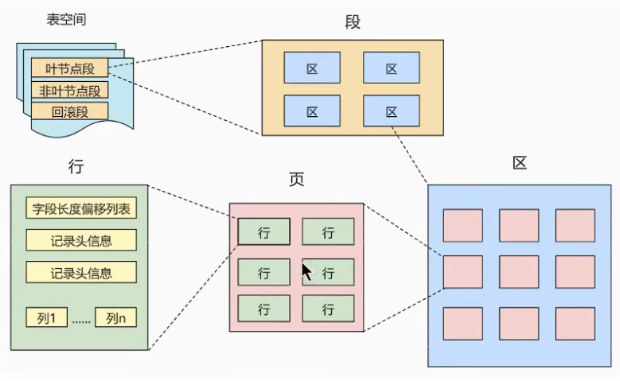

# MySql学习

## 基础

### 1. DCL语句

**DCL语句主要用来对于数据控服务层的连接和权限控制**,其操作的数据库为**系统数据库**(*MySql*);

- 创建用户

  ```sql
  create user 'xxx'@'host' identified by 'password';
  ```

  - xxx:用户名,可以自定义,可以重名.

  - host:主机ip地址,可以省略(即`create user xxx identified by 'password'`);,省略是默认为%,即任意主机.

  - 但是用户名和ip地址组合起来不能重复,也就是只用当用户名和ip地址相同是才被认为是同一个用户.

  - `identified by ‘password’`:这一段是用来设置密码的,可以省略,省略的话则没有密码,可以直接使用`mysql -uxxx`登录.

  - password:密码,设置密码可能会收到一些限制(一般出现在linux_mysql中,会对于密码有复杂度检测,

    > validate_password是一个密码检测的插件,在linux上默认安装,而在windows上则默认不安装.
    >
    > 可以使用`select * from mysql.plugin`或者`SHOW PLUGINS;`查看是所有已安装的插件.

    > windows下的安装语句`INSTALL PLUGIN validate_password SONAME 'validate_password.dll';`
    >
    > linux下的安装语句`INSTALL PLUGIN validate_password SONAME 'validate_password.so';`
    >
    > 卸载语句`UNINSTALL PLUGIN validate_password;`
    >
    > ***ref***:[ Linux 配置MySQL密码复杂度](https://blog.csdn.net/stklway/article/details/122360248)

- 删除用户

  ```mysql
  drop user 'xxx'@'host';
  ```

  - xxx:用户名
  - host:主机ip地址,可以省略,省略是默认为%.

  ```mysql
  delete from mysql.user where user='xxx' and host = 'host';
  ```

  - 这种方式是直接操作系统的数据表.

- 用户授权

  用户创建之后默认是没有任何权限的,可以通过下面的代码查看用户的权限,user和host为用户名和地址.省略情况同上.

  ```mysql
  show grants for user@host;
  ```

  对于刚创建的用户,查看权限是可以看到

  ```mysql
  mysql> show grants for lee@localhost;
  +-----------------------------------------+
  | Grants for lee@localhost                |
  +-----------------------------------------+
  | GRANT USAGE ON *.* TO `lee`@`localhost` |
  +-----------------------------------------+
  ```

  1. 用户授权

     ```mysql
     GRANT privileges ON databasename.tablename TO 'username'@'host';
     ```

     - privileges – 用户的操作权限,如SELECT , INSERT , UPDATE  等.如果要授予所 的权限则使用ALL说明: 

       | 权限名                 | 描述                                                         |
       | ---------------------- | ------------------------------------------------------------ |
       | ALL                    | 允许所用权限                                                 |
       | ALTER                  | 允许使用ALTER TABLE                                          |
       | ALTER ROUTINE          | 允许更改存储例程                                             |
       | CREATE                 | 允许使用CREATE TABLE                                         |
       | CREATE ROUTINE         | 允许创建存储例程                                             |
       | CREATE TEMPORARY TABLE | 允许创建临时表*(with语句)*                                   |
       | CREATE USER            | 允许新建用户                                                 |
       | CREATE VIEW            | 允许创建view                                                 |
       | DELETE                 | 允许使用DELETE                                               |
       | DROP                   | 允许用户使用DROP TABLE                                       |
       | EXECUTE                | 允许用户运行存储的例程                                       |
       | FILE                   | 允许使用SELECT…INFILE和LOAD DATA INFILE                      |
       | INDEX                  | 允许使用CREATE INDEX和DROP INDEX                             |
       | INSERT                 | 允许使用INSERT                                               |
       | LOCK TABLES            | 允许对用户还具有SELECT权限的表使用LOCK TABLES                |
       | PROCESS                | 允许使用SHOW FULL PROCESSLIST                                |
       | RELOAD                 | 允许使用FLUSH缓存                                            |
       | REPLICATION            | [MySQL Replication,主从同步( Master-Slave)](https://blog.csdn.net/xiaohuanxiong6616/article/details/84352425) |
       | REPLICATION SLAVE      | [MySQL Replication,主从同步( Master-Slave)](https://blog.csdn.net/xiaohuanxiong6616/article/details/84352425) |
       | SELECT                 | 允许使用select语句                                           |
       | SHOW DATABASES         | 允许查看数据库(*schema*)                                     |
       | SHOW VIEW              | 允许使用`show create view`语句                               |
       | SHUTDOWN               | 允许关闭mysql服务端                                          |
       | SUPER                  | 允许使用CHANGE MASTER、KILL、PURGE MASTER LOGS和SET GLOBAL SQL语句。允许debug命令。如果达到最大连接数，则允许进行一个额外连接。 |
       | UPDATE                 | 允许对表中数据更新                                           |
       | USAGE                  | 只能连接,没有任何权限,这就是初始创建的用户的情况             |

     - databasename –  数据库名,*表示所有

     - tablename-表名,如果要授予该用户对所有数据库和表的相应操作权限则可用* 表示, 如*.*

     ```mysql
     # 例如
     grant all on *.* to lee@localhost
     ```

  2. 用户撤权

     ```mysql
     drop privileges on databasename.tablename from user@host;
     ```

## 索引

### 索引的数据结构

索引的目的只要是为了快速数据库查询操作,减少系统I/O,优秀的索引,但是索引也会带来一些负面影响,那就是降低增删改的效率,但是总体来讲,设置索引还是利大于弊,但是如何合理的设置索引也是一门值得研究的学问.

索引本质上始终数据结构,InnoDB中常见的索引有**B+树,FULL-TEXT索引**,但是常见的还是**B+树**,再次,我们就一研究MySQL中InnoDB中的默认使用的**B+树**为例,来研究如何合理的设置索引.

#### B+树的结构

**B+树**是一种树状结构,他的特点是:

- 索引和数据分离,真实数据存放在叶子结点,其余的分支节点只是作为索引来使用.
- 父节点中的值始终可以在子节点中找到与它等值的节点.
- 叶子结点不是完全分散独立的,他会分成一个一个的段,每一个段有一个阈值(这个就是这颗B+树的最大度),在同一段的节点是存储在一段连续的存储空间中的.
- 删除节点会触发检查,也就是和相邻的兄弟节点之间检查是否可以合并,也就是两者相加是否会超过这棵树的最大度.

B+树对于B树的一种特殊演进结构,这种结构相比于B树而言,可以实现索引和真是数据分离,同时所有值都在叶子结点,方便做范围查询.

>  InnoDB中还讲每一个叶子结点的每一段首尾尾加上了一个指针,指向相邻叶子结点段,这样叶子节点就形成了一个分段的双向链表.这样的范围查询更快.
>
> 比如我现在要查询比2大的节点,我只需要先找到键为2的节点,然后在链表中迭代遍历即可.
>
> 这里会有个问题,如果一开始没有2的节点,那怎么办?
>
> InnoDB会进行一个相似查询,就是找到一个最近的,这样的效率会有所损耗,因此在MySQL优化时,一般建议在范围查询是使用等值进行匹配(比如在整数中查找大于1的数,可以写大于等于2)

#### B+树的优缺点

1. 优点:

   - 单词请求涉及到磁盘I/O次数少:

     树的高度小,在精准查找时,树的高度往往决定了I/O的次数.

   - 查询效率高:

     查询效率由树的高和节点的度数决定,但是相比较,但其实但就数据结构来讲,他和红黑树是差不多的,只是说对于B+树,在实际使用中,I/O减少了时间的开销.

   - 遍历效率高:

     B+树的所有叶子节点会连接成为一个双向链表,因此在遍历的时候只需要在链表上操作即可,效率更高.

2. 缺点:

   - 对于无序插入,导致的I/O会比较大(这一是我们在数据库主键设计时推荐使用自动递增的原因)
   - 删除时可能触发的子节点合并,对于I/O流的需求可能会比较大.

3. 总结

   总体来讲,B+树可以使用大部分的场景,这也就是InnoDB将其设置为默认的索引结构的原因,但是B+树最明显的优势还是在读的场景下,因此对于数据重要,多读少写的场景,强烈推荐使用B+树.

### 索引的分类

- 按「数据结构」分类：**B+tree索引、Hash索引、Full-text索引**。
- 按「物理存储」分类：**聚簇索引（主键索引）、二级索引（辅助索引）**。
- 按「字段特性」分类：**主键索引、唯一索引、普通索引、前缀索引**。
- 按「字段个数」分类：**单列索引、联合索引**。


### 索引的特性

#### 按数据结构分类


#### 按物理存储分类

从物理存储的角度来看，索引分为**聚簇索引（主键索引）、二级索引（辅助索引）**。

这两个区别在前面也提到了：

- 主键索引的 B+Tree 的叶子节点存放的是实际数据，所有完整的用户记录都存放在主键索引的 B+Tree 的叶子节点里；
- **二级索引的 B+Tree 的叶子节点存放的是主键值**，而不是实际数据。

所以，在查询时使用了二级索引，如果查询的数据能在二级索引里查询的到，那么就不需要回表，这个过程就是覆盖索引。如果查询的数据不在二级索引里，就会先检索二级索引，找到对应的叶子节点，获取到主键值后，然后再检索主键索引，就能查询到数据了，这个过程就是**回表**。

#### 按字段特性分类

从字段特性的角度来看，索引分为**主键索引、唯一索引、普通索引、前缀索引**。

1. **主键索引**

   - 一张表最多只有一个主键索引
   - 主键索引只能是单列索引
   - 主键索引不能为**NULL**且不能重复
   - 在实际开发中，建议每个表都要有主键索引
   - 主键索引建议使用递增的方式生成，可以再新增数据是原先数据的移动

2. **唯一索引**

   - 一张表可以有多个唯一索引
   - 当唯一索引是联合索引时，唯一性只有在联合字段任意唯一即可
   - 唯一索引可以为**NULL**，唯一性对**NULL**不起作用，即可以存在多个**NULL**

3. **普通索引**

   - 普通索引没有严格的约束条件，主要用来加快检索速度，但是索引的建立会影响**增删改**的性能
   - 普通索引的建立要根据实际的业务情况，当一个字段重复的概率很大时（比如性别这一字段），则无需建立索引

4. **前缀索引**

   - 前缀索引是指对字符类型字段的前几个字符建立的索引，而不是在整个字段上建立的索引

   - 可以建立在字段类型为 **char、 varchar、binary、varbinary** 的列上

   - 使用前缀索引的目的是为了减少索引占用的存储空间，提升查询效率

   - 前缀索引满足最左前缀原则，遇到`like ‘%string’`时失效，即通配符在指定字符串前时失效

     > 当查询语句通过二级索引避免了回表查询时，我们认为索引没有失效，但是其实本质上依然对二级索引的B+树遍历了

   - order by 就无法使用前缀索引；

   - 无法把前缀索引用作覆盖索引；

#### 按字段个数分类

- 建立在单列上的索引称为单列索引，比如主键索引；

- 建立在多列上的索引称为联合索引；

  > 联合索引遵循最左前缀原则，因此在建立联合索引时的字段的先后顺序会影响索引的结构
  >
  > 建立合适的联合索引，可以实现覆盖索引优化，减少回表查询

## 在磁盘中的存储结构

MySQL常用的**InnoDB**将数据存储在磁盘中，为了达到更加高效的数据读写，**InnoDB**使用了特殊的存储结构将数据持久化在磁盘上

**InnoDB**将数据表以文件的形式持久化，我们可以通过`SHOW VARIABLES LIKE 'datadir'`来查看他所存储的位置。

在最新版的**MySQL**中，数据文件都存放在***idb***文件中。我们把这个文件叫做**表空间**

### 表空间文件的结构

**表空间由段（segment）、区（extent）、页（page）、行（row）组成**，InnoDB存储引擎的逻辑存储结构大致如下图：



#### 行

这里的行就对应着数据库中的行记录，因此行的大小是不确定的，但是行也是有特定格式。

InnoDB 提供了 4 种行格式，分别是 **[Redundant](https://dev.mysql.com/doc/refman/8.0/en/innodb-row-format.html#:~:text=of%20a%20Table-,REDUNDANT%20Row%20Format,-The%20REDUNDANT%20format)**、**[Compact](https://dev.mysql.com/doc/refman/8.0/en/innodb-row-format.html#:~:text=index%20page%20fragmentation.-,COMPACT%20Row%20Format,-The%20COMPACT%20row)**、**[Dynamic](https://dev.mysql.com/doc/refman/8.0/en/innodb-row-format.html#:~:text=DYNAMIC%20Row-,Format,-The%20DYNAMIC%20row)**和 **[Compressed](https://dev.mysql.com/doc/refman/8.0/en/innodb-row-format.html#:~:text=COMPRESSED%20Row-,Format,-The%20COMPRESSED%20row)** 行格式。

- Redundant 是很古老的行格式了， MySQL 5.0 版本之前用的行格式，现在基本没人用了。
- 由于 Redundant 不是一种紧凑的行格式，所以 MySQL 5.0 之后引入了 Compact 行记录存储方式，Compact 是一种紧凑的行格式，设计的初衷就是为了让一个数据页中可以存放更多的行记录，从 MySQL 5.1 版本之后，行格式默认设置成 Compact。
- Dynamic 和 Compressed 两个都是紧凑的行格式，它们的行格式都和 Compact 差不多，因为都是基于 Compact 改进一点东西。从 MySQL5.7 版本之后，默认使用 Dynamic 行格式。

1. **[Compact](https://dev.mysql.com/doc/refman/8.0/en/innodb-row-format.html#:~:text=index%20page%20fragmentation.-,COMPACT%20Row%20Format,-The%20COMPACT%20row)行格式**

   

- **记录的额外信息**

  1. **变长字段长度列表**

     > 在存储数据时，对于部分长度可变的字段，不经需要将数据本身存储起来，还需要将数据的长度存储起来（可参考Java中的String类型），因此据需要使用**变长字段长度列表**

     - **变长字段长度列表**本身的长度由常见表时规定的可变字段的**数量**和每个字段的**长度阈值**决定

     - 逆序存放的特点：

       > 因为「记录头信息」中指向下一个记录的指针，指向的是下一条记录的「记录头信息」和「真实数据」之间的位置，这样的好处是向左读就是记录头信息，向右读就是真实数据，比较方便。
       >
       > 「变长字段长度列表」中的信息之所以要逆序存放，是因为这样可以**使得位置靠前的记录的真实数据和数据对应的字段长度信息可以同时在一个 CPU Cache Line 中，这样就可以提高[ CPU Cache](https://xiaolincoding.com/os/1_hardware/how_to_make_cpu_run_faster.html) 的命中率**。
       >
       > 同样的道理， NULL 值列表的信息也需要逆序存放。

  2. **NULL值列表**

  表中的某些列可能会存储 NULL 值，如果把这些 NULL 值都放到记录的真实数据中会比较浪费空间，所以 Compact 行格式把这些值为 NULL 的列存储到 NULL值列表中。

  > ***如果存在允许 NULL 值的列，则每个列对应一个二进制位（bit），二进制位按照列的顺序逆序排列。***

  - 二进制位的值为`1`时，代表该列的值为NULL。
  - 二进制位的值为`0`时，代表该列的值不为NULL。
  - 另外，NULL 值列表必须用整数个字节的位表示（1字节8位），如果使用的二进制位个数不足整数个字节，则在字节的高位补 `0`。

  3. [**记录头信息**(固定大小5byte)  ](https://blog.csdn.net/weixin_55705029/article/details/124353827#:~:text=3.2.3-,%E8%AE%B0%E5%BD%95%E5%A4%B4%E4%BF%A1%E6%81%AF,-%EF%BC%885%E5%AD%97%E8%8A%82)

  

  | 名称            | 大小（单位：bit） | 描述                                                         |
  | --------------- | ----------------- | ------------------------------------------------------------ |
  | `预留位1`       | 1                 | 没有使用                                                     |
  | `预留位2`       | 1                 | 没有使用                                                     |
  | `delete_mask`   | 1                 | 标记该记录是否被删除 <br>【值为0：代表记录并没有被删除 值为1：代表记录被删除掉了】 |
  | `mini_rec_mask` | 1                 | B+树的每层非叶子节点中的最小记录都会添加该标记               |
  | `n_owned`       | 4                 | 表示当前记录拥有的记录数                                     |
  | `heap_no`       | 13                | 表示当前记录在记录堆的位置信息                               |
  | `record_type`   | 3                 | 表示当前记录的类型<br>`0`表示普通记录，`1`表示B+树非叶子节点记录，`2`表示最小记录，`3`表示最大记录 |
  | `next_record`   | 16                | 表示下一条记录的相对位置                                     |

  > **被删除的记录为什么还在页中存储呢？** 你以为它删除了，可它还在真实的磁盘上。这些被删除的记录之所以不立即从磁盘上移除，是因为移除它们之后其他的记录在磁盘上需要`重新排列，导致性能消耗`。所以只是打一个删除标记而已，所有被删除掉的记录都会组成一个所谓的`垃圾链表`，在这个链表中的记录占用的空间称之为`可重用空间`，之后如果有新记录插入到表中的话，可能把这些被删除的记录占用的存储空间覆盖掉。

- **记录的真实数据**

  

  1. **row_id**(6byte)

     如果我们建表的时候指定了主键或者唯一约束列，那么就没有 row_id 隐藏字段了。如果既没有指定主键，又没有唯一约束，那么 InnoDB 就会为记录添加 row_id 隐藏字段。row_id不是必需的。

  2. **trx_id**(6byte,==MUST==)

     事务id，表示这个数据是由哪个事务生成的。

  3. **roll_pointer**(7byte,==MUST==)

     这条记录上一个版本的指针。

> **MySQL 规定除了 TEXT、BLOBs 这种大对象类型之外，其他所有的列（不包括隐藏列和记录头信息）占用的字节长度加起来不能超过 65535 个字节（64KB）**。也就是说，一行记录除了 TEXT、BLOBs 类型的列，限制最大为 65535 字节，**注意是一行的总长度**，不是一列。

#### 页

数据库读取的最小单位，也就是一次磁盘I/O读取一页数据。页是有大小规定的，默认每个页的大小为16KB，也就是说，无论其中有没有16KB的行记录，一页都会有16KB。因此磁盘I/O一次就会读取16KB的数据，当然，着16KB里面并不全是有效数据，也存在空白区。

页的类型有很多，常见的有数据页、undo 日志页、溢出页等等。数据表中的行记录是用「数据页」来管理的

页的结构如下：

| 名称                                | 大小   | 说明                                                 |
| ----------------------------------- | ------ | ---------------------------------------------------- |
| 文件头<br>File Header               | 38字节 | 表示页的信息                                         |
| 页头<br>Page Header                 | 56字节 | 表示页的状态信息                                     |
| 最小和最大记录<br>Infimum+superemum | 26字节 | 两个虚拟的伪记录，分表白哦是页中的最小记录和最大记录 |
| 用户记录<br>Use Records             | 不确定 | 存储行记录内容                                       |
| 空闲空间<br>Free Space              | 不确定 | 页中还没有被使用的空间                               |
| 页目录<br>Page Directory            | 不确定 | 存储用户记录的相对位置，对记录起到索引作用           |
| 文件尾<br>File Tailer               | 8字节  | 校验页是否完整                                       |

1. **文件头部和文件尾部**

   - **文件头部（38Byte）**

     | 名称                               | 占用空间大小 | 描述                                                         |
     | ---------------------------------- | ------------ | ------------------------------------------------------------ |
     | `FIL_PAGE_SPACE_OR_CHKSUM`         | `4`字节      | [页的校验和（checksum值）](https://blog.csdn.net/weixin_55705029/article/details/124353827#:~:text=%E9%AA%8C%E5%92%8C%EF%BC%88checksum%EF%BC%89%E3%80%82-,%E4%BB%A3%E8%A1%A8%E5%BD%93%E5%89%8D%E9%A1%B5%E9%9D%A2%E7%9A%84%E6%A0%A1%E9%AA%8C%E5%92%8C%EF%BC%88checksum%EF%BC%89,-%E3%80%82%0A%E4%BB%80%E4%B9%88%E6%98%AF) |
     | `FIL_PAGE_OFFSET`                  | `4`字节      | 页号，每一个页都有一个单独的页号，就跟你的身份证号码一样，InnoDB通过页号可以**唯一定位**一个页。 |
     | `FIL_PAGE_PREV`                    | `4`字节      | 上一个页的页号                                               |
     | `FIL_PAGE_NEXT`                    | `4`字节      | 下一个页的页号                                               |
     | FIL_PAGE_LSN                       | `8`字节      | 页面被最后修改时对应的日志序列位置                           |
     | `FIL_PAGE_TYPE`                    | `2`字节      | 该页的[类型](https://blog.csdn.net/weixin_55705029/article/details/124353827#:~:text=%E5%AD%97%E8%8A%82%EF%BC%89%EF%BC%9A-,%E8%BF%99%E4%B8%AA%E4%BB%A3%E8%A1%A8%E5%BD%93%E5%89%8D%E9%A1%B5%E7%9A%84%E7%B1%BB%E5%9E%8B%E3%80%82,-%E7%B1%BB%E5%9E%8B%E5%90%8D%E7%A7%B0) |
     | FIL_PAGE_FILE_FLUSH_LSN            | `8`字节      | 仅在系统表空间的一个页中定义，代表文件至少被刷新到了对应的LSN值 |
     | `FIL_PAGE_ARCH_LOG_NO_OR_SPACE_ID` | `4`字节      | 页属于哪个表空间                                             |

   - **文件尾部（8Byte）**

     - 前4个字节代表页的校验和：这个部分是和File Header中的校验和相对应的。
     - 后4个字节代表页面被最后修改时对应的日志序列位置（LSN）：这个部分也是为了校验页的完整性的，如果首部和尾部的LSN值校验不成功的话，就说明同步过程出现了问题

在 File Header 中有两个指针，分别指向上一个数据页和下一个数据页，连接起来的页相当于一个双向的链表，如下图所示：采用链表的结构是让数据页之间不需要是物理上的连续的，而是逻辑上的连续。


InnoDB 里的 B+ 树中的**每个节点都是一个数据页**，但是只有叶子结点才存放真正的数据，结构示意图如下：


这样的设计可以大大减少磁盘I/O的次数，极大地发挥系统性能。

**行溢出后，MySQL 是怎么处理的？**

> MySQL 中磁盘和内存交互的基本单位是页，一个页的大小一般是 `16KB`，也就是 `16384字节`，而一个 varchar(n) 类型的列最多可以存储 `65532字节`，一些大对象如 TEXT、BLOB 可能存储更多的数据，这时一个页可能就存不了一条记录。这个时候就会**发生行溢出，多的数据就会存到另外的「溢出页」中**。

如果一个数据页存不了一条记录，InnoDB 存储引擎会自动将溢出的数据存放到「溢出页」中。在一般情况下，InnoDB 的数据都是存放在 「数据页」中。但是当发生行溢出时，溢出的数据会存放到「溢出页」中。

当发生行溢出时，在记录的真实数据处只会保存该列的一部分数据，而把剩余的数据放在「溢出页」中，然后真实数据处用 20 字节存储指向溢出页的地址，从而可以找到剩余数据所在的页。大致如下图所示。


上面这个是 **Compact** 行格式在发生行溢出后的处理。

**Compressed** 和 **Dynamic** 这两个行格式和 Compact 非常类似，主要的区别在于处理行溢出数据时有些区别。

这两种格式采用完全的行溢出方式，记录的真实数据处不会存储该列的一部分数据，只存储 **20 个字节**的指针来指向溢出页。而实际的数据都存储在溢出页中，看起来就像下面这样：


#### 区

我们知道 InnoDB 存储引擎是用 B+ 树来组织数据的。

B+ 树中每一层都是通过双向链表连接起来的，如果是以页为单位来分配存储空间，那么链表中相邻的两个页之间的物理位置并不是连续的，可能离得非常远，那么磁盘查询时就会有大量的随机I/O，随机 I/O 是非常慢的。

解决这个问题也很简单，就是让链表中相邻的页的物理位置也相邻，这样就可以使用顺序 I/O 了，那么在范围查询（扫描叶子节点）的时候性能就会很高。那具体怎么解决呢？

> **在表中数据量大的时候，为某个索引分配空间的时候就不再按照页为单位分配了，而是按照区（extent）为单位分配。每个区的大小为 1MB，对于 16KB 的页来说，连续的 64 个页会被划为一个区，这样就使得链表中相邻的页的物理位置也相邻，就能使用顺序 I/O 了**

#### 段

表空间是由各个段（segment）组成的，段是由多个区（extent）组成的。段一般分为数据段、索引段和回滚段等。

> 对于范围查询，其实是对B+树叶子节点中的记录进行顺序扫描，而如果不区分叶子节点和非叶子节点，统统把节点代表的页面放到申请到的区中的话，进行范围扫描的效果就大打折扣了。所以InnoDB对B+树的叶子节点和非叶子节点进行了区别对待，也就是说叶子节点有自己独有的区，非叶子节点也有自己独有的区。存放叶子节点的区的集合就算是一个段（segment），存放非叶子节点的区的集合也算是一个段。也就是说一个索引会生成2个段，一个叶子节点段，一个非叶子节点段。
>
> 除了索引的叶子节点段和非叶子节点段之外，InnoDB中还有为存储一些特殊的数据而定义的段，比如回滚段。所以，常见的段有数据段、索引段、回滚段。数据段即为B+树的叶子节点，索引段即为B+树的非叶子节点。
>
> 在InnoDB存储引擎中，对段的管理都是由引擎自身所完成，DBA不能也没有必要对其进行控制。这从一定程度上简化了DBA对于段的管理。
>
> 段其实不对应表空间中的某一个连续的物理区域，而是一个逻辑上的概念，由若干个零散的页面以及一些完整的区组成。

- 索引段：存放 B + 树的非叶子节点的区的集合；
- 数据段：存放 B + 树的叶子节点的区的集合；
- 回滚段：存放的是回滚数据的区的集合，之前讲**事务隔离**的时候就介绍到了 MVCC 利用了回滚段实现了多版本查询数据。

