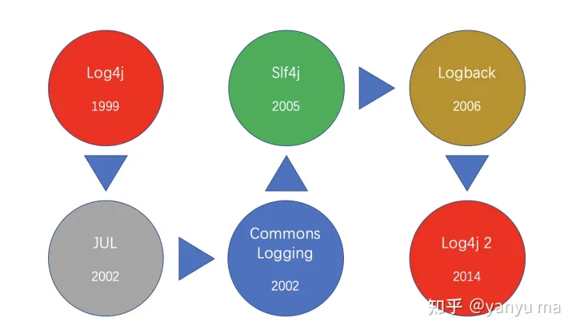

# Spring Cloud

### spring cloud中的一些技术和分类

1. 消息队列：

   - Kafka

   - RabbitMQ

   - ActiveMQ


2. 注册中心：
   - Eureka
   - Nacos
   - Consul 
   - Zookeeper
   - Dubbo

3. 数据连接池

   - C3P0

   - DBCP

   - HiKariCP

   - Druid


4. 数据持久化
   -  关系型数据库
     - MySql
     - Oracle
     - SQLite
   -  非关系型数据库
      - ​	Redis
      - MongoDB
   -  持久化框架
      - Hibernate
      - JPA
      - MyBatis
      - JOQO


5. 常见安全框架

   - Spring Security

   - Shiro


6. 常见服务器

   - Tomcat

   - nginx

   - Apache（注意区别Tomcat，都是Apache基金会开发的，但Apache是web服务器（静态解析，如HTML），tomcat是java应用服务器，动态解析（如JSP）。Tomcat只是一个servlet(jsp也翻译成servlet)容器，可以认为是apache的扩展，但是可以独立于apache运行


7. 页面渲染

   - Vue

   - thymeleaf

   - React


8. 日志框架



### Eureka注册中心

#### **基本配置**

1. **Eureka注册中心的**pom.xml

```xml
<dependency>
	<groupId>org.springframework.cloud</groupId>
    <artifactId>spring-cloud-starter-netflix-eureka-server</artifactId>
</dependency>
```

​	2.**Eureka注册中心的**application.yml

```yaml
# Eureka注册中心配置
server:
	port: 10086 # 端口
# 注册信息
spring:
	application:
		name: eurekaserver # 服务名称,大小写敏感
eureka:
	client:
		service-url:
			defaultZone: http://127.0.0.1:10086/eureka # 服务地址
```

3. **Eureka注册中心需要在配置类上加上`@EnableEurekaServer`注解**
4. **微服务的**pom.xml

```xml
<dependency>
	<groupId>org.springframework.cloud</groupId>
    <artifactId>spring-cloud-starter-netflix-eureka-client</artifactId>
</dependency>
<!--  下面这个配置非常重要，如果没有会报错
Field optionalArgs in org.springframework.cloud.netflix.eureka.EurekaClientAutoConfiguration$RefreshableEurekaClientConfiguration required a bean of type 'com.netflix.discovery.AbstractDiscoveryClientOptionalArgs' that could not be found.
=======================
我们其实也可以在使用Spring Initializer的时候吧Spring Web和Eureka Discovery Client勾选上，这种方式更加方便。
-->
<dependencyManagement>
	<dependencies>
		<dependency>
			<groupId>org.springframework.cloud</groupId>
			<artifactId>spring-cloud-dependencies</artifactId>
			<version>${spring-cloud.version}</version>
			<type>pom</type>
			<scope>import</scope>
		</dependency>
	</dependencies>
</dependencyManagement>
```

5. **微服务的**application.yml

```yaml
# 注册信息
spring:
	application:
		name: userservice # 服务名称
eureka:
	client:
		service-url:
			defaultZone: http://127.0.0.1:10086/eureka # 服务地址
```

#### 备份`pom.xml`，以防后患：

- **服务端**：

```xml
<?xml version="1.0" encoding="UTF-8"?>
<project xmlns="http://maven.apache.org/POM/4.0.0" xmlns:xsi="http://www.w3.org/2001/XMLSchema-instance"
	xsi:schemaLocation="http://maven.apache.org/POM/4.0.0 https://maven.apache.org/xsd/maven-4.0.0.xsd">
	<modelVersion>4.0.0</modelVersion>
	<parent>
		<groupId>com.leotan</groupId>
		<artifactId>SpringCloudDemo</artifactId>
		<version>0.0.1-SNAPSHOT</version>
	</parent>
	<groupId>com.leotan</groupId>
	<artifactId>UserService</artifactId>
	<version>0.0.1-SNAPSHOT</version>
	<name>UserService</name>
	<description>UserService</description>
	<properties>
		<java.version>17</java.version>
		<spring-cloud.version>2022.0.3</spring-cloud.version>
	</properties>
	<dependencies>
		<dependency>
			<groupId>org.springframework.boot</groupId>
			<artifactId>spring-boot-starter-web</artifactId>
		</dependency>
		<dependency>
			<groupId>org.springframework.cloud</groupId>
			<artifactId>spring-cloud-starter-netflix-eureka-client</artifactId>
		</dependency>
		<dependency>
			<groupId>org.projectlombok</groupId>
			<artifactId>lombok</artifactId>
			<optional>true</optional>
		</dependency>
		<dependency>
			<groupId>org.springframework.boot</groupId>
			<artifactId>spring-boot-starter-test</artifactId>
		</dependency>
	</dependencies>
	<dependencyManagement>
		<dependencies>
			<dependency>
				<groupId>org.springframework.cloud</groupId>
				<artifactId>spring-cloud-dependencies</artifactId>
				<version>${spring-cloud.version}</version>
				<type>pom</type>
				<scope>import</scope>
			</dependency>
		</dependencies>
	</dependencyManagement>
	<build>
		<plugins>
			<plugin>
				<groupId>org.springframework.boot</groupId>
				<artifactId>spring-boot-maven-plugin</artifactId>
				<configuration>
					<excludes>
						<exclude>
							<groupId>org.projectlombok</groupId>
							<artifactId>lombok</artifactId>
						</exclude>
					</excludes>
				</configuration>
			</plugin>
		</plugins>
	</build>
</project>
```

- **注册中心**

```xml
<?xml version="1.0" encoding="UTF-8"?>
<project xmlns="http://maven.apache.org/POM/4.0.0"
         xmlns:xsi="http://www.w3.org/2001/XMLSchema-instance"
         xsi:schemaLocation="http://maven.apache.org/POM/4.0.0 http://maven.apache.org/xsd/maven-4.0.0.xsd">
    <modelVersion>4.0.0</modelVersion>

    <groupId>com.leotan</groupId>
    <artifactId>EurekaServer</artifactId>
    <version>1.0-SNAPSHOT</version>
    <parent>
        <groupId>com.leotan</groupId>
        <artifactId>SpringCloudDemo</artifactId>
        <version>0.0.1-SNAPSHOT</version>
    </parent>

    <dependencies>
        <dependency>
            <groupId>org.springframework.cloud</groupId>
            <artifactId>spring-cloud-starter-netflix-eureka-server</artifactId>
        </dependency>
        <dependency>
            <groupId>org.springframework.boot</groupId>
            <artifactId>spring-boot-autoconfigure</artifactId>
        </dependency>
    </dependencies>

</project>
```


#### **使用**

1. 配置**RestTemplate**

```java
@Bean
@LoadBalanced //负载均衡的注解，这里默认 使用的是Ribbon
public RestTemplate restTemplate(){
    return new RestTemplate();
}
```

2. **远程调用服务**

```java
@AutoWired
private RestTemplate restTemplate;

public Entity queryEntityById(Long id){
    String url = "http://userservice/" + id;
    Entity e = restTemplate.getForObject(url,Entity.class);
    return e;
}

@GetMapping("/{id}")
public Entity getById(@PathVariable Long id){
    return mapper.getById(id);
}
```

3. **负载均衡**

   1. 原理：

      - `LoadBalancerInterceptor`拦截请求
      - `DynamicServerListLoadBalancer`从**Eureka**注册中心查询服务地址列表
      - `IRule`从列表选择一个服务地址作为请求地址返回
      - `LoadBalancerInterceptor`将原地址替换

   2. **IRule**的常见实现

      | 规则名称                  | 特点                                                         |
      | :------------------------ | :----------------------------------------------------------- |
      | AvailabilityFilteringRule | 过滤掉一直连接失败的被标记为circuit tripped（电路跳闸）的后端Service，并过滤掉那些高并发的后端Server或者使用一个AvailabilityPredicate来包含过滤Server的逻辑，其实就是检查status的记录的各个Server的运行状态 |
      | BestAvailableRule         | 选择一个最小的并发请求的Server，逐个考察Server，如果Server被tripped了，则跳过 |
      | RandomRule                | 随机选择一个Server                                           |
      | ResponseTimeWeightedRule  | 已废弃，作用同WeightedResponseTimeRule                       |
      | RetryRule                 | 对选定的负责均衡策略机上充值机制，在一个配置时间段内当选择Server不成功，则一直尝试使用subRule的方式选择一个可用的Server |
      | RoundRobinRule            | 轮询选择，轮询index，选择index对应位置Server                 |
      | WeightedResponseTimeRule  | 根据相应时间加权，相应时间越长，权重越小，被选中的可能性越低 |
      | ZoneAvoidanceRule         | （默认是这个）负责判断Server所Zone的性能和Server的可用性选择Server，在没有Zone的环境下，类似于轮询（RoundRobinRule） |

   3. **IRule**的配置

      - 代码方式：消费者服务中定义一个新的`IRule`,这种方式的配置会影响该消费者的所有负载均衡策略。

        ```java
        @Bean
        public IRule randomRule(){
            return new RandomRule();
        }
        ```

      - 配置文件方式：在消费者服务的配置文件中加入以上代码，对**userservice**服务的调用单独配置

        ```yaml
        userservice: # 莫目标服务
        	ribbon:
        		NFLoadBalancerRuleClassName: com.netflix.loadbalancer.RandomRule # 负载均衡的实现类的唯一坐标
        ```

   4. **Ribbon**饥饿加载(一定程度上提高第一次使用的效率)

      ```yaml
      ribbon:
      	eager-load:
      		enabled: true # 开启饥饿加载
      		clients: 
      			- userservice # 指定作用范围，可以为多个
      			- orderservece 
      ```

### Nacos注册中心

**Nacos**是阿里旗下的一个产品，现在已经被**Spring Cloud**收录了（也可以算是编内人员了），**Nacos**和**Eureka**都遵循**Spring Cloud**的服务注册中心的接口规范，因此在使用方面大同小异，从**Eureka**转变到**Nacos**几乎不需要改代码，只需要该配置即可，下面就演示从**Eureka**转到**Nacos**的过程。

#### Nacos替换Eureka

1. 下载**Nacos**发行版[Nacos官网](https://nacos.io/)

   下载地址：[Releases · alibaba/nacos (github.com)](https://github.com/alibaba/nacos/releases/)

2. 在bin目录下执行命令行`./startup.cmd -m standalone`

3. 在工程中添加依赖（SpringCloud的保留），对于版本对应要求高，可参考[版本说明 Wiki ](https://github.com/alibaba/spring-cloud-alibaba/wiki/版本说明)

   ```xml
   <dependencyManagement>
       <dependencies>
           <dependency>
               <groupId>com.alibaba.cloud</groupId>
               <artifactId>spring-cloud-alibaba-dependencies</artifactId>
               <version>2022.0.0.0-RC2</version>
               <type>pom</type>
               <scope>import</scope>
           </dependency>
       </dependencies>
   </dependencyManagement>
   ```

4. 去掉Eureka依赖，替换成Nacos依赖

   ```xml
   <!-- 这个是放在dependencies下的，版本会有dependencyManagement中配置管理 -->
   <dependency>
   	<groupId>com.alibaba.cloud</groupId>
   	<artifactId>spring-cloud-starter-alibaba-nacos-discovery</artifactId>
   </dependency>
   ```

5. nacos的yml配置修改

   ```yaml
   spring:
     application:
       name: UserService
     cloud:
       compatibility-verifier:
         enabled: false
         #这个不设置会因为版本问题报错，建议打开
       nacos:
         server-addr: localhost:8848  
   # 注册中心地址，可以省略，默认localhost:8848 和服务端的默认值一样，因此转变是可以只把Eureka配置删除
   server:
     port: 8081
   ```


#### 备份`pom.xml`，以防后患（包含配置服务）:

```xml
<?xml version="1.0" encoding="UTF-8"?>
<project xmlns="http://maven.apache.org/POM/4.0.0" xmlns:xsi="http://www.w3.org/2001/XMLSchema-instance"
         xsi:schemaLocation="http://maven.apache.org/POM/4.0.0 https://maven.apache.org/xsd/maven-4.0.0.xsd">
    <modelVersion>4.0.0</modelVersion>
    <parent>
        <groupId>org.springframework.boot</groupId>
        <artifactId>spring-boot-starter-parent</artifactId>
        <version>3.1.1</version>
        <relativePath/>
    </parent>
    <groupId>com.leotan</groupId>
    <artifactId>UserService</artifactId>
    <version>0.0.1-SNAPSHOT</version>
    <name>UserService</name>
    <description>UserService</description>
    <properties>
        <java.version>17</java.version>
        <spring-cloud.version>2022.0.3</spring-cloud.version>
    </properties>
    <dependencies>
        <dependency>
            <groupId>org.springframework.boot</groupId>
            <artifactId>spring-boot-starter-web</artifactId>
        </dependency>
        <!-- Nacos配置服务的依赖 -->
        <dependency>
            <groupId>com.alibaba.cloud</groupId>
            <artifactId>spring-cloud-starter-alibaba-nacos-discovery</artifactId>
        </dependency>
        <dependency>
            <groupId>org.projectlombok</groupId>
            <artifactId>lombok</artifactId>
            <optional>true</optional>
        </dependency>
        <dependency>
            <groupId>com.alibaba.cloud</groupId>
            <artifactId>spring-cloud-starter-alibaba-nacos-config</artifactId>
        </dependency>
        <dependency>
            <groupId>org.springframework.boot</groupId>
            <artifactId>spring-boot-starter-test</artifactId>
            <scope>test</scope>
        </dependency>
        <!--这个配置不加的化，LoadBalanced注解不会生效，也就不从Nacos注册中心查服务-->
        <dependency>
            <groupId>org.springframework.cloud</groupId>
            <artifactId>spring-cloud-starter-loadbalancer</artifactId>
        </dependency>    
    </dependencies>
    <dependencyManagement>
        <dependencies>
            <dependency>
                <groupId>org.springframework.cloud</groupId>
                <artifactId>spring-cloud-dependencies</artifactId>
                <version>2022.0.0</version>
                <type>pom</type>
                <scope>import</scope>
            </dependency>
            <!-- SpringBoot -->
            <dependency>
                <groupId>org.springframework.boot</groupId>
                <artifactId>spring-boot-dependencies</artifactId>
                <version>3.1.1</version>
                <type>pom</type>
                <scope>import</scope>
            </dependency>
            <!-- SpringCloudAlibaba -->
            <dependency>
                <groupId>com.alibaba.cloud</groupId>
                <artifactId>spring-cloud-alibaba-dependencies</artifactId>
                <version>2022.0.0.0-RC2</version>
                <type>pom</type>
                <scope>import</scope>
            </dependency>
        </dependencies>
    </dependencyManagement>

    <build>
        <plugins>
            <plugin>
                <groupId>org.springframework.boot</groupId>
                <artifactId>spring-boot-maven-plugin</artifactId>
                <configuration>
                    <excludes>
                        <exclude>
                            <groupId>org.projectlombok</groupId>
                            <artifactId>lombok</artifactId>
                        </exclude>
                    </excludes>
                </configuration>
            </plugin>
        </plugins>
    </build>
</project>
```

#### 集群和命名空间

1. 什么是集群

   > 我们把集群看成是一个团队，一般情况下，同一个团队之间的协作效果最佳。在服务部署中，往往将部署在同一个地域的服务当作一个集群来使用，如果集群内能够提供服务，则直接使用内部的，否则调用其他集群的。这就是集群的好处。能够减少地域性带来的性能损失。

2. 集群的使用

   ```yaml
   spring:
     application:
       name: userservice
     cloud:
       compatibility-verifier:
         enabled: false
       nacos:
         discovery:
           server-addr: localhost:8848
           cluster-name: XT # 集群名称，一般用地域来命名
   ```

3. 什么是命名空间

   > 用于进行租户粒度的配置隔离。不同的命名空间下，可以存在相同的 Group 或 Data ID 的配置。Namespace 的常用场景之一是不同环境的配置的区分隔离，例如开发测试环境和生产环境的资源（如配置、服务）隔离等。

4. 如何使用命名空间

   ```yaml
   spring:
     application:
       name: userservice
     cloud:
       compatibility-verifier:
         enabled: false
       nacos:
         discovery:
           server-addr: localhost:8848
           cluster-name: XT
           namespace: fa5b9f17-29ca-4f91-af64-f0caac3ac533 # 在Nacos控制台中新建生成的命名空间ID
   ```

5.  配置NacosRule使用集群优先原则(具体可参照**Eureka**)

   ```yaml
   userservice:
     ribbon:
       NFLoadBalancerRuleClassName: com.alibaba.nacos.ribbon.NacosRule
   ```

   > 规则说明：优先使用同一个集群内的，同一集群内则用随机调用均衡。

6. 分组

   ```yaml
   spring:
     application:
       name: userservice
     cloud:
       compatibility-verifier:
         enabled: false
       nacos:
         discovery:
           server-addr: localhost:8848
           cluster-name: XT
           namespace: fa5b9f17-29ca-4f91-af64-f0caac3ac533
           group: Hello # 组名
   ```

7. 权重的使用

   权重可以宏观调整不同机器的负载分配，权重大的负载大，权重小的负载小，权重为0则不负载（可以用来分批次更新，但是企业中有更好的解决方案）

#### Nacos配置管理

**nacos配置管理**帮助我们在服务运行时，动态的、统一的更改服务配置。

1. 添加依赖

```xml
<!-- Nacos配置服务的依赖 -->
<dependency>
    <groupId>com.alibaba.cloud</groupId>
    <artifactId>spring-cloud-starter-alibaba-nacos-discovery</artifactId>
</dependency>
```

2. 在**Nacos**控制台新建一个配置服务：
   - **Data ID**的命名规范为 **servicename-profile.fileextension**，例如`userservice-dev.yaml`，入宫没写`profile`，则作用于所有`servicename`匹配的服务。
   - 配置格式推荐选择`yaml`（和上面对应即可）
   - 内容可以为空，也可以在运行的时候冬天更改
3. 在和`application.yaml`统计目录下新建一个`bootstrap.yaml`文件

```yaml
spring:
  application:
    name: userservice # 服务名称
  profiles:
    active: dev #开发环境
  cloud:
    nacos:
      server-addr: localhost:8848 # 注册地址
      config:
        file-extension: yaml # 文件后缀
```

4. 到这里就会产生最多三个配置文件作用与同一个服务（bootstrap.yaml只在服务启动时引导服务，作用范围很小）

   - **servicename-profile.yaml**(Nacos)
   - **servicename.yaml**(Nacos)
   - **application.yaml**(Local)

   优先级从上到下。作用在Nacos端的配置文件可以实现**热更新**


### Feign代替RestTemplate

在上面的案例中我们可以看到在**RPC**时，我们会将请求硬编码进入另一个服务的代码中，并且还需要自行在后面添加参数，如果参数较多时，或者远程服务较多时，我们的使用成本就会跟着一起上升，并且在将来，如果我们需要对服务进行拆分时，我们需要手动的修改代码。因此我们需要一种更加优雅的方式来实现**RPC**，尽量让消费者无感地远程调用。

> **Feign是声明式Web Service客户端**，**它让微服务之间的调用**变得更简单，**类似controller调用service**。SpringCloud集成了Ribbon和Eureka，可以使用Feigin提供负载均衡的http客户端

#### Feign替换RestTemplate

1. 引入依赖

   ```xml
   <!-- Feign -->
   <dependency>
   	<groupId>org.springframework.cloud</groupId>
   	<artifactId>spring-cloud-starter-openfeign</artifactId>
   	<version>2.2.7.RELEASE</version>
   </dependency>
   ```

2. 配置

   配置类上加上注解`@EnableFeignClients`

3. 新建一个Client接口，接口对应要调用的服务，使用**SpringMVC**的注解标记上请求路径，并且为之加上注解`@FeignClient(service-name)`

   ```java
   @FeignClient("UserService") //对应Nacos中的服务名称
   public interface UserClient {
       @GetMapping("/user/b/{id}")
       User getById(@PathVariable String id);
   
       @GetMapping("/user/a/{id}")
       User getUserById(@PathVariable String id);
   
   }
   ```

   > `@RequestMapping`注解不能添加到接口上，因此如果需要使用方法上的参数表示完整的请求路径

#### Feign日志配置

1. 通过配置文件配置

   在`application.yaml`写下如下代码

   ```yaml
   spring:
     application:
       openfeign:
         client:
           config:
             default:  # default为全局配置，也可以指定服务名配置
               logger-level: FULL  # 日志等级，包括NONE/BASIC/HEADER/FULL，级别依次递增，性能依次下降
   ```

2. 通过代码配置

   1. 新建一个配置类（UserFeignConfig）

   ```java
   package com.leotan.userservice.config;
   
   import feign.Logger;
   import org.springframework.context.annotation.Bean;
   
   public class UserFeignConfig {
       @Bean
       public Logger.Level feignLogLevel(){
           return Logger.Level.FULL;
       }
   }
   ```

   2. 载入服务配置

      - 单独服务配置

        在FeignClient的注解后面加上该配置类

        ```java
        @FeignClient(value = "UserService",configuration = UserFeignConfig.class)
        ```

      - 全局配置

        在启动类上原有的注解上添加参数

        ```java
        @EnableFeignClients(defaultConfiguration = UserFeignConfig.class)
        ```

#### Feign的连接优化

**Feign**的底层Http客户端包括**URLConnection**、**OKHttp**、**Apache HttpClient**，这些

| Http客户端              | 特性                             |
| ----------------------- | -------------------------------- |
| URLConnection（不推荐） | 默认实现，不支持连接池，性能较差 |
| OKHttp                  | 支持连接池                       |
| Apache HttpClient       | 支持连接池                       |

**客户端配置**（性能调优）

这里我们就使用**ApacheHttpClient**最为配置

1. 引入依赖

   ```xml
   <dependency>
       <groupId>io.github.openfeign</groupId>
       <artifactId>feign-httpclient</artifactId>
   </dependency>
   ```

2. `application.yaml`配置

   ```yaml
   spring:
     application: # 这里吧其他的配置省略了，比如日志级别的配置
       openfeign:      
         httpclient:
           enabled: true
           max-connections: 200
           max-connections-per-route: 50
   ```

#### Feign企业级最佳实践

将**Client**和**PoJo**作为公共部分抽取出放到一个模块里，其他模块可以通过`pom.xml`导入使用，但是这里要注意包扫描问题，不然**Client**无法配**Feign**实例化。

在启动类上的

```java 
//basePackageClasses参数可以一个一个类的扫描，basePackages可以一个包一个包的扫描             
@EnableFeignClients(basePackageClasses = {User.class})
```

### GateWay

#### 框架引入

#### 基本配置使用

