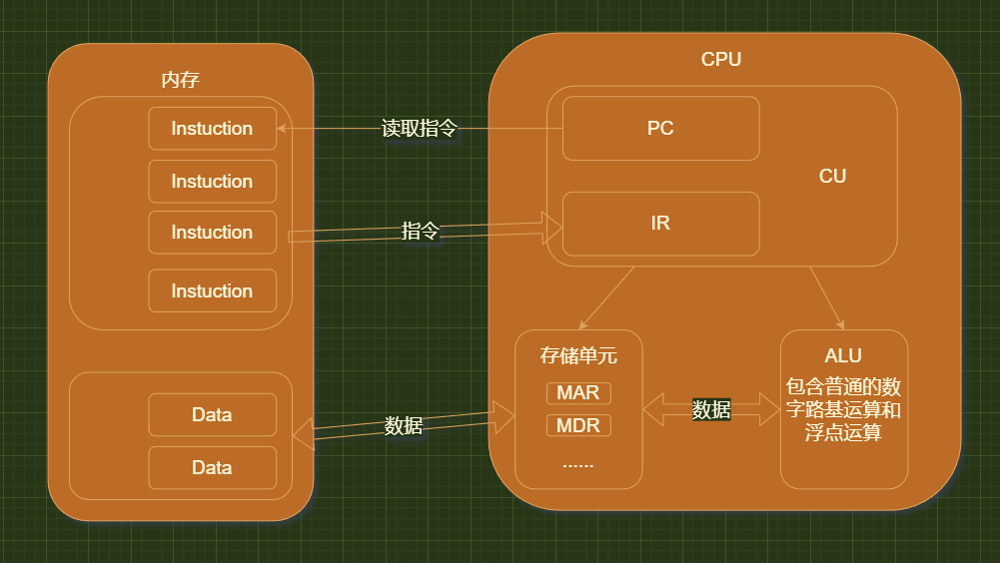

# 计算机的组成原理

学好底层，探索计算机底层原理，打好计算机基础，加油！（**大二专业课**）

## 一、计算机基础

### 1.1计算机硬件构成

1. **中央处理器**(CPU)：

   - **算数运算单元**（ALU）：主要用于算术运算、逻辑运算、移位等各种数据操作。和寄存器协调工作，计算结果由内部总线返回寄存器，运算结果的特征放在特殊寄存器之中。
   - **控制器**（CU）：由指令寄存器、指令译码器和时序部件组成。按一定顺序在储存器中读取指令、译码，在时钟信号控制下发送一系列操作命令。
   - **寄存器**（Register）：用来存放操作数、中间结果、和反映运算结果的状态标志等。

2. **总线**（Bus）：

   把计算机的各个部分连接起来的信号线，是个部分信息交换的公共通道。

   - **地址总线**（AB）：负责传输数据的储存位置的一组信号线。传输CPU发送的地址，一遍选中CPU所需要的存储单元或I/O接口。
   - **数据总线**（DB）：负责传输数据的一组信号线。数据在CPU和存储器、I/O接口之间的传送是双向的，因此又可称为双向总线。传送的数据是广义的数据，包括狭义的数据和指令代码。
   - **控制总线**（CB）：传输和交换数据时起到管理控制作用的一组信号线。CPU到I/O接口的读写信号[$\overline{\text{RD}}$,$\overline{\text{WR}}$]，I/O接口和存储器到CPU的准备就绪和终端信号等[READY,INT].

3. **存储器**（Memory）：

   存储程序、数据和各种信号、命令等信息。

4. **输入输出接口**（I/O接口）：

   - 用于缓存数据：协调计算机内部和外部设备的协调工作（内部速度过快）。
   - 信息格式转化：例如键盘使用的是串行接口，而计算机内部是并行传输。并且键盘数据五花八门，需要转成统一的数据格式。
   - 向计算机传达指令，报告运行状态。

5. **输入输出设备**（I/O设备）：

   通过I/O接口和计算机相连接。比如常见的键盘，鼠标，和显示屏。这里要注意，硬盘其实是属于外部设备，即使他是内置的。由此可知，I/O设备不仅可以作为输入输出的窗口，也可以用来存储数据。

### 1.2 计算机的工作原理

1.1.1 指令与指令集

计算机对于一个可执行文件是如何执行的呢？首先我们要区别一个概念，我们日常编写的程序都不是可执行文件，只有编译连接后，可以不依赖任何平台直接运行的才是二进制可执行文件。对于可执行文件，计算机是如何执行的呢？这就要提及到指令和指令集了。

在CPU中，厂家往往会预定义一些基本的操作，比如加减乘除等，而对于二进制文件，只需要告诉计算机”你需要执行哪一个指令“即可，但是必须要求在CPU中有这些指令。计算机能执行的全部指令就叫指令集。指令集应CPU信号而已，但是对于使用高级语言的程序猿们基本不需要关注，而对于汇编语言从事着就需要记住一些常见CPU的指令集了。

**CPU**的工作原理



**MAR**

MAR叫做存储地址寄存器，保存的是存储单元的地址，其位数反映了**存储单元的个数**。

> 比如有32个存储单元，而存储单元的地址是用二进制来表示的，那么5位二进制数就可以32个存储单元。那么，MAR的位数就是5位。

在实际运用中，我们 知道了MAR的位数，存储单元的个数也可以知道了。

**MDR**

MDR表示存储数据寄存器，其位数反映**存储字长**。

MDR存放的是从存储元件读出，或者要写入某存储元件的数据（二进制数）。

> 如果MDR=16,，每个存储单元进行访问的时候，数据是16位，那么存储字长就是16位。


为自动连学的执行程序，必须先将程序和数据送到具有记忆功能的存储器中保存起来，然后有CPU依据程序的指令执行的顺序取出指令、分析指令、执行指令，直到将全部指令执行完。在CPU里面有个寄存器叫程序计数器（PC），在有些地方又可以叫指令指针（IP）。没错，他就是用来指向下一条指令的位置的。而CP之中的位置是可以被程序修改的，这一就是`if`语句实现的原理

```mermaid
graph LR
读取指令-->指令译码-->获取操作数-->执行运算-->存储结果-->修改PC-->读取指令
```


### 1.3 计算机的运算

#### 1.3.1 浮点数的表示（以单精度浮点数为例）

>float在内存中用指数型式表示，分解为：**数符，尾数，指数符，指数**四部分。
>
>数符占 1 位二进制，表示数的正负。
>
>指数占8位二进制，表示指数大小，其中还包括指数为的正负。一般这里的指数是以2为底数的指数。
>
>尾数占23位，表示浮点数有效数字，0.xxxxxxx, 但不存开头的 0 和点。
>
>注意，浮点数有自己的使用规范，尾数永远无法溢出到指数。

#### 1.3.2 浮点数的计算

1. 运算规则：

   ${x\pm y=(M_x*2^{E_x-E_y} \pm M_y*2^{E_y})} (E_x \leq E_y)$

2. 具体步骤：

   1. 0操作数检查：如果有操作数为0，直接返回结果，节省时间。

   2. 比较指数大小，指数对齐：

      - ${\Delta E = 0}$,表示指数对齐；${\Delta E \neq 0}$,表示指数未对齐；
      - 如果未对齐，则指数小的操作数尾数为向右位移，每一动一位位数，指数加一，知道使两指数相等为止。

   3. 位数求和运算：指数对齐后就可以直接对尾数进行运算，运算规则和整数运算规则一样。

   4. 结果规范化：运算的结果也有可能溢出，它表明位数求和的结果绝对值大于2，此时需要将运算结果向右移实现规范化表示。同样指数加一。

      ​		舍入处理：在规范化的过程中低位会被舍弃，从而产生一定的误差，因此需进行舍入处理。舍入处理有两种方式：

      - 0舍1进：右移是时被丢弃的最高数位为0，则直接舍掉；为1则将尾数末尾加一。
      - 恒置1法：只要数位被移掉，就往尾数加一。

   5. 溢出处理

      对于尾数的溢出只需要向指数进行进位即可，可对于指数的溢出咋办呢？

      - 指数上溢就是指数超过了最大值的正指数值，一般将其认为是${+\infty}$或者${-\infty}$
      - 指数下溢就是指数超过了最下值的负指数值，一般将其认为是0。

### 1.4 计算机系统中数据的存储

计算机处理的数据通常存储在存储器中，存储器以字节为单位存储数据，因此计算机存储多字节数据时，需要使用连续多个存储单元，并以这个存储单元的最低地址作为该数据的地址。（PS：计算机内存中数据存储从高字节向低字节依次存放）

#### 1.4.1 存储字节序

- 大字节序（大端序/大尾序）（***大小小大***）：数据的最高位字节放在最低位的存储单元。采用这种机制的处理器有*PowerPC、SPARC、Motorala微处理器系列和绝大多数RISC（精简指令集）处理器。*
- 小字节序（小端序/小尾序）（***大大小小***）：数据的最高位字节放在最高位的存储单元。采用这种机制的处理器有*Inter*架构的CPU（*Inter、AMD*）。

| 地址     | (1200) | (1201) |
| -------- | ------ | ------ |
| 大字节序 | 12     | 34     |
| 小字节序 | 34     | 12     |

对于不同处理器可以有不同的存储方式，但是如果两个计算机需要进行数据传输是，就需要统一一个规范：在网络传输中，我们常用**大字节序**。

**大小端各自的优点**

- 大端：符号位在所表示的内存的低地址，用于快速判断数据的正负和大小

- 小端：CPU做数值运算的时候是从内存中依次从低位到高位取数据进行运算，这样运算效率更高。

#### 1.4.2 数据的表现形式（机器数）

- **原码**

  原码与真值的对应关系最直接，符号位0–>非负，1–>负；原码的数值为是真值的绝对值。

- **反码**

  正数的反码等于原码，负数的反码就是数值为全部取反。0的反码依然是0

- **补码**

  正数的补码等于原码，负数的补码就是负数的反码加上1（*也可以理解为出符号位和最后一位1外全部取反*）。0的补码 是0

- **移码**

  移码是补码的符号为取反。主要用来按位比较两个数的大小。

> 1. 原码的表示范围是[ $-2^{n-1}+1 $  ~      $ 2^{n-1}-1$]
> 1. 补码的表示范围是[ $-2^{n-1} $          ~      $ 2^{n-1}-1$]

## 二、汇编语言

### 2.1 计算机指令架构

计算机的指令通常分为两个部分：**操作码**和**操作数**。操作码指明计算机执行什么样的操作，而操作数则指出该操作处理的数据或数据存放的地址。

计算机系统能执行的全部指令构成了该计算机系统的指令集。不同的处理器有不同的指令集，而这些指令集的设计发展主要有两个方向：

- 精简指令集（Reduced Instruction Set Computer,RISC）：目的是尽可能降低指令集的复杂度，已达到简化实现、提高性能的目的。更适用于专用机。如**MISP**、**Motorola**等微处理机。
- 复杂指令集（Complex Instruction Set Computer,CISC）：目的是强化指令功能，实现软件功能性硬件功能转移。更适用于通用机，我们日常使用的PC通常就是使用CISC架构。以**InterX86**为典型。

**特点**：

| CISC                                  | RISC                                                        |
| ------------------------------------- | ----------------------------------------------------------- |
| 指令系统庞大，指令数目一般多达200多条 | 精简了指令系统，流水线以及常用指令均可用硬件执行            |
| 寻址方式多、代码长度不固定            | 所有指令长度均相同                                          |
| 访问存储器指令不加限制                | 只有`load`和`store`可以访问存储器，其他操作均在寄存器中执行 |
| 各指令执行时间相差很大                | 所有指令的功能单一，在一个机器周期内完成                    |

### 2.2 MISP汇编指令一般格式

<center><b>[标号:] 操作码 [操作数1、操作数2、操作数3] [#注释]<b></center>

1.  标号：表示指令在存储器中的存储地址，可选项;
2. 操作码：表示进行的操作类型；
3. 操作数：表示操作的对象（数据或地址），可有0~3个；
4. 注释：众所周知。

**example**：`add a,b,c #将b+c的结果放在a中`

### 2.3 寄存器及其分类

MISP中有32个通用寄存器，都是16位的

| 编号      | 名称      | 使用规则                                                 |
| --------- | --------- | -------------------------------------------------------- |
| $0        | $zero     | 常数0                                                    |
| $1        | $at       | 汇编程序临时存储超出16位的数据                           |
| $2、\$3   | $v1、\$v2 | 函数返回值                                               |
| $4~\$7    | $a0~\$a3  | 函数输入参数                                             |
| $8~\$15   | $t0~\$t7  | 临时寄存器                                               |
| $16~\$23  | $s0~\$s7  | 存储寄存器，**变量**或者存储单元的起始地址（**基地址**） |
| $24、\$25 | $t8、\$t9 | 临时寄存器                                               |
| $26、\$27 | $k0、\$k1 | 系统保留指针                                             |
| $28       | $gp       | 全局指针                                                 |
| $29       | $sp       | 堆栈指针                                                 |
| $30       | $fp       | 帧指针                                                   |
| $31       | $ra       | 函数调用返回地址                                         |


**example**：

**c**:`e = (a+b)-(c-d);`

**MISP**:

```assembly
#$s0	$s1		$s2		$s3		$s4
#a		b		c		d		e
add $t1,$s0,$s1
add $t2,$s2,$s3
sub $s4,$t1,$t2
```

### 2.4 存储器的地址表示

对于复杂的、庞大的数据，寄存器肯定是无法直接存储的，那怎么办呢？我们可以把它存放在存储器之中，然后使用引用的方式使用（也就是保存他的地址，等到要用其中的内容的时候再将具体内容加载进寄存器之中）。那要如何表示他的地址呢？

我们知道现在的内存有2GB的、4GB的、8GB的甚至更大，如果使用一个寄存器（16位），只可以记录$2^{16}$个地址，也就是65536个地址，这在内存中是远远不够的，如何表示更多的地址，这时候我们就可以给16位的数据后面在附加几位，让他表示的范围更大。

MISP的处理方式就是在内存中的地址一共使用20位表示，前十六位位基地址，也就是其实地址；后四位表示偏移地址。

当然这样对于一些大的内存还是无法表示，这就是为什么处理器会有内存的最大限制的原因。

他究竟是如何使用的呢？也许直接将理论给你你看不明白，那就举个例子吧！

**example**：已知数组存储的起始地址*A*，数组每个元素占用m个字节，那么元素*A[n]*的存储地址位$A+n \times m$,n从0开始计数（有没有一种很熟悉的感觉）。

MISP中如何表示**A[n]**的地址内？处理器将A的起始地址保存在寄存器（基址寄存器）中，然后将$m \times n$的结果计算出来作为常数（**Imm**,*immediate*），采用`Imm($Rs)`的方式表示。

> 当一个数据（组）占用多个单元时，通常为了提高微处理机的执行效率，采用字节边界对齐的方式存储数据。也就是存储的数据的起始位置必须是该数据的大小的整数倍，比如`int`就必须以4的倍数位起始位置。当然，这也是可以调整的，比如c语言中的`#pragma pack(2)`就可以使所有数组放在2的整数倍上。但是这样会一定程度上降低微处理机的执行效率，正所谓**牺牲时间节省空间**嘛！


### 2.5 立即数（常数）

直接写在汇编语言中，不占用寄存器空间，可直接使用，和指令绑在一起编码，成为指令的一部分。可以加快执行效率。

比如

```assembly
#$s2存储的是int数组A的基地址
lw $t0,0($s2) #从存储器中取出A[0]的数据放在$t0中
lw $t1,32($s2) #从存储器中取出A[8]的数据放在$t1中
sw $t1,0($s2) #将$t1中的数据写入存储器中的A[0]
sw $t0,32($s2) #将$t0中的数据写入存储器中的A[8]
#以上操作可以实现A[0]和A[8]的数据交换。
```

### 2.6 MISP指令编码

MISP指令全都是32位的（这和之前讲的RISC特点相符），分别为b31~b0（从高位到低位），而每个指令都有操作符和操作数，那么在MISP中的指令是如何同时包含这些内容的呢？首先对于不同类型的指令肯定会有不同的格式，我们把指令主要分为**R型指令、I型指令、J型指令**。

1. **R型指令**

   - 结构：

     | Op   | Rs   | Rt   | Rd   | Shamt | Funct |
     | ---- | ---- | ---- | ---- | ----- | ----- |
     | 6    | 5    | 5    | 5    | 5     | 6     |

     - Op(operation)：操作码，表明该指令的基本功能。如*add、sub*等
     - Rs、Rt、Rd：分别为各个寄存器编号的二进制编码（表明寄存器地址）
     - Shamt：移位指令移位次数立即数的二进制编码，就时在c语言使用`<<`或`>>`时所用到的指令，如果是其他指令，则此处无意义，处理机将其编码位$(00000)_2$
     - Funct：功能码，相当于对于操作码的详细选择，比如`寄存器间接跳转后链接`、`寄存机间接跳转`的操作码相同，可是他们的功能码不同。

   - 用例：

     ```assembly
     add $t0,$s1,$s2#对于每个寄存器到的二进制表示，可以从上面的寄存器分类中看出
     ```

     | Op           | Rs          | Rt          | Rd          | Shamt       | Funct        |
     | ------------ | ----------- | ----------- | ----------- | ----------- | ------------ |
     | $(000000)_2$ | $(10001)_2$ | $(10010)_2$ | $(01000)_2$ | $(00000)_2$ | $(100000)_2$ |

   - R型指令常见Op码：

   

2. **I型指令**

   I型指令为数据传送类指令，就是寄存器和存储器之间的数据传送。操作数不仅包含寄存器，还包含立即数（常数），而这里的常数可能很大，如果使用R型指令肯定是无法表示的（立即苏被限制在0~31），如果定义了*A[100]*，那么对于后面的数据就无法读取了，因此需要重新调整一下结构。

   - 结构

   | Op   | Rs   | Rt   | Imm（常数地址） |
   | ---- | ---- | ---- | --------------- |
   | 6    | 5    | 5    | 16              |

   - 用例
     - 数据传送指令的格式：`Op Rt,Imm(Rs) `，例如`lw $t0,1200($t1)`
     - 条件跳转的指令：`Op Rs,Rt,Imm`,
     - 常数参与运算的指令：`Op Rt,Rs,Imm`，例如`add $s0,$t0,12344`

   - J型指令常见指令码：

     

3. **J型指令**

   在程序结构中大多都不是顺序执行的，有各种各样的结构，因此计算机中好需要有伪直接跳转指令，这类指令实现无条件跳转（和**I型指令**有所不同）.

   - 结构：

     | Op   | 伪直接跳转地址 |
     | ---- | -------------- |
     | 6    | 26             |

     **伪直接跳转地址**：标号所指存储单元的中间26位，因为MISP每条指令都占4个存储单元，因此MISP存储的地址都是4的倍数（比如*伪直接跳转地址*值为1，那么他所只想的就是开头为4的存储单元）。

     这种跳转指令实际上还是属于跳跃寻址。如果这是个32位机，那么他的地址就应该有32位二进制表示，而这里的伪直接跳转地址只有26位，咋办？那么我们就需要将它空充到32位，首先在伪直接跳转地址后面加两个0（因为指令都是4个字节的），然后再讲PC高4位取过来当做他的高四位。
     
     | PC高四位 | 为直接跳转地址 | 指令都是4字节，补两个0 |
     | -------- | -------------- | ---------------------- |
     | 4        | 26             | 2                      |

   - 常见J型指令指令码：

     

### 2.7数据传送指令

MISP指令集中提供常用的数据传送指令，包括存储器到通用寄存器、通用寄存器到存储器、通用寄存器到特殊寄存器、特殊寄存器到通用寄存器以及立即数到通用寄存器的数据传送指令。

1. **存储器到通用寄存器**（*装载load*）

   装载的指令都是以“l”开头的，具体后面的就是对于装载的要求，例如：

   `lbu $Rt, Imm( $Rs)`

   b指的是字节（byte）传送；u指的是无符号扩展。可以看到，这些指令都是I型指令。这又复习了一遍我们之前学的知识点。

   具体还有那些操作符：

   | 符号 | 含义                                 |
   | ---- | ------------------------------------ |
   | `b`  | 按字节（byte）传输(以字节)           |
   | `u`  | 无符号扩展                           |
   | `w`  | 按字（word）传输（4字节）            |
   | `h`  | 按半字（half word）传输（2字节）     |
   | `r`  | 以当前的地址最为右边界，向左进行传输 |
   | `l`  | 以当前的地址最为左边界，向右进行传输 |

2. **通用寄存器到存储器**（*存储store*）

   

