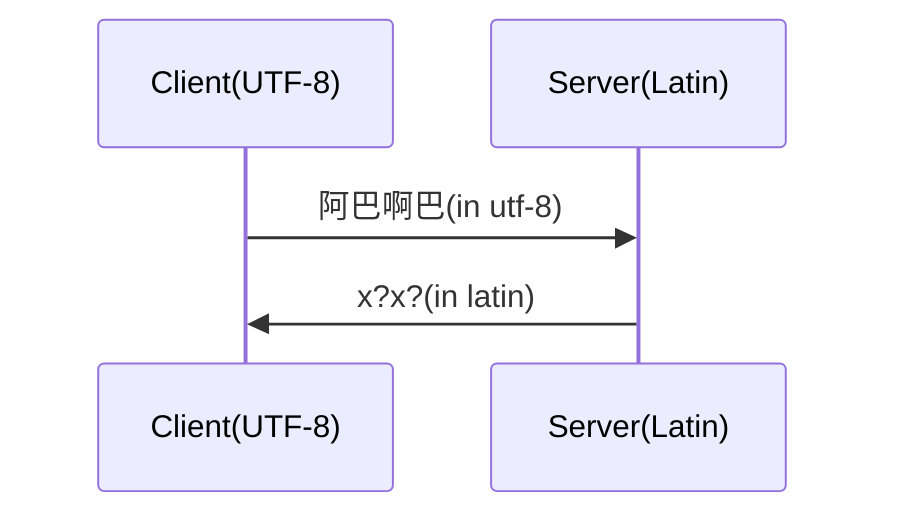

# 猫咪小程序

[TOC]

> 记录猫咪小程序在开发过程中遇到的问题和解决思路。供以后学习

## 测试类的特殊配置

### 问题描述

使用**MyBatis-Plus**时测试时，测试中报错找不到连接`java.lang.IllegalStateException: Failed to load ApplicationContext`，但是不适用测试类却能够正常运行，当时的代码如下

```java
@MybatisPlusTest
class CatMapperTest {
    @Autowired
    private CatMapper catMapper;

    @Test
    public void testSelectAll() {
        final Cat cat = catMapper.selectById(1);
        System.out.println("cat = " + cat);
    }

    @Test
    public void testInsert() {
        final Cat cat = new Cat();
        cat.setPictures(new ArrayList<>());
        cat.setNickname("Tom");
        cat.setShape("Round");
        cat.setIsMale(true);
        cat.setStatus("休学");
        cat.setLocation("南苑");
        cat.setNamed("测试输入");
        cat.setTopicId(3);
        int row = catMapper.insert(cat);
        System.out.println("cat = " + cat);
        Assertions.assertEquals(row, 1);
    }

}
```

### 解决办法

> 参考了网上的博客[解决 spring-test 出现 Failed to load ApplicationContext 的异常 - 由良大小姐 - 博客园 (cnblogs.com)](https://www.cnblogs.com/kinome/p/9628830.html)

问题来源于没有关联上相关的配置，虽然`@MybatisPlusTest`注解能够陪正确识别为springboot测试类的注解，但是这并不会和`classpath://application.yaml`相关联，也就是说配置文件不会神效，那么为什么之前写过的程序都不会出现这种问题呢？我们来看看之前写的测试类：

```java
@SpringBootTest
public class StockReaderApplicationTests {

    @Autowired
    StockReader redis;
    @Test
    void contextLoads() {
        System.out.println(redis.getDefaultStocks());
    }

}
```

我们可以看到当时使用的注解是`@SpringBootTest`，那么我们是不是加上这个注解就可以解决我们之前出现的问题呢？也就是说同时使用两个Test注解会发生啥呢？

```java
java.lang.IllegalStateException: Configuration error: found multiple declarations of @BootstrapWith for test class
```

注解冲突了，也就是说不能够在测试类上加上多个和测试配置有关的注解，会发生冲突

最终的解决办法是在测试类上加上一个`@AutoConfigureTestDatabase(replace = AutoConfigureTestDatabase.Replace.NONE)`

```java
// 最终成功的代码
@MybatisPlusTest
@AutoConfigureTestDatabase(replace = AutoConfigureTestDatabase.Replace.NONE)
class CatMapperTest {
    @Autowired
    private CatMapper catMapper;

    @Test
    public void testSelectAll() {
        final Cat cat = catMapper.selectById(1);
        System.out.println("cat = " + cat);
    }

    @Test
    public void testInsert() {
        final Cat cat = new Cat();
        cat.setPictures(new ArrayList<>());
        cat.setNickname("Tom");
        cat.setShape("Round");
        cat.setIsMale(true);
        cat.setStatus("休学");
        cat.setLocation("南苑");
        cat.setNamed("测试输入");
        cat.setTopicId(3);
        int row = catMapper.insert(cat);
        System.out.println("cat = " + cat);
        Assertions.assertEquals(row, 1);
    }

}
```

> 有个maven依赖的小坑
>
> springboot3的mybatis依赖如下，尤其主语***boot3***
>
> ```properties
> <dependency>
>     <groupId>com.baomidou</groupId>
>     <artifactId>mybatis-plus-spring-boot3-starter</artifactId>
>     <version>3.5.5</version>
> </dependency>
> 
> <dependency>
>     <groupId>com.baomidou</groupId>
>     <artifactId>mybatis-plus-boot-starter-test</artifactId>
>     <version>3.5.5</version>
> </dependency>
> ```
>
> 

## Docker部署初始化数据库

### 问题描述

无论是对于开发人员，测试人员还是运维人员，**Docker**部署无疑都是最佳的选择之一，可以让开发者忽略硬件细节，但是我们往往对于一个web应用的开发需要使用数据库，并且我们会通过SQL脚本建立相应的数据结构。可以我们又不希望启动一个数据库容器之后还需要进入该容器做初始化，那有什么更好的解决办法呢？

### 解决办法

主要有两种解决办法，一种是基于**Docker**的，另一种是基于**SpringBoot**的

- **Docker**指定**MySQL**容器的初始化脚本

  我们可以通过docker的目录挂在指定初始化的脚本。例如

  ```yaml
  services:
    wiki-db:
      image: mysql
      environment:
        MYSQL_ROOT_PASSWORD: root
      volumes:
        - ./init.sql:/docker-entrypoint-initdb.d/wiki.sql
  ```

  > 值得注意的是：数据库会执行`/docker-entrypoint-initdb.d/`目录下面的所有数据库脚本文件，但是执行顺序不确定（猜测因该是按照字母顺序来），因此不建议将相关联的数据库结构通过两个脚本文件初始化。

- **SpringBoot**在初始化是测试连接，并且自定义异常处理

  > 来自[Spring Boot实现第一次启动时自动初始化数据库-阿里云开发者社区 (aliyun.com)](https://developer.aliyun.com/article/1235027#slide-2)

  我们通过`@PostConstruct`注解进行初始化，首先检测数据库在不在，如果数据库不在，连接必然失败，那就我们就可以先不指定数据库连接，然后通过配置好的主机端口和鉴权方式连接上数据库，执行我们的初始化脚本，然后在重新连接。

  ```java
  import cn.hutool.core.io.resource.ClassPathResource;
  import jakarta.annotation.PostConstruct;
  import lombok.extern.slf4j.Slf4j;
  import org.apache.ibatis.jdbc.ScriptRunner;
  import org.springframework.beans.factory.annotation.Value;
  import org.springframework.context.annotation.Configuration;
  
  import java.io.BufferedReader;
  import java.io.FileInputStream;
  import java.io.InputStream;
  import java.io.InputStreamReader;
  import java.net.URI;
  import java.net.URISyntaxException;
  import java.nio.charset.StandardCharsets;
  import java.sql.Connection;
  import java.sql.DriverManager;
  import java.sql.SQLException;
  import java.sql.Statement;
  
  /**
   * 用于第一次启动时，初始化数据库的配置类
   */
  @Slf4j
  @Configuration
  public class DatabaseInitialize {
     
  
      /**
       * 读取连接地址
       */
      @Value("${spring.datasource.url}")
      private String url;
  
      /**
       * 读取用户名
       */
      @Value("${spring.datasource.username}")
      private String username;
  
      /**
       * 读取密码
       */
      @Value("${spring.datasource.password}")
      private String password;
  
      /**
       * 检测当前连接的库是否存在（连接URL中的数据库）
       *
       * @return 当前连接的库是否存在
       */
      private boolean currentDatabaseExists() {
     
          // 尝试以配置文件中的URL建立连接
          try {
     
              Connection connection = DriverManager.getConnection(url, username, password);
              connection.close();
          } catch (SQLException e) {
     
              // 若连接抛出异常且错误代码为1049，则说明连接URL中指定数据库不存在
              if (e.getErrorCode() == 1049) {
     
                  return false;
              }
          }
          // 正常情况下说明连接URL中数据库存在
          // 或者为其它错误代码时，不能判断数据库是否存在
          return true;
      }
  
      /**
       * 执行SQL脚本
       *
       * @param path        SQL脚本文件的路径
       * @param isClasspath SQL脚本路径是否是classpath路径
       * @param connection  数据库连接对象，通过这个连接执行脚本
       */
      private void runSQLScript(String path, boolean isClasspath, Connection connection) {
     
          try (InputStream sqlFileStream = isClasspath ? new ClassPathResource(path).getStream() : new FileInputStream(path)) {
     
              BufferedReader sqlFileStreamReader = new BufferedReader(new InputStreamReader(sqlFileStream, StandardCharsets.UTF_8));
              // 创建SQL脚本执行器对象
              ScriptRunner scriptRunner = new ScriptRunner(connection);
              // 使用SQL脚本执行器对象执行脚本
              scriptRunner.runScript(sqlFileStreamReader);
              // 最后关闭文件读取器
              sqlFileStreamReader.close();
          } catch (Exception e) {
     
              log.error("读取文件或者执行脚本失败！");
              e.printStackTrace();
          }
      }
  
      /**
       * 创建数据库
       */
      private void createDatabase() {
     
          try {
     
              // 修改连接语句，重新建立连接
              // 重新建立的连接不再连接到指定库，而是直接连接到整个MySQL
              // 使用URI类解析并拆解连接地址，重新组装
              URI databaseURI = new URI(url.replace("jdbc:", ""));
              // 得到连接地址中的数据库平台名（例如mysql）
              String databasePlatform = databaseURI.getScheme();
              // 得到连接地址和端口
              String hostAndPort = databaseURI.getAuthority();
              // 得到连接地址中的库名
              String databaseName = databaseURI.getPath().substring(1);
              // 组装新的连接URL，不连接至指定库
              String newURL = "jdbc:" + databasePlatform + "://" + hostAndPort + "/";
              // 重新建立连接
              Connection connection = DriverManager.getConnection(newURL, username, password);
              Statement statement = connection.createStatement();
              // 执行SQL语句创建数据库
              statement.execute("create database if not exists `" + databaseName + "`");
              // 关闭会话和连接
              statement.close();
              connection.close();
              log.info("创建数据库完成！");
          } catch (URISyntaxException e) {
     
              log.error("数据库连接URL格式错误！");
              throw new RuntimeException(e);
          } catch (SQLException e) {
     
              log.error("连接失败！");
              throw new RuntimeException(e);
          }
      }
  
      /**
       * 该方法用于检测数据库是否需要初始化，如果是则执行SQL脚本进行初始化操作
       */
      @PostConstruct
      private void initDatabase() {
     
          log.info("开始检查数据库是否需要初始化...");
          // 检测当前连接数据库是否存在
          if (currentDatabaseExists()) {
     
              log.info("数据库存在，不需要初始化！");
              return;
          }
          log.warn("数据库不存在！准备执行初始化步骤...");
          // 先创建数据库
          createDatabase();
          // 然后再次连接，执行脚本初始化库中的表格
          try (Connection connection = DriverManager.getConnection(url, username, password)) {
     
              runSQLScript("/create-table.sql", true, connection);
              log.info("初始化表格完成！");
          } catch (Exception e) {
     
              log.error("初始化表格时，连接数据库失败！");
              e.printStackTrace();
          }
      }
  
  }
  ```

### 总结

对于这两种解决方案各有优缺点。

- Docker的方式更加简单，只需要挂在上去就可以了，但是他也只能在Docker环境下使用，并且初始化顺序不可控。
- SpringBoot的方式过程更加可控，也不依赖Docker环境，也就是无论在Docker上还是在宿主机上都可运行，但是较为复杂，容易 出问题。

个人还是更加喜欢使用Docker，因为不大会出错，只要SQL文件没写错。

## 中文乱码问题

### 问题描述

解决数据库初始化的问题，我开始做接口测试，但是发现中文部分输出一对乱码，英文和数字部分正常，猜测：

- 数据库中的数据集存储的时候就是乱码，可能由于脚本文件的编码方式不正确。
- SpringBoot的和数据库的连接出现乱码，可能连接配置不正确。
- SpringMVC返回中文乱码，可能是没正确配置

### 解决方案

我首先尝试使用MVC测试一个返回`成功`的信号，返回显示正常，说明MVC配置没问题。然后在到数据库容器中查看原始数据，也没问题。中文可以正常显示。那么就是连接的问题。

最开始我以为连接的问题可以通过连接的url指定，但是url指定编码方式只是作用于连接的客户端，服务端没有改变。因此在多次尝试网上的url指定编码之后发现没有解决中文乱码问题，当时制定url如下

```shell
jdbc:mysql://localhost:3306/cat_wiki?serverTimezone=UTC&useUnicode=true&characterEncoding=utf-8
```

那么应该是谁的问题呢，我想重新回到数据库容器中查看，因为Springboot在我的电脑上运行的时候是没有问题的，因此我认为错的不是Springboot，而是数据库。在网上看到查看有关编码方式的配置的SQL指令`show variables like 'char%';`，果然不一样。在连接这一栏容器里面的是latin，而window上的是utf-8。latin是不支持中文的（离谱的是只有连接是latin，存储是utf-8，不知道这MySQL官方配的镜像是个啥构思。。）

解决办法也在网上找了，有的说进入容器内部里面改配置然后重启的，有的说可以直接挂在配置文件将原来的配置覆盖掉。我选择了后者。

配置文件如下：

```shell
# For advice on how to change settings please see
# http://dev.mysql.com/doc/refman/8.3/en/server-configuration-defaults.html

[mysqld]
host-cache-size=0
skip-name-resolve
datadir=/var/lib/mysql
socket=/var/run/mysqld/mysqld.sock
secure-file-priv=/var/lib/mysql-files
user=mysql
character-set-server=utf8  #重点！！

pid-file=/var/run/mysqld/mysqld.pid
[client]
socket=/var/run/mysqld/mysqld.sock
default-character-set=utf8  #重点！！

!includedir /etc/mysql/conf.d/
```

然后docker-compos是这样的：

```yaml
services:
  wiki-db:
    image: mysql
    environment:
      MYSQL_ROOT_PASSWORD: root
    volumes:
      - ./my.cnf:/etc/my.cnf # 重点！！
      - ./wiki/mock_data.sql:/docker-entrypoint-initdb.d/mock_data.sql # wiki mock sql
```

具体原理可以看下面的流程图



## 公共模块的抽离

### 问题描述

在开发小程序时，为了测试方便，我希望我能够看到每次请求时的请求路径和请求参数，以确保在网络传输部分没有问题，虽然打断点是一个可行的方案，但是由于测试环境实在docker上面，虽然通过idea连接实现打断点可行，但是太过麻烦。因此我写了一个切面，作用于所有请求路径之上，然后打印请求路径和请求参数。

```java
@Before("com.xtu.leotan.log.Pointcuts.requestMapping()")
public void requestParamLog(JoinPoint joinPoint) {
    var request =((ServletRequestAttributes)RequestContextHolder.getRequestAttributes()).getRequest();
    StringBuilder sb = new StringBuilder();
    request.getParameterMap().forEach(
        (key, value) -> sb.append(key).append("=").append(Arrays.toString(value)).append("\t")
    );
    log.info("request {} url:{},params:{}", request.getMethod(), request.getRequestURI(), sb);
}
```

但是如果其他模块也需要用这个功能，那么我需要通过复制的方式配置，但是复制是编程中的一大忌讳，复制带来的BUG是最愚蠢的BUG。因此需要抽离出一个公用模块方便其他模块使用。

### 解决方案

一开始我的想法很简单，直接将代码抽离出来，放到一个common模块中，然后其他模块通过maven引用合格模块就可以了，但是这么做出现了一个问题，那就是这个模块是需要基于Springboot进行管理的，而Springboot在没有特殊指定或者专门配置的情况下只会托管启动类所在的包下面的类。但是公共模块不知道引用模块的启动类在哪了。

最开始我使用的解决办法很简单，将公共模块所在的包添加到Springboot的扫描包中

```java
@SpringBootApplication(scanBasePackages = "com.xtu.leotan")
public class CatWikiApplication {
    public static void main(String[] args) {
        SpringApplication.run(CatWikiApplication.class, args);
    }
}
```

虽然有点傻，但是可以用，但是后面就发现了问题。

1.  扫描的包路径太大，启动速度收到影响
2. 设计原则里面，作为服务调用者，应该不需要考虑服务提供者的细节，而这里还需要知道这个的结构。

我想到那些写给spring用的starter好像就是解决了这一问题，于是在网上寻找如何写一个starter。这里还存在一个小坑。需要注意版本问题。

- Springboot3以前

  要写一个starter，我们需要有一个配置文件来说明模块应该如何有Springboot托管，咋Springboot3以前，我们只需要在`resources`目录下建一个文件`META-INF/spring.factories`，然后在里面写上相应的配置节，这些教程很多，应为springboot2都已经出来很久了，我们在网上看到的可能大多数也是这一说法。这里给出官方的一个文档说明。（网上有些教程说打包方式用pom才能生效，真实害人不浅！！）

  > [46. Creating your own auto-configuration (spring.io)](https://docs.spring.io/spring-boot/docs/2.0.0.M4/reference/html/boot-features-developing-auto-configuration.html)

  简单一点用就是：新建一个配置类（`@Configuration`等都OK），然后在配置类中配置好Bean，当然也可以指定包扫描。然后新建配置文件，在其中指定这个配置类即可，配置文件如下

  ```properties
  org.springframework.boot.autoconfigure.EnableAutoConfiguration = com.xtu.leotan.log.AutoConfiguration
  ```

  

- Springboot3

  上面的方式在Springboot3起不到任何作用，springboot3在网上的教程也很少，终于找到一篇了

  > [spring.factories将被弃用，做好Get新技能的准备了吗-CSDN博客](https://blog.csdn.net/yaomingyang/article/details/124981028)

  我们也可以看看官方是如何使用的

  > [spring-boot/spring-boot-project/spring-boot-autoconfigure/src/main/resources/META-INF/spring/org.springframework.boot.autoconfigure.AutoConfiguration.imports at main · spring-projects/spring-boot (github.com)](https://github.com/spring-projects/spring-boot/blob/main/spring-boot-project/spring-boot-autoconfigure/src/main/resources/META-INF/spring/org.springframework.boot.autoconfigure.AutoConfiguration.imports)

  其实就是`META-INF/spring.factories`变成`META-INF/spring/org.springframework.boot.autoconfigure.AutoConfiguration.imports`，然后**直接**在里面协商配置类的全限定名

## 统一返回值

### 问题描述

在前后端分离的项目中，后端和前端的开发人员需要沟通好一些接口协议，推荐使用**RESTful**规范，然而接口的返回格式需要我们自己协商。推荐的原则是最外层的返回统一形式。

网上也有很多统一返回形式的教程，但是大多数都是教你用一个泛型类将其包装一下，虽然可用，但是不好用。我之前没接触aop的时候的确用的就是这种方法，但是这样会有很多问题：

1. 每个地方都需要返回这种类型，写起来很麻烦，很多重复的代码片段。即使将其抽象出来作为一个函数也不优雅。
2. 侵入式变成，对于这个非业务上的功能，却导致业务代码发生变化，这是很危险的，并且万一那个接口忘记按照规范编写，那不直接寄。
3. 当你这份代码有第二个人接盘时，别人看到许多跟业务逻辑无关的代码。上手的学习成本太高。

### 解决方案

遇到这个问题，我当时想到的是使用aop，就像上面的打印请求日志一样。意料之外的事情是，**SpringMVC**早就帮你想到这件事情，提供了一个叫`ResponseBodyAdvice<T>`的接口然你实现，做于是有各种十分优雅地方式就形成了。

```java
// 统一返回包装类
@Data
@AllArgsConstructor
public class CommonResult<T> {

    private final static int SUCCESS_CODE = 200;

    private final static int FAIL_CODE = 400;
    private final static int ERROR_CODE = 500;

    private final static String SUCCESS_MESSAGE = "成功";
    private int code;

    private String message;

    private T data;

    private Long timestamp;


    public static <T> CommonResult<T> success(T data) {
        return new CommonResult<>(SUCCESS_CODE, SUCCESS_MESSAGE, data, System.currentTimeMillis());
    }

    public static <T> CommonResult<T> fail(String message) {
        return new CommonResult<>(FAIL_CODE, message, null, System.currentTimeMillis());
    }

    public static CommonResult<String> error(String message) {
        return new CommonResult<>(FAIL_CODE, message, null, System.currentTimeMillis());
    }
}
// ================= 增强器 ============
@RestControllerAdvice
public class ResponseAdvice implements ResponseBodyAdvice<Object> {
    @Autowired
    private ObjectMapper objectMapper;

    @Override
    public boolean supports(MethodParameter returnType, Class<? extends HttpMessageConverter<?>> converterType) {
        return true;
    }

    @Override
    @SneakyThrows
    public Object beforeBodyWrite(Object body, MethodParameter returnType, MediaType selectedContentType, Class<? extends HttpMessageConverter<?>> selectedConverterType, ServerHttpRequest request, ServerHttpResponse response) {
        if (body instanceof String) {
            return objectMapper.writeValueAsString(CommonResult.success(body));
        }
        if (body instanceof CommonResult<?> commonResult) {
            return commonResult;
        }
        return CommonResult.success(body);
    }
}

// ================= 统一的异常处理
@Slf4j
@RestControllerAdvice
@ResponseBody
public class RestExceptionHandler {
    @ExceptionHandler(Exception.class)
    public CommonResult<String> exceptionHandler(Exception e) {
        log.error("Unknown Exception:{}", e.getMessage(), e);
        return CommonResult.error(e.getMessage());
    }
}
```

> 这里有个小细节，就是如果我们不对`RestControllerAdvice`加上范围限制，他可能会导致其他中间件无法正常工作，最典型的便是swagger，因此建议：
>
> 1. 拦截器不要写在公共模块中，因为他可能作用到我们无法预料的地方
> 2. 拦截器一定要分析清楚作用域，建议加上作用域限制
