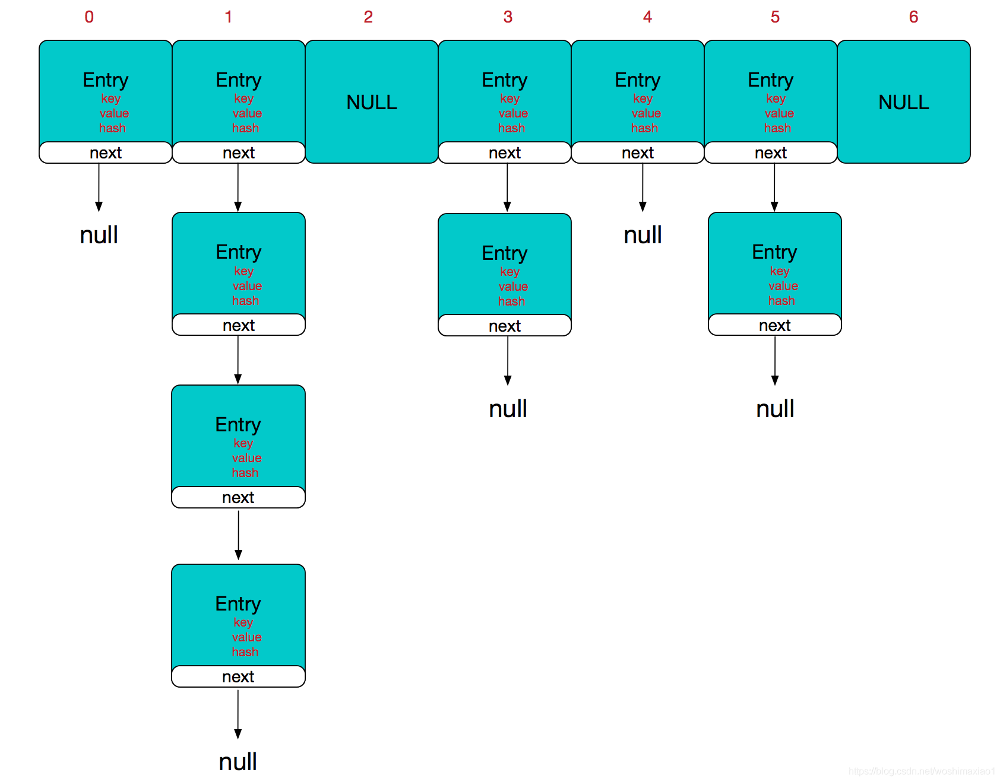
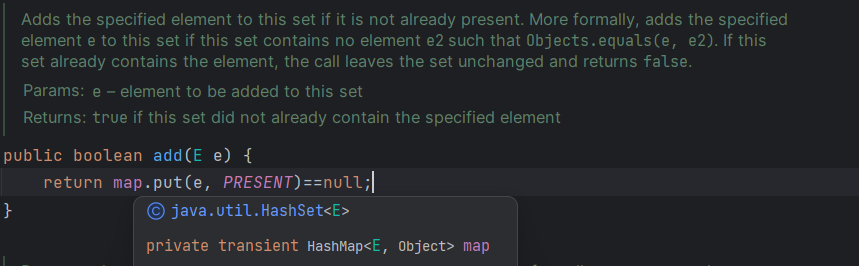
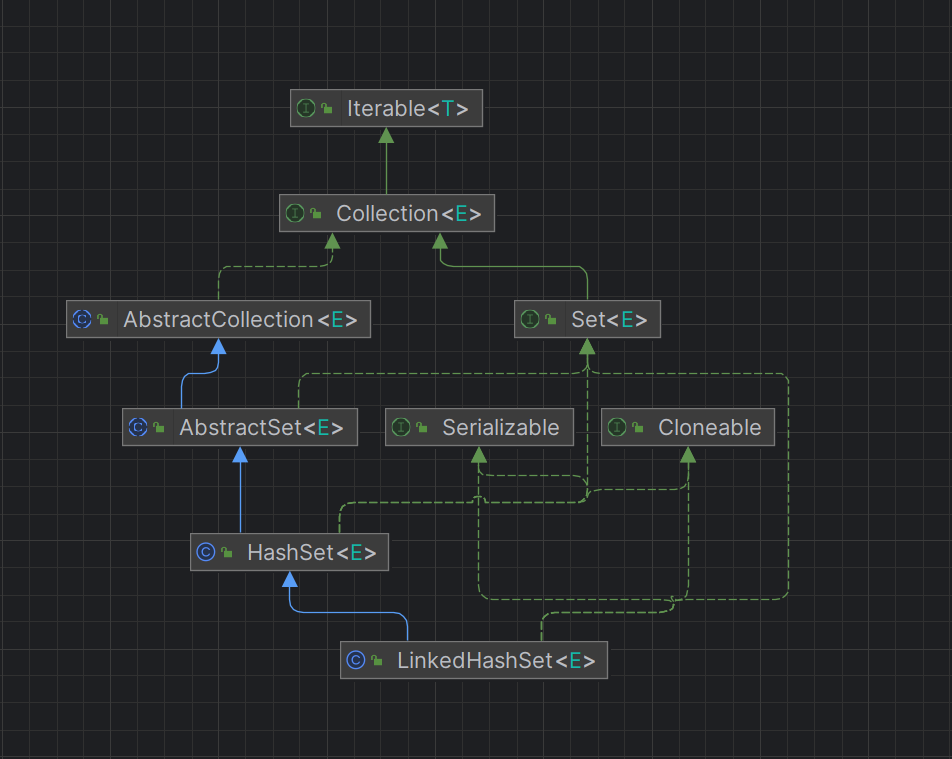
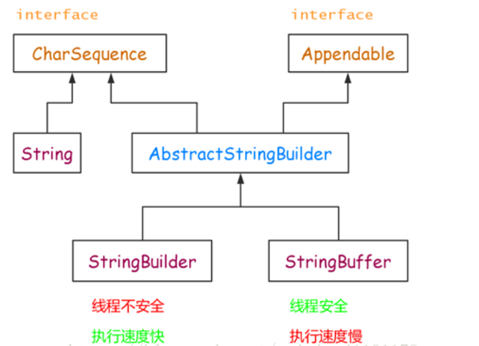
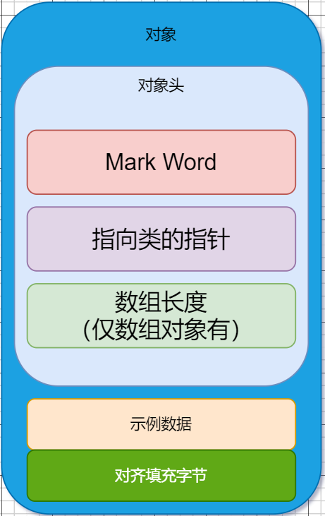
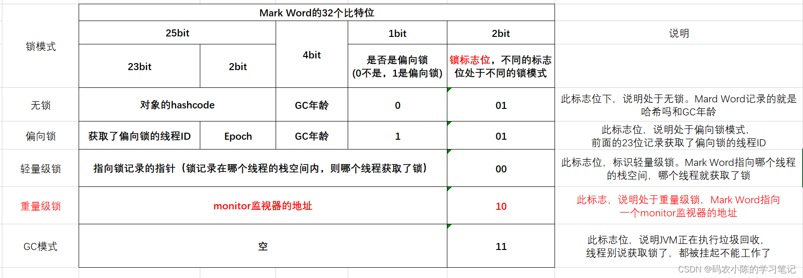
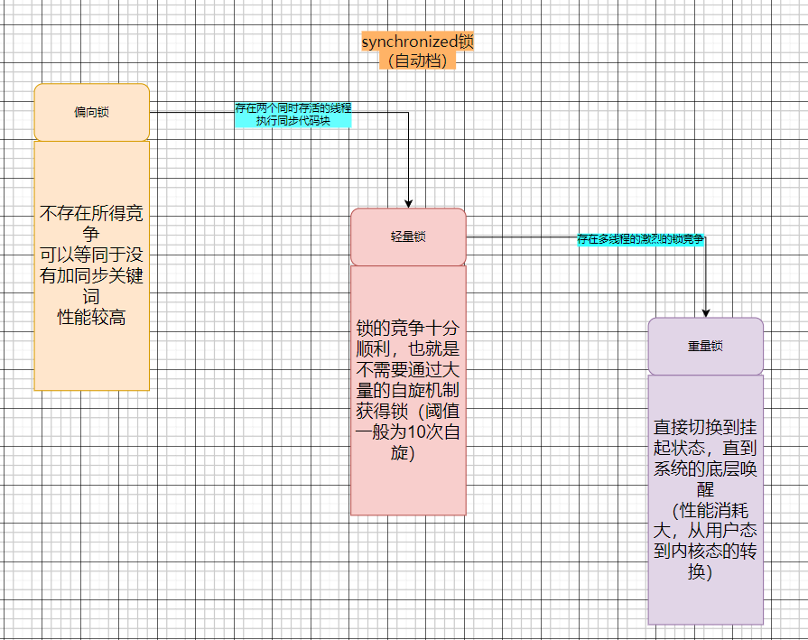
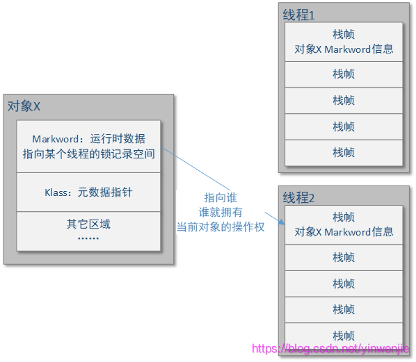
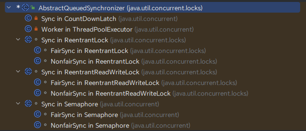
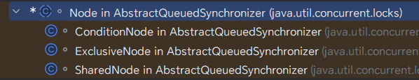

# JAVA源码分析(JDK19)

分析源码,了解原理,同时让自己的代码更加优雅


## 数据集篇(Map,List,Set)

### 1. ArrayList(同时和Vector最对比分析)

#### **原理分析**

- **ArrayList**是线程不安全的,但是在单线程环境下效率比**Vector**高,而**Vector**的操作都有**`synchronized`**,在多线程下更加安全.

- **ArrayList**的底层使用的是数组存储,他相当于是一个动态可变数组,也就是大小可变.

- 初始生成的**ArrayList**对象是一个空的数组,他指向类中的*静态不可变* **空数组**,每一次进行add操作时都会检查底层数组大小,根据需求对底层扩容.

- **ArrayList**对象在第一次使用(add操作),如果没有指定初始大小,默认为*10*;

- 对象中有个成员变量`size`,这个是指当前数组中含有的元素个数,常用来遍历数组中的数据,但是要注意,这个成员变量并不是值底层数组的长度,底层数组的长度一定*大于等于*这个`size`.

- 每一次`add()`操作都会检查对象的`size`和底层数组的`length`的大小关系:如果底层数组长度不过,就会调用`grow()`,在`grow()`里面会比较传入的增量和默认增量(*原长度的一半*)的大小,取最大的一个作为实际增量,避免了频繁的增加.确定好增量之后会调用底层的方法,并且将之前的数据copy到新的数组中,可见**ArrayList**的扩容操作是多么的费劲.

  ```java
  private Object[] grow(int minCapacity) {
      int oldCapacity = elementData.length;
      if (oldCapacity > 0 || elementData != DEFAULTCAPACITY_EMPTY_ELEMENTDATA) {
          int newCapacity = ArraysSupport.newLength(oldCapacity,//原来的大小(指的是底层数组的大小)
                                                    minCapacity - oldCapacity,//最小增量的大小
                                                    oldCapacity >> 1);//可供参考的增量大小,这里是原大小的一半
          //底层会取后两个值得最大值,与原来的大小相加(oldCapacity),得到新的大小,大多情况下是扩容为之前的1.5倍
          return elementData = Arrays.copyOf(elementData, newCapacity);//底层重建,并且将之前的数组赋值过来
      } else {
          return elementData = new Object[Math.max(DEFAULT_CAPACITY, minCapacity)];
      }
  }
  ```

  

- 无论是通过下标`remove()`,还是通过对象来`remove()`,本质上都是通过下标删除,只不过后者通过对象找到了下标.

  ```java
  public boolean remove(Object o) {
      final Object[] es = elementData;
      final int size = this.size;
      int i = 0;
      found: {
          if (o == null) {
              for (; i < size; i++)
                  if (es[i] == null)
                      break found;
          } else {
              for (; i < size; i++)
                  if (o.equals(es[i]))
                      break found;
          }
          return false;
      }
      fastRemove(es, i);
      return true;
  }
  ```

  

- `remove()`方法调用的成本校对较高,他会调用`System`底层单函数,将数组整体向前移动,但是数组的大小不会变.(*之所以说成本高,是因为我们都知道对于数组的改动操作时间复杂度为O(n)*),不过对于**ArrayList**对象中的`size`是肯定减少了,就算将**ArrayList**中的所有所有元素全部移除了,底层的数组也回不到最初的状态(指向类中的一个静态不可变空数组),而是会保留一个位置,其值为`null`

  ```java
  private void fastRemove(Object[] es, int i) {
      modCount++;//修改计数器
      final int newSize;//final修饰变量,变量只能被赋值一次,但并不一定在声明的时候赋值
      if ((newSize = size - 1) > i)//如果删除后还有元素
          System.arraycopy(es, i + 1, es, i, newSize - i);
      es[size = newSize] = null;
  }
  ```

- `clear()`函数是用来清空底层数组内容的,但是他不会修改底层数组的大小,因此他不能等同于`remove()`的封装

  ```java
  public void clear() {
      modCount++;
      final Object[] es = elementData;
      for (int to = size, i = size = 0; i < to; i++)
          es[i] = null;
  }
  ```

- `trimToSize()`可以删除空白的空间，他会根据size的大小重新将生成一个数组，但是保证数据内容不变。当估计很少会有增的操作后使用，可节省空间，但是不建议频繁使用，这是底层的操作，对性能有损耗，并且如果之后要新增数据时，又重新扩容，带来的性能开销很大。

  ```java
  public void trimToSize() {
      modCount++;
      if (size < elementData.length) {
          elementData = (size == 0)
            ? EMPTY_ELEMENTDATA
            : Arrays.copyOf(elementData, size);
      }
  }
  ```

  

- 平常对于集合的遍历,我们是手写一个for循环,对于一些复杂的操作,可能只能写for循环来完成,尤其是那些和下表有关的操作,但是对于一些简单的,无关联的操作,jdk为我们提供了一种更加优雅的方式.使用`foreach()`对集合函数操作.

  ```java
  //foreach是Iterable接口中的一个方法
  default void forEach(Consumer<? super T> action) {
      Objects.requireNonNull(action);
      for (T t : this) {
          action.accept(t);
      }
  }
  //这个是接口Iterable的默认实现
  @Override
  public void forEach(Consumer<? super E> action) {
      Objects.requireNonNull(action);
      final int expectedModCount = modCount;
      final Object[] es = elementData;
      final int size = this.size;
      for (int i = 0; modCount == expectedModCount && i < size; i++)
          action.accept(elementAt(es, i));
      if (modCount != expectedModCount)//说明遍历期间发生了数据修改,多线程环境下需要注意
          throw new ConcurrentModificationException();
  }
  //这个是ArrayList中的实现.
  ```

  `forEach`的底层其实是通过**Iterator**实现的，而**Iterator**与`fori`性能于其数据接口有关，如果底层是通过数组等连续地址空间访问，通常`fori`的性能高于**Iterator**（但是效果不明显），但是如果底层通过链表等方式访问的话，**Iterator**性能远高于`fori`，原理很简单：谁的寻址跟快，谁的性能更高。

  > 但是网上有一种说法，JVM对**Iterator**进行了性能优化，这样的话**Iterator**的各方面性能比fori强

#### **总结**

- **ArrayList**的底层是对象数组,基础类型数据使用会自动拆装箱,也可以存储**null**
- **ArrayList**在多线程环境下是不安全的,谨慎使用.但是在单线程环境下效率相对较高.多线程环境下可以考虑使用**Vector**或者其他集合类型
- **ArrayList**每次添加的时候底层的数据不一定会发生改变,但是如果发生了改变,那么时间复杂度是O(n),因此在做优化的时候,可以事先将**ArrayList**的大小根据业务提前初始化,避免到后期的动态扩容所带了的性能亏损.
- **Vector**除了在多线程安全性方面表现的比**ArrayList**好以外,其余都和**ArrayList**差不多,但是单线程下还是推荐使用**ArrayList.**
- 在一些执行周期比较长或者不确定的操作中,尽量保证对外原子化.也就是只在函数开始和结束的时候与外界进行数据交互,中间的执行过程形成一个内封闭.
- 一般情况下,当添加一个元素导致需要扩容是,扩容后的大小是原大小的1.5倍,这也就导致空白的空间剩余过多。因此如果不建议一个**ArrayList**里面的数据过多,可以考虑根据一些特点分类,然后使用多个**ArrayList**来装载数据。或者用`trimToSize()`函数将空白空间除掉。
- 如果对集合是一般的遍历，**建议使用`forEach()`**，性能更优。

### 2. LinkedList

#### **源码分析**

- **LinkedList**是双向链表和双端队列的实现类,也就是既有链表又有队列的特性.

  ```java
  //这个是LinkedList里面的一个私有内部类.
  private static class Node<E> {
      E item;
      Node<E> next;
      Node<E> prev;
      Node(Node<E> prev, E element, Node<E> next) {
          this.item = element;
          this.next = next;
          this.prev = prev;
      }
  }
  ```

- **LinkedList**对象也有一个size来标志链表当前的大小,初始为0.

- **LinkedList**对象内部两个特殊的Node对象,***first***和***last***,这两个对象可以将有些操作的复杂度直接减半

  ```java
  //根据下标定位元素
  Node<E> node(int index) {
      if (index < (size >> 1)) {	//从前面开始
          Node<E> x = first;
          for (int i = 0; i < index; i++)
              x = x.next;
          return x;
      } else {					//从后面开始
          Node<E> x = last;
          for (int i = size - 1; i > index; i--)
              x = x.prev;
          return x;
      }
  }
  ```

- **LinkedList**的添加操作默认添加到链表末端.当然你也可以指定其下标,这也就是说链表内元素的顺序不是有序的,对于一般的添加操作时间复杂度为O(1).

  ```java
  //add(E e)内部默认调用这个方法,addLast也是调用这个方法
  void linkLast(E e) {
      final Node<E> l = last;
      final Node<E> newNode = new Node<>(l, e, null);
      last = newNode;
      if (l == null)
          first = newNode;
      else
          l.next = newNode;
      size++;
      modCount++;
  }
  //addFist调用此方法
  void linkBefore(E e, Node<E> succ) {
      // assert succ != null;
      final Node<E> pred = succ.prev;
      final Node<E> newNode = new Node<>(pred, e, succ);
      succ.prev = newNode;
      if (pred == null)
          first = newNode;
      else
          pred.next = newNode;
      size++;
      modCount++;
  }
  ```

- `peek`和`get`两种方式的差异: 

  - peek翻译为偷看,peek不会抛出异常.同理还有`peekFirst`和`peekLast`

    ```java
    public E peek() {
        final Node<E> f = first;
        return (f == null) ? null : f.item;
    }
    ```

  - get就是索要,如果对方没有,他就会报错.同理还有`getFirst`和`getLast`

    ```java
    public E get(int index) {
        checkElementIndex(index);
        return node(index).item;
    }
    ```

- `clear`函数就是将所有节点的关联全部删除,并且将节点中对于value的应用也删掉,这样这个对象就会自动被GC系统回收.

  ```java
  public void clear() {
      for (Node<E> x = first; x != null; ) {
          Node<E> next = x.next;
          x.item = null;
          x.next = null;
          x.prev = null;
          x = next;
      }
      first = last = null;
      size = 0;
      modCount++;
  }
  //从上面的代码我们可以看出,LinkedList是线程不安全的
  //比如在clear是启动了一个addFirst操作,但是addFisrt操作的modCount自增又比clear的完,那么最终clear就清理不干净了
  ```

- `remove`操作其实和`clear`的内容相似,也是将节点的所有引用删除,交给GC自动回收.但是他只会删除掉链表中的一个节点,而**LinkedList**中可以有重复的对象,也就是说无法删除全部符合条件的元素节点,如果想删除全部等于o的元素节点,可以一直删除直到返回值为*false*为止.

  ```java
  public boolean remove(Object o) {
      if (o == null) {
          for (Node<E> x = first; x != null; x = x.next) {
              if (x.item == null) {
                  unlink(x);
                  return true;
              }
          }
      } else {
          for (Node<E> x = first; x != null; x = x.next) {
              if (o.equals(x.item)) {
                  unlink(x);
                  return true;
              }
          }
      }
      return false;
  }
  ```

#### 总结

- **LinkedList**的元素的添加删除，不是通过数组来完成的，所以效率很高.
- **ArrayList**和**LinkedList**比较

|            | 底层结构 | 增删的效率     | 改查的效率 |
| ---------- | -------- | -------------- | ---------- |
| ArrayList  | 可变数组 | 较低，数组扩容 | 较高       |
| LinkedList | 双向链表 | 较高，链表追加 | 较低       |

- 如何选择**ArrayList**和**LinkedList**:(因为是两个都是线程不安全的，所以在单线程的情况下考虑这两种集合）

  - 如果我们改查的操作多，选择**ArrayList**.

  - 如果我们增删的操作多，选择**LinkedList**.

    一般来说，在程序中，80%-90%都是查询，因此大部分情况下会选择**ArrayList**

### 3. HashMap

#### **源码分析**

- HashMap可以存储任何类型的数据(基础类型会自动装包),数据在底层的表现形式都是**key-value**的方式.底层将数据封装在一个Node类型的对象中,同时形成一个单向链表*key*和*value*可以使任意值,包括`null`，而所有**Node**都存储在**HashMap**对象中的`table`字段中。

  ```java
  static class Node<K,V> implements Map.Entry<K,V> {
      final int hash;
      final K key;
      V value;
      Node<K,V> next;
      
      Node(int hash, K key, V value, Node<K,V> next) {
      	this.hash = hash;
      	this.key = key;
      	this.value = value;
      	this.next = next;
  	}
  }
  ```

  

- **HashMap**底层将数据封装在一个Node中,并且将其存放在`Node[] table`数组中,每一个hash值对应一个下标,查找时只需要计算key的hash值,即可定位到table中的位置.但是不仅有链表,还有红黑树(JDK8开始的新特性)

  

- table的默认初始大小是16(**DEFAULT_INITIAL_CAPACITY**).同时引入一个加载因子(**loadFactor**)和阈值(**threshold**)的概念.当数组中

  - **capacity**:容量,也就是table数组的长度,数组容量一定是2的指数倍.
  - **阈值**:当HashMap中的键值对数量超过阈值是,HashMap会自动进行扩容,扩容后的容量会变成原容量的两倍.
  - **加载因子**:阈值大大小就等于容量乘以加载因子,每次`resize`之后,阈值都会根据容量和加载因子重新计算.
  - 设置阈值主要是为了提前准备扩容,尽量减少hash碰撞,同时因为数组的容量一定是2的指数倍,因此在扩容的时候,原数据有50%的概率不需要移动,而这就有新增的高位决定.因为每个hash在table中的位置是*由hash值和capacity大小进行* **按位与**运算得来的.是否需要一定只需要新增的高位位0即可.

- 及时尽可能的避免了hash碰撞,但是碰撞还是有可能发生.如果碰撞节点比较小,就会按照链表的方式存储数据,而当碰撞节点数量比较大时(一般是8),HashMap就是把他的结构调整成树状节点.(当前版本使用的是红黑树)

  > [HashMap之TreeNode（红黑树）源码分析_removetreenode( ) untreeify条件_年轻的叔叔的博客-CSDN博客](https://blog.csdn.net/sun112233445/article/details/103350026)

  ```java
  static final class TreeNode<K,V> extends LinkedHashMap.Entry<K,V> {
      TreeNode<K,V> parent;  //父节点
      TreeNode<K,V> left;	   
      TreeNode<K,V> right;
      TreeNode<K,V> prev;    // 当做链表连接节点时使用。
      boolean red;
      
      TreeNode(int hash, K key, V val, Node<K,V> next) {
          super(hash, key, val, next);
      }
  }
  ```

- `put`函数会判断碰撞检测是否需要重新调整大小,是否需要调整为树状结构等.

  ```java
  final V putVal(int hash, K key, V value, boolean onlyIfAbsent,
                 boolean evict) {
      Node<K,V>[] tab; Node<K,V> p; int n, i;
      if ((tab = table) == null || (n = tab.length) == 0)          //初始状态,数组为空,需要初始化
          n = (tab = resize()).length;
      if ((p = tab[i = (n - 1) & hash]) == null)                   //如果计算出下标所在的位置为空,则直接放入
          tab[i] = newNode(hash, key, value, null);
      else {
          Node<K,V> e; K k;
          if (p.hash == hash &&                //判断key是否相等的作用,先通过hash判断,可以提高性能
              ((k = p.key) == key || (key != null && key.equals(k))))
              e = p;                   
          else if (p instanceof TreeNode)      //红黑树的存放方式,因为树和链表的遍历方式不同,因此单独处理
              e = ((TreeNode<K,V>)p).putTreeVal(this, tab, hash, key, value);
          else {                               //链表的处理方式
              for (int binCount = 0; ; ++binCount) {
                  if ((e = p.next) == null) {  //链表遍历,同时使用binCount计数,用来判断碰撞的因子数
                      p.next = newNode(hash, key, value, null);  // 向链表末端插入目标数据
                      if (binCount >= TREEIFY_THRESHOLD - 1)     // 如果超过阈值,将链表变成红黑树
                          treeifyBin(tab, hash);
                      break;
                  }
                  if (e.hash == hash &&        //判断key是否相等
                      ((k = e.key) == key || (key != null && key.equals(k))))
                      break;
                  p = e;
              }
          }
          if (e != null) {                     //存在相同的key
              V oldValue = e.value;
              if (!onlyIfAbsent || oldValue == null)
                  e.value = value;             //替换操作
              afterNodeAccess(e);              //空接口    
              return oldValue;
          }
      }
      ++modCount;                              //数据的结构发生改变时执行,因此上面仅仅是替换操作,不需要自增
      if (++size > threshold)                  //阈值判断,重新调整大小
          resize();
      afterNodeInsertion(evict);               //空接口
      return null;
  }
  ```

- `get`函数会计算出key对应的hash值,然后根据hash值在表中查找

  ```java
  final Node<K,V> getNode(Object key) {
      Node<K,V>[] tab; Node<K,V> first, e; int n, hash; K k;
      if ((tab = table) != null && (n = tab.length) > 0 &&          //空表判断
          (first = tab[(n - 1) & (hash = hash(key))]) != null) {    //表中的空值判断
          
          //============key查找=============
          if (first.hash == hash &&                                 //这里对单独第一个值进行判断
              ((k = first.key) == key || (key != null && key.equals(k))))
              return first;
          if ((e = first.next) != null) {                           //遍历查找
              if (first instanceof TreeNode)                        //判断结构,如果是树就进行红黑树查找
                  return ((TreeNode<K,V>)first).getTreeNode(hash, key);
              do {
                  if (e.hash == hash &&
                      ((k = e.key) == key || (key != null && key.equals(k))))
                      return e;
              } while ((e = e.next) != null);
          }
      }
      return null;
  }
  ```

- `remove`函数

  ```java
  final Node<K,V> removeNode(int hash, Object key, Object value,
                             boolean matchValue, boolean movable) {
      Node<K,V>[] tab; Node<K,V> p; int n, index;
      if ((tab = table) != null && (n = tab.length) > 0 &&           //空表判断
          (p = tab[index = (n - 1) & hash]) != null) {               //空值判断
          Node<K,V> node = null, e; K k; V v;
          if (p.hash == hash &&                                      //对第一个节点key的相等判断
              ((k = p.key) == key || (key != null && key.equals(k))))
              node = p;
          else if ((e = p.next) != null) {
              if (p instanceof TreeNode)                             //树状结构的方式获取
                  node = ((TreeNode<K,V>)p).getTreeNode(hash, key);
              else {
                  do {                                               //链状结构的遍历
                      if (e.hash == hash &&
                          ((k = e.key) == key ||
                           (key != null && key.equals(k)))) {
                          node = e;
                          break;
                      }
                      p = e;
                  } while ((e = e.next) != null);
              }
          }
          if (node != null && (!matchValue || (v = node.value) == value ||   //对于删除的条件判断
                               (value != null && value.equals(v)))) {
              if (node instanceof TreeNode)
                  ((TreeNode<K,V>)node).removeTreeNode(this, tab, movable);
              else if (node == p)
                  tab[index] = node.next;
              else
                  p.next = node.next;
              ++modCount;
              --size;
              afterNodeRemoval(node);
              return node;
          }
      }
      return null;
  }
  ```

- 前面大量提到了红黑树,那么我们来分析一下红黑树的查找、插入和删除吧

  - `putTreeVal`插入节点(这里只是找到对应的节点交给上层,具体的值放入由上层负责,因为有可能有一些策略需要使用)

    ```java
    final TreeNode<K,V> putTreeVal(HashMap<K,V> map, Node<K,V>[] tab,
                                   int h, K k, V v) {
        Class<?> kc = null;
        boolean searched = false;
        TreeNode<K,V> root = (parent != null) ? root() : this;           //定位到根节点
        for (TreeNode<K,V> p = root;;) {
            int dir, ph; K pk;
            if ((ph = p.hash) > h)          //根据hash值得大小判断方向,说明hashmap中的红黑树的索引是hash
                dir = -1;
            else if (ph < h)
                dir = 1;
            else if ((pk = p.key) == k || (k != null && k.equals(pk)))   //判断key是否相等
                return p;                   //找到了相同的key,直接将该节点返回
            else if ((kc == null &&
                      (kc = comparableClassFor(k)) == null) ||
                     (dir = compareComparables(kc, k, pk)) == 0) {       //如果key是无法比较的
                if (!searched) {                                         //如果还没有找到
                    TreeNode<K,V> q, ch;                                 
                    searched = true;                                     //认为找到了,打个标记
                    if (((ch = p.left) != null &&
                         (q = ch.find(h, k, kc)) != null) ||
                        ((ch = p.right) != null &&
                         (q = ch.find(h, k, kc)) != null))               //对左右分支搜索
                        return q;
                }
                dir = tieBreakOrder(k, pk);  //按照特定方式生成顺序(类名或者hash比较)
            }
            TreeNode<K,V> xp = p;
            if ((p = (dir <= 0) ? p.left : p.right) == null) {          //红黑树到达叶子结点,调整树的结构
                Node<K,V> xpn = xp.next;
                TreeNode<K,V> x = map.newTreeNode(h, k, v, xpn);
                if (dir <= 0)
                    xp.left = x;
                else
                    xp.right = x;
                xp.next = x;
                x.parent = x.prev = xp;
                if (xpn != null)
                    ((TreeNode<K,V>)xpn).prev = x;
                moveRootToFront(tab, balanceInsertion(root, x));
                return null;
            }
        }
    }
    ```

  - `find`函数用来查找对应的节点

    ```java
    final TreeNode<K,V> find(int h, Object k, Class<?> kc) {
        TreeNode<K,V> p = this;
        do {
            int ph, dir; K pk;
            TreeNode<K,V> pl = p.left, pr = p.right, q;
            if ((ph = p.hash) > h)                                          //左分支
                p = pl;                         
            else if (ph < h)                                                //右分支
                p = pr;                                                    
            else if ((pk = p.key) == k || (k != null && k.equals(pk)))      //命中
                return p;                       
            else if (pl == null)                                            //左空向右偏
                p = pr;
            else if (pr == null)                                            //有空向左偏
                p = pl;
            else if ((kc != null ||                                         //两边都不为空,但是无法比较
                      (kc = comparableClassFor(k)) != null) &&
                     (dir = compareComparables(kc, k, pk)) != 0)
                p = (dir < 0) ? pl : pr;                                    //通过自己的比较方式比较并偏移
            else if ((q = pr.find(h, k, kc)) != null)                       //递归向右边寻找
                return q;
            else
                p = pl;                                                     //默认向左偏移
        } while (p != null);
        return null;
    }
    ```
  
  - **HashSet**是通过**HashMap**实现的，利用的就是**HashMap**的*K*唯一性，而**LinkedHashSet**又是继承**HashSet**的，因此这几个容器底层都是基于**HashMap**的
  
    
  
    
  

#### **总结**

- 同**ArrayList**一样,含有的数据越多,浪费的资源也就越多(默认至少有25%的空间是空的)

- 但是并不是说每个**HashMap**对象存储的数据越少越好,虽然那样会带来空间上的节约,但是这样导致发生*hash碰撞*的可能性越大.

- 和**ArrayList**一样,扩容的代价是巨大的,因此对于一个已知的或者可以确定具体范围的数据量,可以提前定义好**HashMap**的大小.

- 单纯的将数据从HashMap中移出并不会减少**HashMap**所占用的空间,因为在**HashMap**的声明周期中,所占用的空间只会扩大,不会减少.

- **HashMap**的引用其实相当广泛,**HashSet**就是底层利用**HashMap**,只不过在一些操作上面使用了默认的参数用来保证他的**Set**特性,但是要注意,**HashSet**不能覆盖Key所对应的的值,但是可以先删除后加入.

- **HashMap**还有一个比较出名的子类:**LinkedHashMap**,它在**HashMap**的基础上实现了链表的功能,他底层还存在一个链表,这个链表会因为读写的操作而该表元素顺序,这样实现一个**[LRU缓存](https://www.zhihu.com/tardis/zm/art/370972240?source_id=1005)**.

- **HashMap**并发下线程不安全,具体见 [HashMap 为什么线程不安全?](https://cloud.tencent.com/developer/article/1631902)

  - 在jdk1.7中，在多线程环境下，扩容时会造成环形链或数据丢失。

  - 在jdk1.8中，在多线程环境下，会发生数据覆盖的情况。

- 五花八门的**Map**比较：

  | 特性         | TreeMap        | HashMap        | LinkedHashMap    |
  | ------------ | -------------- | -------------- | ---------------- |
  | **排序**     | *支持*         | 不支持         | 不支持           |
  | **插入顺序** | 不保证         | 不保证         | *保证*           |
  | **查找效率** | O(log n)       | *O(1)*         | *O(1)*           |
  | **空间占用** | 通常较大       | *通常较小*     | 通常较大         |
  | **使用场景** | 需要排序的场景 | 无需排序的场景 | 需要保持插入顺序 |

### 4. Hashtable

#### **源码分析**

- **Hashtable**存放的也是**K-V**的形式,但是和**HashMap**不同的是,他不能存储`null`,无论他是当做K还是V.

- **Hashtable**是线程安全的,所有操作都使用了`synchronized`,但是这也必然会带来性能上的损耗.

- **Hashtable**底层依然是使用数组来存储数据,但是对于hash碰撞的情况,**Hashtable**只使用链表来解决,没有涉及到树.从`get`方法中可以看出

  ```java
  public synchronized V get(Object key) {
      Entry<?,?> tab[] = table;
      int hash = key.hashCode();
      int index = (hash & 0x7FFFFFFF) % tab.length;                  //hash & 0x7FFFFFFF的作用是舍弃符号位
      for (Entry<?,?> e = tab[index] ; e != null ; e = e.next) {
          if ((e.hash == hash) && e.key.equals(key)) {
              return (V)e.value;
          }
      }
      return null;
  }
  ```

- 初始大小位11,阈值位0.75,这两个值的作用和前面的**HashMap**一样.

- 在`new Hashtable`时就会自动生成一个数组,会占用实际空间,前面的**HashMap**也是一样,这里注意和**List**区别开来

- 和**HashMap**一样,clear只是将表中的所有元素设为`null`,表的大小不会改变,在整个生命周期中,表只会增大,不会变小.

- `clone`函数是深度clone,但是需要注意的是,对于之前 的数据的引用还是没有变,也就是说就算复制了,复制后的**Hashtable**对象还是可以通过改变其中的**Value**影响前者的内容.分析了前面HashMap的源码,发现十分相似,仅仅只是吧结构完全的复制了.看了其他的数据集合体,发现基本都是只clone结构.

  ```java
  protected Object clone() {
      return new Entry<>(hash, key, value,
                            (next==null ? null : (Entry<K,V>) next.clone()));
  }
  //上面的是Entry的clone函数,也就是具体数据的clone
  //下面的Hashtable的clone函数
  public synchronized Object clone() {
      Hashtable<?,?> t = cloneHashtable();
      t.table = new Entry<?,?>[table.length];
      for (int i = table.length ; i-- > 0 ; ) {
          t.table[i] = (table[i] != null)
              ? (Entry<?,?>) table[i].clone() : null;
      }
      t.keySet = null;
      t.entrySet = null;
      t.values = null;
      t.modCount = 0;
      return t;
  }
  ```

- **Hashtable**重新调整大小的函数叫做`rehash`

  ```java
  protected void rehash() {
      int oldCapacity = table.length;
      Entry<?,?>[] oldMap = table;
      int newCapacity = (oldCapacity << 1) + 1;         //扩大两倍再加一
      if (newCapacity - MAX_ARRAY_SIZE > 0) {           //扩容后的容量大小检查,防止过大导致不可用,
          if (oldCapacity == MAX_ARRAY_SIZE)            //容量已经达到峰值,直接返回
              return;
          newCapacity = MAX_ARRAY_SIZE;                 //扩容到最大
      }
      Entry<?,?>[] newMap = new Entry<?,?>[newCapacity];//新建了一个entry数组
      modCount++;
      threshold = (int)Math.min(newCapacity * loadFactor, MAX_ARRAY_SIZE + 1);    //阈值改变
      table = newMap;
      for (int i = oldCapacity ; i-- > 0 ;) {           //将之前的hash表中的值重新计算放入新的表中
          for (Entry<K,V> old = (Entry<K,V>)oldMap[i] ; old != null ; ) {
              Entry<K,V> e = old;
              old = old.next;
              int index = (e.hash & 0x7FFFFFFF) % newCapacity;
              e.next = (Entry<K,V>)newMap[index];
              newMap[index] = e;
          }
      }
  }
  ```

#### **总结**

- **HashMap**和**HashTable**的区别(面试题)

  - 1、线程的安全性不同
    **HashMap**线程不安全（在多线程并发会造成死锁问题）但是他的效率比HashTable高，大部分都是单线程操作

    **HashTable**线程安全 （他的每一个方法都加了锁，适用于多线程并发的环境）

  - 2、继承的父类不同
    **HashMap**是继承**AbstractMap**类 都实现了 *map*，*cloneable* *serializable* 接口

    **HashTable**是继承**Dictionary**类 都实现了 *map*，*cloneable* *serializable* 接口

  - 3、初始容量大小和每次扩容大小不同

    **HashTable**默认的初始大小为11 每次扩充为2n+1,可以自由定义初始容量

    ***HashMap***默认的初始化大小是16 每次扩充为2倍,并且容量始终是2的指数倍

  - 4、*key*和*value*是否允许为null值
    **HashTable**中，*key*和*value*都不能为`null`

    **HashMap**中，可以允许*key*和*value*为空的且存储在数组索引为0处

  - 5、遍历方式不同
    **Hashtable**比**HashMap**多一个`elements`方法。

  - 6、对于hash碰撞的处理方式不一样

    **HashTable**对于hash碰撞只用链表来处理

    **HashMap**对于hash碰撞的处理能力比较强,当超过一个特定值(默认是8),他会将链表转化成红黑树.

- **HashTable**和**HashMap**一样,扩容带来的开销很大.因此尽量避免扩容操作,扩容是不可逆的,也就是说,在对象的生命周期**只会扩大,不会缩小**

- **HashTable**是一个已经过世的数据结构,尽量不要使用.可以用**ConcurrentHashMap**替代

- **Properties**是**HashTable**的继承子类,实现原理和父类大体相似,但是子类可以从*xxx.properties*文件中,加载数据到**Properties**类对象,并讲行卖取和修改(调用`load`()方法即可从输入流中读取配置文件)


### 5. TreeMap(红黑树)

#### **源码分析**

- 从名字就可以看出,他是以树状结构存储数据的,没有使用数组,也就是说,扩容的开销相对于前面的**HashMap**和**HashTable**都要小,而且占用空间是动态的,不需要指定.

- 内部使用一个成员变量*root*来保存树的根节点,TreeMap使用的是红黑树结构.内部使用一个**boolean**值来确定颜色(***RED,BLACK***)

- `put`函数源码如下:

  ```java
  private V put(K key, V value, boolean replaceOld) {
      Entry<K,V> t = root;
      if (t == null) {                                  //如果是一个还没有初始化的空的数
          addEntryToEmptyMap(key, value);
          return null;
      }
      int cmp;
      Entry<K,V> parent;                                //要插入的对象的位置的父节点
      Comparator<? super K> cpr = comparator;                                //对象的比较器
      if (cpr != null) {            //比较器不为空,也就是说外部定义了比较器,而不需要实体类实现comparable接口
          do {                      //红黑树搜索,其实也就是普通的二叉树搜索,
              parent = t;
              cmp = cpr.compare(key, t.key);
              if (cmp < 0)
                  t = t.left;
              else if (cmp > 0)
                  t = t.right;
              else {
                  V oldValue = t.value;
                  if (replaceOld || oldValue == null) {
                      t.value = value;
                  }
                  return oldValue;
              }
          } while (t != null);
      } else {                      //比较器为空,需要实体类实现comparable接口,使用实体类Key的比较方法来比较
          Objects.requireNonNull(key);
          @SuppressWarnings("unchecked")  //只是编译时忽略检查,但是在运行时发生类型不符时会抛出异常
          Comparable<? super K> k = (Comparable<? super K>) key;             //实体类Key的比较器
          //其实这里和上面的额那部分是一样的,只需要更改一下比较器这里竟然没有代码复用!!!
          do {
              parent = t;
              cmp = k.compareTo(t.key);
              if (cmp < 0)
                  t = t.left;
              else if (cmp > 0)
                  t = t.right;
              else {
                  V oldValue = t.value;
                  if (replaceOld || oldValue == null) {
                      t.value = value;
                  }
                  return oldValue;
              }
          } while (t != null);
      }
      addEntry(key, value, parent, cmp < 0);  //插入节点
      return null;
  }
  ```

- 我们可以看到,所有方法均没有使用`synchronized`关键字上锁,说明在高并发的情况下**TreeMap**是不安全的.

- `get`函数的查找逻辑和`put`的其实差不多,所以我没想明白为什么不在向上抽象一层

  ```java
  final Entry<K,V> getEntry(Object key) {
      if (comparator != null)
          return getEntryUsingComparator(key);
      Objects.requireNonNull(key);
      @SuppressWarnings("unchecked")
          Comparable<? super K> k = (Comparable<? super K>) key;
      Entry<K,V> p = root;
      while (p != null) {
          int cmp = k.compareTo(p.key);
          if (cmp < 0)
              p = p.left;
          else if (cmp > 0)
              p = p.right;
          else
              return p;
      }
      return null;
  }
  ```

- `clear`函数就比较简单了,他就是吧根节点设置位`null`,其余节点也就自动会被**GC系统**回收了,当然具体还要看**GC机制**

- `clone`函数和其他的一样,也就是把结构复制一下.

- 对于树状结构的一些调整,**TreeMap**使用的是循环而不是递归,这样有助于减少性能损耗,因为递归对栈的空间损耗很大.

- 插入和删除后都需要重新调整树的结构

  - 插入后调整

  ```java
  private void fixAfterInsertion(Entry<K,V> x) {
      x.color = RED;
      while (x != null && x != root && x.parent.color == RED) {//每一次循环后的结果,x都是红色的
          if (parentOf(x) == leftOf(parentOf(parentOf(x)))) {  //如果父节点是左分支
              Entry<K,V> y = rightOf(parentOf(parentOf(x)));   //爷节点的右分支,相当于伯父节点
              if (colorOf(y) == RED) {                         //伯父节点的颜色如果为红色
                  setColor(parentOf(x), BLACK);                
                  setColor(y, BLACK);                          //伯父节点和父节点都变成黑色
                  setColor(parentOf(parentOf(x)), RED);        //祖父节点变成红色
                  x = parentOf(parentOf(x));                   //向上移动两层
              } else {                                         //伯父节点的颜色如果为黑色
                  if (x == rightOf(parentOf(x))) {             //如果当前节点是右,则向上移动并且旋转
                      x = parentOf(x);
                      rotateLeft(x);
                  }
                  setColor(parentOf(x), BLACK);                //父节点变成黑色
                  setColor(parentOf(parentOf(x)), RED);        //祖父节点变成红色
                  rotateRight(parentOf(parentOf(x)));          //旋转
              }
          } else {								// 与上面的知识左右的方向相反而已,其余的操作相同
              Entry<K,V> y = leftOf(parentOf(parentOf(x)));
              if (colorOf(y) == RED) {
                  setColor(parentOf(x), BLACK);
                  setColor(y, BLACK);
                  setColor(parentOf(parentOf(x)), RED);
                  x = parentOf(parentOf(x));
              } else {
                  if (x == leftOf(parentOf(x))) {
                      x = parentOf(x);
                      rotateRight(x);
                  }
                  setColor(parentOf(x), BLACK);
                  setColor(parentOf(parentOf(x)), RED);
                  rotateLeft(parentOf(parentOf(x)));
              }
          }
      }
      root.color = BLACK;
  }
  ```

  ```mermaid
  graph LR
  classDef default fill: #f9a, stroke: #333, stroke-width: 5px;
  bofu{{伯父节点颜色}}
  
  PR1(父节点和伯父节点设置为黑色)
  PR2(爷爷节点设置为红色)
  PR3(指正移动到爷节点)
  
  PB{{父节点和自身的位置关系}}
  
  PBS1(指针移动到父节点)
  PBS2(自身方向旋转)
  
  PBD1(父节点设为黑色)
  PBD2(爷节点设为红色)
  PBD3(自身相反方向旋转)
  
  bofu--红色-->PR1-->PR2-->PR3
  bofu--黑色-->PB--不同侧-->PBD1-->PBD2-->PBD3
  PB--同侧-->PBS1-->PBS2
  
  ```
  
  
  
  - 删除后调整
  
  ```java
  private void fixAfterDeletion(Entry<K,V> x) {
      while (x != root && colorOf(x) == BLACK) {
          if (x == leftOf(parentOf(x))) {
              Entry<K,V> sib = rightOf(parentOf(x));//兄弟节点
              if (colorOf(sib) == RED) {            //如果是红色
                  setColor(sib, BLACK);             //变色
                  setColor(parentOf(x), RED);
                  rotateLeft(parentOf(x));          //旋转
                  sib = rightOf(parentOf(x));       //旋转之后需要重新获取兄弟节点
              }
              if (colorOf(leftOf(sib))  == BLACK &&
                  colorOf(rightOf(sib)) == BLACK) { //如果子节点都是黑色
                  setColor(sib, RED);               //将兄弟节点设置为红色
                  x = parentOf(x);                  //向上移动进行循环
              } else {                              //如果子节点不都为黑色
                  if (colorOf(rightOf(sib)) == BLACK) {//如果右边为黑色,左边不是黑色,就把左边变成黑色,并且旋转
                      setColor(leftOf(sib), BLACK);
                      setColor(sib, RED);
                      rotateRight(sib);
                      sib = rightOf(parentOf(x));   //旋转后重新寻找兄弟节点
                  }
                  setColor(sib, colorOf(parentOf(x)));//将兄弟节点设置和父节点颜色一致
                  setColor(parentOf(x), BLACK);     //将父节点设置为黑色
                  setColor(rightOf(sib), BLACK);    //将兄弟节点的右节点设置为黑色
                  rotateLeft(parentOf(x));          //旋转
                  x = root;                         //向上移动进行循环
              }
          } else { // 与上面的知识左右的方向相反而已,其余的操作相同
              Entry<K,V> sib = leftOf(parentOf(x));
              if (colorOf(sib) == RED) {
                  setColor(sib, BLACK);
                  setColor(parentOf(x), RED);
                  rotateRight(parentOf(x));
                  sib = leftOf(parentOf(x));
              }
              if (colorOf(rightOf(sib)) == BLACK &&
                  colorOf(leftOf(sib)) == BLACK) {
                  setColor(sib, RED);
                  x = parentOf(x);
              } else {
                  if (colorOf(leftOf(sib)) == BLACK) {
                      setColor(rightOf(sib), BLACK);
                      setColor(sib, RED);
                      rotateLeft(sib);
                      sib = leftOf(parentOf(x));
                  }
                  setColor(sib, colorOf(parentOf(x)));
                  setColor(parentOf(x), BLACK);
                  setColor(leftOf(sib), BLACK);
                  rotateRight(parentOf(x));
                  x = root;
              }
          }
      }
      setColor(x, BLACK);
  }
  ```

#### **总结**

- **TreeMap**在键的判断的时候没有使用hash值进行判断,相对于**HashMap**存放数据和取数据是的时间开销可能大一点.底层的比较就是通过实体类(需要实现**comparable**接口)或者外部定义的比较器进行比较.

- 因为TreeMap底层就是使用树来实现的,没有扩容的操作,因此对于扩容的开销十分小.

- **TreeMap**底层使用的是**红黑树结构**,能够自平衡,但是自平衡的开销目前不清楚究竟有多大.由于是树状结构,因此对象在内存中的大小和对象所存储的数据的大小成**一次相关**.

- 当需要对键排序是建议使用**TreeMap**,否则可以使用**HashMap**,因为**HashMap**如果使用的合理(尽量减少扩容这一操作),性能上还是比**TreeMap**的要高一点

  > **Map**和**Set**的对比
  >
  > **Set**是单个值的存储，具有唯一性，常见的实现类有**HashSet**(无序)、**TreeSet**(按大小排序)、**LinkedHashSet**(按照添加顺序排序)
  >
  > **Map**是键值对存储，键具有唯一性，常见的实习类有**HashMap**(无序)、**TreeMap**(按大小排序)、**LinkedHashMap**(按添加顺序排序)

### 6. ConcurrentHashMap

#### 源码分析

- `put`函数

  ```java
  final V putVal(K key, V value, boolean onlyIfAbsent) {
      if (key == null || value == null) throw new NullPointerException(); //说明key和value是不能为null的
      int hash = spread(key.hashCode());   //(h ^ (h >>> 16)) & HASH_BIT; 其中HASH_BIT=0x7FFFFFFF
      int binCount = 0;
      for (Node<K,V>[] tab = table;;) {
          Node<K,V> f; int n, i, fh; K fk; V fv;
          if (tab == null || (n = tab.length) == 0)                       //空表判断
              tab = initTable();
          else if ((f = tabAt(tab, i = (n - 1) & hash)) == null) {        //如果找到的父表的位置为空
              if (casTabAt(tab, i, null, new Node<K,V>(hash, key, value)))
                  break;                                                  //没有hash碰撞,直接插入元素
          }
          else if ((fh = f.hash) == MOVED)                                //如果当前对象正在扩容
              tab = helpTransfer(tab, f);                                 //加入其他线程一同扩容
          else if (onlyIfAbsent     //如果只允许空白时插入,
                   && fh == hash    //发生hash碰撞
                   && ((fk = f.key) == key || (fk != null && key.equals(fk)))//key相等
                   && (fv = f.val) != null)//值不为空
              return fv;            //直接退出
          else {
              V oldVal = null;
              synchronized (f) {            //这里只给一个元素单独上锁,减少了锁带来的性能损耗
                  if (tabAt(tab, i) == f) {
                      if (fh >= 0) {
                          binCount = 1;
                          for (Node<K,V> e = f;; ++binCount) {//链表搜索
                              K ek;
                              if (e.hash == hash &&
                                  ((ek = e.key) == key ||
                                   (ek != null && key.equals(ek)))) {
                                  oldVal = e.val;
                                  if (!onlyIfAbsent)
                                      e.val = value;
                                  break;
                              }
                              Node<K,V> pred = e;
                              if ((e = e.next) == null) {
                                  pred.next = new Node<K,V>(hash, key, value);
                                  break;
                              }
                          }
                      }
                      else if (f instanceof TreeBin) {//红黑树搜索
                          Node<K,V> p;
                          binCount = 2;
                          if ((p = ((TreeBin<K,V>)f).putTreeVal(hash, key,
                                                         value)) != null) {
                              oldVal = p.val;
                              if (!onlyIfAbsent)
                                  p.val = value;
                          }
                      }
                      else if (f instanceof ReservationNode)
                          throw new IllegalStateException("Recursive update");
                  }
              }
              if (binCount != 0) {                    //如果插入节点找到,判断是否需要扩容
                  if (binCount >= TREEIFY_THRESHOLD)
                      treeifyBin(tab, i);
                  if (oldVal != null)
                      return oldVal;
                  break;
              }
          }
      }
      addCount(1L, binCount);
      return null;
  }
  ```

#### 总结

- 从上面的源码中我们发现,其实他和**HashMap**还是比较相似的,都使用了红黑树和链表来解决hash碰撞的问题,只不过对于可能改变数据的结构的一些结构加上了对象锁机制,同时和**HashTable**不同,他并不是将整个表锁住,而是尽可能的缩小对象锁的影响范围,这相对于**HashTable**自然是有着更高的效率.
- 在多线程的开发环境下还是推荐使用**ConcurrentHashMap**,而不是**HashTable**和**HashMap**更不要将**TreeMap**了.
- 和**HashMap**一样,扩容带来的性能消耗是巨大的,因此建议在初始化时合理的规划初始容量,初始容量必须是2的指数倍.
- 和HashMap一样,底层的数据变更都是使用**[Unsafe类](https://zhuanlan.zhihu.com/p/82257645)**来操作的,也都使用了**[CAS](https://zhuanlan.zhihu.com/p/55461024)**(*Compare And Swap*)思想.

## 基础数据类型

### 1. String

#### **源码分析**

【最浅显易懂的 KMP 算法讲解】 【精准空降到 07:09】 https://www.bilibili.com/video/BV1AY4y157yL/?share_source=copy_web&vd_source=35872e32a14b2e305d99d420da37a552&t=429

- 误区一:**String**就是`char`数组吗?[**NO**]

  ```java
  private final byte[] value;
  ```

  为什么不用`char[]`数组二用`byte[]`，因为**String**还需要考虑字符编码的问题，如果使用`char[]`，那么就只能使用**UTF-16**了，

  > 误区：**Java中的char占用2个字节**，和C语言以及C++中的不一样，因此Java中的一个char也可以表示汉字。

- 误区二:**String**对象`length()`就是字符串中字符的长度[**NO**]

  ```java
  public int length() {
      return value.length >> coder();
  }
  ```

  其中的`value.length`就是byte的长度,而`coder()`表示当前字符串的编码单位,**String**内置的编码单位有**UTF-16和LATIN1**.但是了解编码就知道,现代型的大部分编码规范中,每个字符锁占用的字节数并不是固定的(主要是方便扩充字符集).比如有些字符在**UTF-16**编码中可能栈4个字节,6个字节等.

  那应该如何获取字符串中所对应的字符数呢?[*打印时的输出个数*].**String**为我们提供了一个叫`codePointCount()`的函数.

- `coder()`函数中的JIT编译器小知识：

  ```java
  static final boolean COMPACT_STRINGS;
  static {
      COMPACT_STRINGS = true;
  }
  byte coder() {
      return COMPACT_STRINGS ? coder : UTF16;
  }
  ```

  从上面我们可以看到`COMPACT_STRINGS`是一个常量，`COMPACT_STRINGS`的注释中解释道：

  > 如果禁用字符串压缩，则 value 中的字节始终以 UTF16 编码。 对于具有多种可能实现路径的方法，当禁用字符串压缩时，仅采用一种代码路径。 实例字段值通常对于优化 JIT 编译器来说是不透明的。 因此，在性能敏感的地方，在检查编码器字段之前首先对静态布尔值 COMPACT_STRINGS 进行显式检查，因为静态布尔值 COMPACT_STRINGS 将被优化 JIT 编译器**常量折叠**。 这些情况的习语如下。 对于诸如以下的代码： if (coder == LATIN1) { ... } 可以更优化地编写为 if (coder() == LATIN1) { ... } 或： if (COMPACT_STRINGS && coder == LATIN1) { 。 .. } 优化的 JIT 编译器可以将上述条件折叠为： COMPACT_STRINGS == true => if (coder == LATIN1) { ... } COMPACT_STRINGS == false => if (false) { ... }

  这其中有一个小知识点叫**常量折叠**，与之相关的另外一个叫做**常量传播**，具体可以看[Java之常量折叠、常量传播](https://www.jianshu.com/p/96dcb3a9b3c9)，这里就简单做个总结。

  - **常量折叠**

    常量折叠是Java在编译期做的一个优化，简单的来说，在编译期就把一些表达式计算好，不需要在运行时进行计算。
    比如: `int a = 1 + 2`，经过常量折叠后就变成了`int a = 3`。

  - **[常量传播](https://blog.csdn.net/qq_45670844/article/details/121670378#:~:text=3.3-,%E5%B8%B8%E6%95%B0%E4%BC%A0%E6%92%AD,-%E5%B8%B8%E6%95%B0%E4%BC%A0%E6%92%AD%EF%BC%88constant)**

    如果在调用过程时知道哪些变量将具有常量值，以及这些值将是什么，则编译器可以在编译时期简化常数。比如：

    ```java
    int x = 14;
    int y = 7 - x / 2;
    return y * (28 / x + 2);      
    ```
    
    上面代码会被JIT优化成
    
    ```java
    int x = 14;
    int y = 0;
    return 0;
    ```

- `codePointCount()`函数获取**String**对象的某个区间在打印时输出的字符个数

  ```java
  public int codePointCount(int beginIndex, int endIndex) {
      Objects.checkFromToIndex(beginIndex, endIndex, length());
      if (isLatin1()) {
          return endIndex - beginIndex;
      }
      return StringUTF16.codePointCount(value, beginIndex, endIndex);
  }
  ```

  如果要获取全长,一般写成`str.codePointCount(0,str.length())`

- 误区三:`str.equal()`返回**FALSE**,他输出的内容也就不一样[**NO**]

  equal函数是一个整体判断是否相等,也就是说,只有两个对象的所有成员变量都相等的时候,equal才会返回**TRUE**,

  但是如果编码不相同,即使输出是同样的,但是`equal`还是返回**FALSE**.外部在大部分情况下都是使用`Object.equal()`来判断两个对象是否相等,但是对于**String**类型来说,可以对象输出内容可能还是相等,这对于一些查找会出问题,比如从**HashMap**中的通过Key查找数据,但是如果**存**和**取**的时候用的Key的编码不一样,那就找不到原来的值,而且在外部开来没有添加进去.

  那如果我们想要解决上面的问题该怎么办?一般就是统一编码规范.


- 使用双引号的字符串会在需要时自动包装类,并且添加到**String**的常量池中.但是注意,*new*出来的对象不会添加到常量池,如果想手动*new*出来的对象添加到常量池,可使用函数 `intern()`;返回值就是常量池中的**String**对象的引用.

- **String**类型中也有对**正则表达式**的使用

  ```java
  public boolean matches(String regex) {
  	return Pattern.matches(regex, this);
  }
  
  public String replaceFirst(String regex, String replacement) {
      return Pattern.compile(regex).matcher(this).replaceFirst(replacement);
  }
  
  public String replaceAll(String regex, String replacement) {
      return Pattern.compile(regex).matcher(this).replaceAll(replacement);
  }
  
  public String replace(CharSequence target, CharSequence replacement) {
      return Pattern.compile(target.toString(), Pattern.LITERAL).matcher(
              this).replaceAll(Matcher.quoteReplacement(replacement.toString()));
  }
  ```

- `charAt`函数返回的是一个char,但是上面提到对于**String**类型还需要考虑编码问题,因此`charAt`并不能完全保证拿到的数据对应输出的数据.但是`trim`函数放心用,因为底层有调用了和编码对应的处理函数,也就解决了编码问题.总而言之,对于`charAt`函数的使用返回的是char而不是**String**,因此无法解决编码问题.我们不能只使用`charAt`来自己实现`trim`,而不判断编码

  ```java
  public String trim() {
      String ret = isLatin1() ? StringLatin1.trim(value)
                              : StringUTF16.trim(value);
      return ret == null ? this : ret;
  }
  ```

- **String**有两个兄弟类:**StringBuffer**和**StringBuilder**,但是他们和String不同,他们是可以改变的,**String**一旦复制就不可以改变了.

  - **StringBuffer**是可变字符串,效率低,但是线程安全.

  - **StringBuilder**是可变字符序列,效率高,线程不安全.

    

### 2. Integer(Byte、Short、Long、Double、Float类比)

#### **源码分析**

- **Integer**是*int*的包装类,在jvm运行期间可以自动装包拆包.

- **Integer**装包过程会查询自己的常量池,如果原始数据命中常量池中的数据,就不新生成对象,直接返回常量池对象.否则生成新的常量放入类常量池.对于**Integer**,**Long**等类,当数据在(-128,127)内会自动放入常量池.也可以调用

  ```java
  public static Integer valueOf(int i) {//装包的时候自动调用
      if (i >= IntegerCache.low && i <= IntegerCache.high)
          return IntegerCache.cache[i + (-IntegerCache.low)];
      return new Integer(i);
  }
  ```

- **Integer**类中有一个`parseInt()`函数用来将字符串解析成int值，而这段代码中隐藏着一个小小的技巧，从中能够体现出JDK的严谨性

  ```java
  public static int parseInt(String s) throws NumberFormatException {
      return parseInt(s,10);
  }
  
  public static int parseInt(String s, int radix) throws NumberFormatException {
      if (s == null) {
          throw new NumberFormatException("Cannot parse null string");
      }
      if (radix < Character.MIN_RADIX) {
          throw new NumberFormatException("radix " + radix +
                                          " less than Character.MIN_RADIX");
      }
      if (radix > Character.MAX_RADIX) {
          throw new NumberFormatException("radix " + radix +
                                          " greater than Character.MAX_RADIX");
      }
      boolean negative = false;
      int i = 0, len = s.length();
      int limit = -Integer.MAX_VALUE;
      if (len > 0) {
          char firstChar = s.charAt(0);
          if (firstChar < '0') { // 带有符号的情况
              if (firstChar == '-') {
                  negative = true;
                  limit = Integer.MIN_VALUE;
              } else if (firstChar != '+') {
                  throw NumberFormatException.forInputString(s, radix);
              }
              if (len == 1) { // 只有符号的情况
                  throw NumberFormatException.forInputString(s, radix);
              }
              i++;
          }
          // 由于符号问题，这是最大因子的相反数，用来检查解析结果的范围，尽可能提前检测出内存溢出（超出范围）的情况
          int multmin = limit / radix; 
          int result = 0;
          while (i < len) {
              // 在负方向累加数值，防止超出最大值
              int digit = Character.digit(s.charAt(i++), radix);
              if (digit < 0 || result < multmin) {
                  throw NumberFormatException.forInputString(s, radix);
              }
              result *= radix;
              if (result < limit + digit) {
                  throw NumberFormatException.forInputString(s, radix);
              }
              result -= digit;
          }
          return negative ? result : -result;
      } else {
          throw NumberFormatException.forInputString(s, radix);
      }
  }
  ```

  大致的过程概括为：

  - 验证字符串合法
  - 判断符号
  - 解析数值

  其中在解析数值时我们发现，他居然用负数来处理数值部分。为啥不用正数呢？从一篇博客中找到答案。[java parent函数](https://blog.51cto.com/u_16099324/6462118)

  > 严谨是这段程序最大的特点，因为有符号int的上下限是**-2147483648~2147483647**，可见负数表达的范围比正数多一个，这样就好理解为什么在开头要把limit全部表达为负数(下限)，这样的操作减少了后续的判断，可以一步到位，相当于二者选择取其大一样，大的包含了小的。同理，那么multmin也就是负数了，而且可以认为是只和进制参数radix有关系。

  举个例子，假设使用正数解析数值，现在我们要解析`“-2147483648”`，首先字符串合法，符号为负，然后处理数值部分，但是对于正数来讲，最大的数是**2147483647**，因此在解析时就会发生内存溢出，无法解析出正确的结果。而是用负数九可以避免这种情况。

- 与此同时，我们还返现一个也可以用来解析数值的方法`valueOf()`，那么`valueOf()`和上面的`parseInt()`有什么区别呢？

  ```java
  public static Integer valueOf(String s, int radix) throws NumberFormatException {
      return Integer.valueOf(parseInt(s,radix));
  }
  
  public static Integer valueOf(String s) throws NumberFormatException {
      return Integer.valueOf(parseInt(s, 10));
  }
  
  public static Integer valueOf(int i) {
      // -128~127时，被认为是在缓存池中的
      if (i >= IntegerCache.low && i <= IntegerCache.high)
          return IntegerCache.cache[i + (-IntegerCache.low)];
      return new Integer(i);
  }
  ```

  这是`valueOf()`方法的三个具体代码，我们可以发现

  - `valueOf()`返回的是一个**Integer**对象
  - 当值的在***-128~127***时，不会新建一个对象，而是返回一个缓存区的一个值。
  - 总体来讲使用的时候没啥区别，因为当你需要使用一个对象时，Java也会有自动装包机制。

- **Integer**类中的一些特殊的工具方法

  | 函数名                                          | 说明                                              | 实例                                                         |
  | ----------------------------------------------- | ------------------------------------------------- | ------------------------------------------------------------ |
  | static int **reverseBytes**(int i)              | 将数值按字节翻转                                  | 0xABCDEFFF ==> 0xFFFEDCBA                                    |
  | static int **reverse**(int i)                   | 将数值按照二进制位反转                            | (10110111)~2~ ==> (11101101)~2~ <br/>这里只演示8bit，但实际是32bit的反转 |
  | static int **signum**(int i)                    | 返回int数值的符号【-1=》负；0=》0；1=》正】       | -2  ==》 -1；                                                |
  | static int **rotateRight**(int i, int distance) | 将***i***按照二进制向右循环移动***distance***位   | (10110111)~2~ =右移1bit=》(11011011)~2~  ~2~ <br/>这里只演示8bit，但实际是32bit的循环 |
  | static int **rotateLeft**(int i, int distance)  | 将***i***按照二进制向向左循环移动***distance***位 | (10110111)~2~ =左移1bit=》(01101111)~2~  <br/>这里只演示8bit，但实际是32bit的循环 |
  | static int **bitCount**(int i)                  | 返回***i***的二进制中1的个数                      | (10110111)~2~ ==》 6                                         |
  | static int **numberOfTrailingZeros**(int i)     | 返回***i***的二进制中末尾的连续的0的个数          | (01110100)2~2~ ==》2                                         |
  | static int **numberOfLeadingZeros**(int i)      | 返回***i***的二进制中开头的连续的0的个数          | (01110100)2~2~ ==》1                                         |
  | static int **lowestOneBit**(int i)              | 返回***i***的二进制中的最低位的一个1，原位置返回  | (01110100)2~2~ ==》(00000100)~2~                             |
  | static int **highestOneBit**(int i)             | 返回***i***的二进制中的最高位的一个1，原位置返回  | (01110100)2~2~ ==》(01000000)~2~                             |
  
  以上并不是**Integer**中的全部工具方法，**Integer**中的工具方法还有很多，而我们之所以要把以上的方法罗列出来，是因为我们要学习他们的二进制处理方式。
  
  - `static int reverseBytes(int i)`
  
    ```java
    public static int reverseBytes(int i) {
        return ((i >>> 24)           ) |	// 取4byte并移动到 1byte，其他位为1(为与运算服务)
               ((i >>   8) &   0xFF00) |	// 取3byte并移动到 2byte，其他位为0
               ((i <<   8) & 0xFF0000) |	// 取2byte并移动到 3byte，其他位为0
               ((i << 24));					// 取1byte并移动到 4byte，其他位为0
    }
    ```
  
    这个逻辑不是很复杂：就是交换几个byte位置之后合并
  
  - <p id="reverse"><code>static int reverse(int i)</code></p>
  
    ```java
    public static int reverse(int i) {
        // HD, Figure 7-1
        i = (i & 0x55555555) << 1 | (i >>> 1) & 0x55555555;//两位一组互相交换
        i = (i & 0x33333333) << 2 | (i >>> 2) & 0x33333333;//四位一组互相交换
        i = (i & 0x0f0f0f0f) << 4 | (i >>> 4) & 0x0f0f0f0f;//八位一组互相交换
        i = (i << 24) | ((i & 0xff00) << 8) |
            ((i >>> 8) & 0xff00) | (i >>> 24);	// 第四次赋值和reverseBytes的代码作用是一样的
        return i;
    }
    ```
  
    > NewBing：这段文字是一个Java程序，用于将一个整数的二进制位反转。例如，如果输入是00000001，输出就是10000000。这个程序的步骤如下：
    >
    > - 首先，将输入的整数i按照每两位一组进行分割，然后交换每组的两位。例如，如果i是01011011，那么分割后得到01 01 10 11，交换后得到10 10 01 11。这一步用了一个位运算符&和一个移位运算符>>>。
    > - 然后，将上一步的结果按照每四位一组进行分割，然后交换每组的四位。例如，如果上一步的结果是10100111，那么分割后得到1010 0111，交换后得到0111 1010。这一步也用了一个位运算符&和一个移位运算符>>>。
    > - 接着，将上一步的结果按照每八位一组进行分割，然后交换每组的八位。例如，如果上一步的结果是01111010，那么分割后得到01111010，交换后得到10101111。这一步也用了一个位运算符&和一个移位运算符>>>。
    > - 最后，将上一步的结果按照每十六位一组进行分割，然后交换每组的十六位。例如，如果上一步的结果是10101111，那么分割后得到00000000 10101111，交换后得到10101111 00000000。这一步用了一个移位运算符<<和一个或运算符|。
    >
    > 这样就完成了整数的二进制位反转，并返回最终的结果。可参考：
    >
    > [【位操作笔记】详解一种高效位反转算法_位反转操作-CSDN博客](https://blog.csdn.net/u012028275/article/details/108895271)
  
  - `static int bitCount(int i)`
  
    ```java
    public static int bitCount(int i) {
        // HD, Figure 5-2
        i = i - ((i >>> 1) & 0x55555555);				// 每两位为一组，计算两位中的1的位数
        i = (i & 0x33333333) + ((i >>> 2) & 0x33333333);// 每四位为一组，计算四位中的1的位数（将上面算的结果相加）
        i = (i + (i >>> 4)) & 0x0f0f0f0f;				// 每八位为一组，计算八位中的1的位数（将上面算的结果相加）
        i = i + (i >>> 8);								// 每16位为一组，计算16位中的1的位数（将上面算的结果相加）
        i = i + (i >>> 16);								// 将前16为的结果和后16位的结果相加
        return i & 0x3f;								// 取低位的6位（最大值只有32，因此不可能大于6位）
    }
    ```
  
    仔细看这段代码你会发现它和上面的[`reverse()`](#reverse)函数十分类似。可参考[Java Integer.bitCount()方法解析](https://blog.csdn.net/Yohohaha/article/details/72744434)
  
    对于第一个计算`i = i - ((i >>> 1) & 0x55555555);`可能会理解起来比较困难，我们引入真值表：
  
    | i    | (i >>> 1) & 0x55555555 | i = i - ((i >>> 1) & 0x55555555) | 1的数量 |
    | ---- | ---------------------- | -------------------------------- | ------- |
    | 00   | 00                     | 00                               | 0       |
    | 01   | 00                     | 01                               | 1       |
    | 10   | 01                     | 01                               | 1       |
    | 11   | 01                     | 10                               | 2       |
  
    ***简直太妙了~***
  
  - `static int signum(int i)`
  
    ```java
    public static int signum(int i) {
        // HD, Section 2-7
        return (i >> 31) | (-i >>> 31);
    }
    ```

    `i >> 31`通过位移运算的符号扩展取的结果的符号位

    > 符号扩展规则
    >
    > - 如果符号位为正，高位低位都填0
    >
    > - 如果符号位为负，高位填1，低位填0

    `-i >>> 31`通过无符号位移运算取得是否为结果的绝对值。
  
    - 如果**i < 0**，`i >> 31` = -1，`-i >>> 31` = 0
    - 如果**i = 0**，`i >> 31` = 0，`-i >>> 31` = 0
    - 如果**i > 0**，`i >> 31` = 0，`-i >>> 31` = 1
  
  - `static int rotateRight(int i, int distance)`  / `static int rotateLeft(int i, int distance)`
  
    ```java
    public static int rotateRight(int i, int distance) {
        return (i >>> distance) | (i << -distance);
    }
    
    public static int rotateLeft(int i, int distance) {
        return (i << distance) | (i >>> -distance);
    }
    ```

    左移和右移的原理大差不差，主要这里需要理解`(i >>> -distance)`和`(i <<< -distance)`；
  
    > `(i >>> -distance)`的作用相当于将***i***的将***i*** 右移 **(32-distance)**位，由于循环反转不会改变除了第一个和最后一个的前驱和后驱，因此可以整体平移，也就是将前**32-distance**和后**distance**位交换位置，左移同理。
  
    
  
  - `static int numberOfTrailingZeros(int i)` / `static int numberOfLeadingZeros(int i)`
  
    ```java
    public static int numberOfTrailingZeros(int i) {
        // HD, Figure 5-14
        int y;
        if (i == 0) return 32;
        int n = 31;
        y = i <<16; if (y != 0) { n = n -16; i = y; }
        y = i << 8; if (y != 0) { n = n - 8; i = y; }
        y = i << 4; if (y != 0) { n = n - 4; i = y; }
        y = i << 2; if (y != 0) { n = n - 2; i = y; }
        return n - ((i << 1) >>> 31);
    }
    
    public static int numberOfLeadingZeros(int i) {
        // HD, Figure 5-6
        if (i == 0)
            return 32;
        int n = 1;
        if (i >>> 16 == 0) { n += 16; i <<= 16; }
        if (i >>> 24 == 0) { n +=  8; i <<=  8; }
        if (i >>> 28 == 0) { n +=  4; i <<=  4; }
        if (i >>> 30 == 0) { n +=  2; i <<=  2; }
        n -= i >>> 31;
        return n;
    }
    ```
  
    原理其实很简单，就是通过位移二分法查找到哪个关键的1的位置，最后一个***return***哪里就是在最后的两个位置中确定一个位置。
  
  - `static int lowestOneBit(int i)`  /  `static int highestOneBit(int i)`
  
    ```java
    public static int lowestOneBit(int i) {
        // HD, Section 2-1
        return i & -i;
        // 正数变成负数的二进制变化，最后一个1不变，其余全部取反，这样和原本取与的时候就只有最后一位保留下来了
    }
    
    public static int highestOneBit(int i) {
        // HD, Figure 3-1
        i |= (i >>  1);
        i |= (i >>  2);
        i |= (i >>  4);
        i |= (i >>  8);
        i |= (i >> 16);
        // 前面先将第一位1之后所有的位变成1，然后右移一位相减，关键的无符号位移
        return i - (i >>> 1);
    }
    ```

    对于第二个函数的具体是如何将第一位之后的所有位变成1的，我们可以打断点跟踪，发现其实他就是利用第一位的1通过分裂扩散的方式给后面的位赋值。

## 多线程篇

### 1. Thread

#### 源码分析

- **静态方法**：

  | 方法                                                         | 说明                                                         |
  | ------------------------------------------------------------ | ------------------------------------------------------------ |
  | int **activeCount**()                                        | 返回和当前线程在同一线程组的活跃的**平台线程**总数           |
  | int **enumerate**(Thread[])                                  | 将当前线程所在的线程组中的存活的平台线程复制到目标数组中，并返回活跃的**平台线程**总数 |
  | Thread **currentThread**()                                   | 返回当前正在执行的线程（java是否能够并行开发）               |
  | void **stackDump**()                                         | 显示当前运行的线程的堆栈信息（通过异常类的`printStackTrace()`函数） |
  | boolean **holdsLock**(Object)                                | 当前线程是否持有该对象的锁                                   |
  | boolean **interrupted**()                                    | 当前线程是否被中断，并且解除线程的中断状态                   |
  | void **sleep**(long)                                         | 使当前线程睡眠指定的毫秒数，线程状态转为挂起，不释放锁，和下面相同。 |
  | void **sleep**(long,int)                                     | 使当前线程睡眠指定的毫秒数和纳秒数，线程状态转为挂起，       |
  | void **yield**()                                             | 当前的线程释放CPU执行权，重新参与CPU竞争                     |
  | void **onSpinWait**()                                        | **since(JDK9.0)**，从底层提高**自旋锁**的性能[Thread.onSpinWait-stackoverflow](https://stackoverflow.com/questions/44622384/onspinwait-method-of-thread-class-java-9) |
  | Builder.OfPlatform **ofPlatform**()                          | **since(JDK19.0)**，返回平台线程的工厂类，可以用来创建平台线程（普通线程） |
  | Builder.OfPlatform **ofVirtual**()                           | **since(JDK19.0)**，返回虚拟线程的工厂类，可以用来创建虚拟线程（协程） |
  | Thread **startVirtualThread**(Runnable)                      | **since(JDK19.0)**，创建一个虚拟线程并且执行Runnable任务     |
  | Map<Thread, StackTraceElement[]> **getAllStackTraces**()     | 返回所有存活线程的栈追踪情况                                 |
  | void **setDefaultUncaughtExceptionHandler**(UncaughtExceptionHandler) | 设置当线程由于未捕获的异常而突然终止并且尚未为该线程定义其他处理程序时调用的默认处理程序。 |
  | UncaughtExceptionHandler **getDefaultUncaughtExceptionHandler**() | 返回当线程由于未捕获的异常而突然终止时调用的默认处理程序。 如果返回值为null，则没有默认值。 |

  - Thread.sleep(0)和Thread.yield()

    > Thread.sleep(0)表示当前线程释放**CPU**执行权，并且在等待0秒后放入就绪队列中。
    >
    > Thread.yield()表示当前线程释放CPU执行权，并且直接放入就绪队列中。
    >
    > 二者在效果上一样，但是sleep()还需要对设置的时间参数进行判断，颗粒度更大，因此性能上不如`yield()`

  - Thread.onSpinWait()

    > 从**JDK9.0**开始出现，从虚拟机层面提供的一种自旋锁的方式。可参考下面文章
    >
    > [Thread.Sleep 与 Thread.onSpinWait_快乐崇拜234的博客-CSDN博客](https://it007.blog.csdn.net/article/details/94474084?spm=1001.2101.3001.6650.3&utm_medium=distribute.pc_relevant.none-task-blog-2~default~CTRLIST~Rate-3-94474084-blog-78123269.235^v38^pc_relevant_default_base3&depth_1-utm_source=distribute.pc_relevant.none-task-blog-2~default~CTRLIST~Rate-3-94474084-blog-78123269.235^v38^pc_relevant_default_base3&utm_relevant_index=4)

    ```java
    public static void t() {
        MD5Test test = new MD5Test();
        new Thread() {
            @Override
            public void run() {
                int i  = 0;
                System.out.println(Thread.currentThread().getName() + "\t等待指令...");
                while (test.flag) {// 自旋结构
    // 如果在自旋结构中使用了这个函数，底层会对该自选结构优化，减少循环带来的资源消耗
    // 性能优于yield()和sleep(0)
                    Thread.onSpinWait();
                }
                System.out.println(Thread.currentThread().getName() + "\t接收到指令");
            }
        }.start();
        new Thread() {
            @Override
            public void run() {
                try {
                    System.out.println("线程二等待1秒");
                    sleep(1000);
                    test.setFlag(false);
                    System.out.println("线程二发出指令");
                } catch (InterruptedException e) {
                    e.printStackTrace();
                }
            }
        }.start();
    }
    ```

  - 平台线程和虚拟线程（协程）

    > 从Java19引入虚拟线程开始，传统的Thread被称为平台线程，与虚拟线程对应。后文如果不特别强调，Java线程一般都是指Java的平台线程。
    >
    > 这里其实应该和**golang**中的协程区分开来的，**jdk19**中的虚拟线程并不完全等同于**golang**的协程，每个语言的协程都有自己的实现方式，这并不有系统本身决定（当然，**golang**使用的是从系统层面的协程），具体可参考[Java19 虚拟线程 VS Go 协程 的吞吐量-CSDN博客](https://blog.csdn.net/ejinxian/article/details/127000866)
    >
    > 平台线程是系统级别的资源，每次创建时都要向系统申请资源，因此极大程度的受到系统的影响，而且小号的资源往往跟多，性能上不如协程。
    >
    > 虚拟线程是JDK19中[JEP 425](https://openjdk.org/jeps/425)中提出的概念，在2023年九月正式发布GA的一个java体系内的线程，他是java平台对线程的一种更轻量级的实现。
    >
    > 协程看起来和线程差不多，但创建一个协程却不用调用操作系统的功能，编程语言自身就能完成这项操作，所以协程也被称作用户态线程。我们知道无论是java还是go程序，都拥有一个主线程，这个线程不用显示编码创建，程序启动时默认就会创建。协程是可以跑在这种线程上的，你可以创建多个协程，这些协程跑在主线程上，它们和线程的关系是一对多。如果你要创建一个线程，那么你必须进行操作系统调用，创建的线程和主线程是同一种东西。显然，协程比线程要轻量的多。可参考[Java19 正式 GA！看虚拟线程如何大幅提高系统吞吐量 - 开源中国](https://my.oschina.net/u/3883669/blog/5579537)
    >
    > **既然协程这么优秀，为什么不彻底替代线程呢？**事实上协程和线程完全不是两个相同层面的东西，完全谈不上替代一说，协程可以说是一个独立于线程的功能，它是在线程的基础上，针对某些应用场景进一步发展出来的功能。我们知道，线程在多核的环境下是能做到真正意义上的并行执行的，注意，是并行，不是并发，而协程是为并发而生的。

    

- **成员方法**

  | 方法                                                         | 说明                                                         |
  | ------------------------------------------------------------ | ------------------------------------------------------------ |
  | final boolean **isVirtual**()                                | 判断是否为虚拟线程                                           |
  | void **start**()                                             | 启动线程，一个线程只能启动一次                               |
  | void **run**()                                               | 此方法在执行时由线程运行。Thread的子类可以覆盖此方法。<br/>此方法不建议直接调用。如果此线程是使用Runnable任务创建的平台线程，那么调用此方法将调用任务的run方法。<br/>如果这个线程是一个虚拟线程，那么直接调用这个方法什么也不做。 |
  | void **interrupt**()                                         | 中断线程，线程可以自己中断自己，但是中断其他线程时徐亚检查权限 |
  | boolean **isInterrupted**()                                  | 检查线程是否中断                                             |
  | final boolean **isAlive**()                                  | 检查线程是否存活（已经开始或者未终止）                       |
  | final void **setPriority**(int)                              | 设置线程的优先级（1-10）,虚拟线程直接忽略这个函数            |
  | final int **getPriority**()                                  | 获取线程的优先级，虚拟线程没有优先级，对虚拟线程始终返回**5**（***NORM_PRIORITY***） |
  | final synchronized void **setName**(String)                  | 设置线程名称，非虚拟线程对自己设置时还会调用底层             |
  | final String **getName**()                                   | 获取线程名称                                                 |
  | final ThreadGruop **getThreadGruop**()                       | 获取线程的线程组（线程组是异常处理器接口的实现）             |
  | final void **join**(long)                                    | 最多等待 millis 毫秒以使该线程终止。超时为 0 意味着永远等待。如果线程尚未启动，则此方法立即返回，无需等待。(执行完调用者的线程之后才能继续) |
  | final void **join**(long , int )                             | 最多等待millis毫秒和nanos纳秒等待该线程终止。超时为0意味着永远等待，同上 |
  | final void **join**()                                        | 永远等待，本质上为`join(0)`                                  |
  | final boolean **join**(Duration)                             | **since(JDK19)**，等待此线程终止，直至达到给定的等待持续时间。返回该线程是否在函数执行期间终止。 |
  | final void **setDaemon**(boolean)                            | 对是否为守护线程进行设置。线程启动后不可改变                 |
  | final boolean **isDaemon**()                                 | 判断线程是否为守护线程。虚拟线程始终为守护线程               |
  | final void **checkAccess**()                                 | 检查当前线程是否有权限修改该线程，从**JDK17**开始弃用，但是目前JDK21内部仍然使用他。 |
  | ClassLoader **getContextClassLoader**()                      | 获取当前线程内的类加载器，如果没有设置，默认返回父线程的类加载器。 |
  | void **setContextClassLoader**(ClassLoader)                  | 设置线程中的类加载器，也就是说每个线程可以有一个单独的类加载器 |
  | StackTraceElement[] **getStackTrace**()                      | 返回线程的栈的情况，如果时当前的线程，则直接通过异常类的栈追踪 |
  | final long **threadId**()                                    | 返回该线程的ID，代替了**JDK19**之前的**getId()**，因为**getId()**不是final，不安全 |
  | State **getState**()                                         | 返回线程状态                                                 |
  | UncaughtExceptionHandler **getUncaughtExceptionHandler**()   | 返回线程的异常处理器，如果线程已经终止，则返回NULL           |
  | void **setUncaughtExceptionHandler**(UncaughtExceptionHandler) | 设置线程的异常处理器                                         |

   

  - **Thread**继承了**Runnable**接口，而**Thread**的构造器中的参数要求传入的就是一个**Runnable**，而在**Thread**底层的构造原理是将**Runnable**对象包装为**FieldHolder**内部类，在调用`start()`方法时，则通过**代理模式** 调用**Runnable**的`run()`函数。
  
  > 这里我们可以做一个小实验，既然Thread的上层还时Runnable，那么可否自己调用自己呢？
  >
  > - 思路一：我们在Thread构造函数中将自己作为参数包装为**FieldHolder**，我们可以继承并且重写他的构造类，然后调用`super()`时将自己传给父类构造器，但是着在是行不通的。报错如下
  >
  >   <font color = “dddd">java: 无法在调用超类型构造器之前引用this</font>
  >
  > - 思路二：我们先创建一个实现Runnable接口的匿名对象，然后在`run()`方法中创建一个Thread对象，将自己作为参数传入并启动。代码如下
  
  ```java
  new Runnable(){
      @Override
      public void run() {
          System.out.println(++hello);
          System.out.println(Thread.currentThread().getName());
          new Thread(this).start();
      }
  }.run();
  ```

  - **Thread**线程只能启动一次，同一个线程不能反复启动，可参考[JAVA线程创建底层流程-阿里云开发者社区 (aliyun.com)](https://developer.aliyun.com/article/72803)
  
  ```java
  public void start() {
      synchronized (this) {
          // 线程对象的状态必须是NEW的，也就是新建的，否则抛出异常
          if (holder.threadStatus != 0)
              throw new IllegalThreadStateException();
          start0();//start0()是一个本地方法，也就是调用系统底层的实现
      }
  }
  ```

  - 有关`run()`方法，在JDK的版本中略有变化，我们分析一下变化的原因

    - **JDK8**
  
      ```java
      public void run() {
          if (target != null) {
              target.run();
          }
      }
      ```

      **JDK8**中的**Thread**类在创建时并没有吧传入的**Runnable**接口封装，而是直接存储在他的`private Runnable target;`中

    - **JDK19**
  
      ```java
      public void run() {
          Runnable task = holder.task;
          if (task != null) {
              task.run();
          }
      }
      ```

      **JDK19**对**Runnable**接口优化，将其封装在内部类`private final FieldHolder holder;`，有关这个内部类，我们可以看一看官方对他的描述
  
      > Additional fields for platform threads.（平台线程的其他字段）
      > All fields, except task, are accessed directly by the VM.（除了task外（Runnable接口），其余可以直接被**JVM**访问）

      那么这个类中有哪些字段呢？
  
      ```java
      private static class FieldHolder {
          final ThreadGroup group;//线程组
          final Runnable task;//任务对象
          final long stackSize;//预设的栈空间大小，-1表示没有限制，在创建Thread的时候可以指定，默认-1
          volatile int priority;//优先级
          volatile boolean daemon;//是否为守护线程
          volatile int threadStatus;//线程状态，0表示NEW
          boolean stillborn;//JVM状态，默认为false
      }
      ```

      对比**JDK8**发现，除了`stackSize`之外，其余都是从**Thread**外部类中抽象进来的，这样封装有什么好处呢？他可以实现一个延迟初始化，也就是在真正需要初始化的时候再去执行初始化过程，同时也可以方便以后得扩展（通过继承**FieldHolder**）

    - **JDK21**
  
      ```java
      public void run() {
          Runnable task = holder.task;
          if (task != null) {
              Object bindings = scopedValueBindings();
              runWith(bindings, task);
          }
      }
      ```

      **JDK21**相比于**JDK19**最大的区别就在于执行时的不同，**JDK21**在执行前还绑定了参数，而且使用代理的方式调用。有啥好处呢，继续看源码。我们先看`scopedValueBindings()`的作用：
  
      ```java
      static Object scopedValueBindings() {
          return currentThread().scopedValueBindings;
      } 
      ```

      我们从openJDK官网上查到**Scoped Values**是**JDK20**引入的性特性，详情可参考[JEP 429: Scoped Values (Incubator) --- JEP 429](https://openjdk.org/jeps/429)，在**Scoped Values**之前，我们往往通过**Thread Local**来读写线程的变量，而**Scoped Value**有可能在未来成为他的替代。下面的是平可以参考

      <iframe src="//player.bilibili.com/player.html?aid=476382586&bvid=BV1JK411z78J&cid=930006117&p=1&autoplay=0" scrolling="no" border="0" frameborder="no" framespacing="0" allowfullscreen="true" > </iframe>
  
      > Scoped Value的作用
      >
      > - 作为**Thread Local**在某些情况下的替代
      > - 共享不可变的值
      > - 解决虚拟线程的使用**Thread Local**的一些问题

      再看看`runWith(Object bindings, Runnable op)`，妥妥的***代理模式***
  
      ```java
      /**
       * The VM recognizes this method as special, so any changes to the
       * name or signature require corresponding changes in
       * JVM_FindScopedValueBindings().
       */
      @Hidden//栈空间上不显示，在stack traces的时候会被忽略
      @ForceInline//强制inline 不可忽略
      private void runWith(Object bindings, Runnable op) {
          ensureMaterializedForStackWalk(bindings);//对Scoped Value 检查，此为本地方法
          op.run();
          Reference.reachabilityFence(bindings);//可达性分析
      }
      ```

  - `void join(long)`函数在**JDK8**和**JDK19**之后的版本有大的改变：

    - **JDK8**使用同步方法，大颗粒加锁导致性能低下
  
      ```java
      public final synchronized void join(long millis) throws InterruptedException {
          long base = System.currentTimeMillis();
          long now = 0;
          if (millis < 0) {
              throw new IllegalArgumentException("timeout value is negative");
          }
          if (millis == 0) {
              while (isAlive()) {//未处理完便自旋阻塞
                  wait(0);
              }
          } else {
              while (isAlive()) {
                  long delay = millis - now;
                  if (delay <= 0) {//超时便结束，
                      break;
                  }
                  wait(delay);
                  now = System.currentTimeMillis() - base;
              }
          }
      }
      ```

    - **JDK19之后**的`join()`函数不使用同步锁，增加了对虚拟线程的处理（*虚拟线程不加锁*）,同时操作的颗粒度更细，性能有所提升。
  
      ```java
      public final void join(long millis) throws InterruptedException {
          if (millis < 0)
              throw new IllegalArgumentException("timeout value is negative");
          if (this instanceof VirtualThread vthread) {//虚拟线程的处理方式
              if (isAlive()) {
                  long nanos = MILLISECONDS.toNanos(millis);
                  vthread.joinNanos(nanos);
              }
              return;
          }
          synchronized (this) {
              if (millis > 0) {//需要及时时才开始计时，相比JDK8性能提升
                  if (isAlive()) {
                      final long startTime = System.nanoTime();
                      long delay = millis;
                      do {//并非真正的自旋
                          wait(delay);
                      } while (isAlive() && (delay = millis -
                               NANOSECONDS.toMillis(System.nanoTime() - startTime)) > 0);
                  }
              } else {
                  while (isAlive()) {//直到任务完成为止
                      wait(0);
                  }
              }
          }
      }
      ```

  - `void setDaemon(boolean on)`设置线程是否为守护线程。有以下几点注意
  
    - 虚拟线程不能进行设置（设置为false时会报错）
    - 正在运行的线程不能设置（否则抛出异常）
  
    ```java
    public final void setDaemon(boolean on) {
        checkAccess();
        if (isVirtual() && !on)
            throw new IllegalArgumentException("'false' not legal for virtual threads");
        if (isAlive())
            throw new IllegalThreadStateException();
        if (!isVirtual())
            daemon(on);
    }
    ```

  - `isAlive()`判断线程是否存活。通过`eetop`字段判断

    > `eetop`保留供JVM独占使用。无法移动到**FieldHolder**因为在执行之前，它需要由VM为JNI附加线程设置将创建**FieldHolder**的构造函数。历史上命名的`eetop `保存底层VM **JavaThread**的地址，并设置为线程启动时为非零，线程终止时重置为零。非零值表示此线程为Alive（）。

  - 线程的状态
  
     - **NEW** A thread that has not yet started is in this state.
     - **RUNNABLE** A thread executing in the Java virtual machine is in this state.
     - **BLOCKED** A thread that is blocked waiting for a monitor lock is in this state.
     - **WAITING** A thread that is waiting indefinitely for another thread to perform a particular action is in this state.
     - **TIMED_WAITING** A thread that is waiting for another thread to perform an action for up to a specified waiting time is in this state.
     - **TERMINATED** A thread that has exited is in this state.
  
  - 每个线程可以拥有一个单独的异常处理器，可以通过` setUncaughtExceptionHandler()`为线程设置异常处理器，异常处理器主要是处理未捕获的异常，如果没有设置，将使用线程组类。（线程组实现了线程的异常处理器。）
  
     ```java
     public UncaughtExceptionHandler getUncaughtExceptionHandler() {
         if (isTerminated()) {
             // uncaughtExceptionHandler may be set to null after thread terminates
             return null;
         } else {
             UncaughtExceptionHandler ueh = uncaughtExceptionHandler;
             return (ueh != null) ? ueh : getThreadGroup();
         }
     }
     
     public void setUncaughtExceptionHandler(UncaughtExceptionHandler ueh) {
         checkAccess();
         uncaughtExceptionHandler(ueh);
     }
     ```
  
  - **猜想：**线程也是一个锁对象，如果线程对象被其他对象加上了锁，线程是不是就不能运行了？
  
     ```java
     public final static Thread thread;
     static {
         thread = new Thread(() -> {
             for (int i = 0; i < 1000; ++i){
                 System.out.println(Thread.currentThread().getName() + ": " + i);
                 System.out.println(Thread.holdsLock(MD5Test.thread));
                 try {
                     Thread.sleep(10);
                 } catch (InterruptedException e) {
                     throw new RuntimeException(e);
                 }
             }
         });
     }
     public static void main(String[] args) {
         thread.start();
         synchronized (MD5Test.thread){
             System.out.println(Thread.currentThread().getName());
             try {
                  Thread.sleep(1000);
             } catch (InterruptedException e) {
                  throw new RuntimeException(e);
             }
     }
     ```
  
     输出结果是false，但是能运行。因此证明线程对象的锁不会导致线程无法正常运行。

#### 总结

- **JDK19**提出的虚拟线程与**GoLang**中的协程相似，但是二者在实现上面差别很大。[Java19 虚拟线程 VS Go 协程 的吞吐量-CSDN博客](https://blog.csdn.net/ejinxian/article/details/127000866)
- **JDK19**提出的虚拟线程是预览版，**JDK21**正式发布，Java中的协程 成为未来长期支持维护的一种特性
- 一个线程只能启动一次，启动之后线程的状态改变。
-  线程不处于**NEW**和**TERMINAL**才被认为是存活的（***Alive***），它使用*eetop*是否为0来判断。*eetop*似乎和线程栈空间的大小有关。
-  **虚拟线程**不能设置为守护线程，如果将虚拟线程设置为**非守护线程**会报错
-  虚拟线程不能设置优先级，优先级都为5
-  对正在运行的平台线程改动名称会调用底层接口，使其在寄存器或者本地内存中的名称改变。
- **JDK8**和**JDK9**之后的`Thread.start()`方法的区别置疑就是将同步方法改成了同步代码块。这样改的好处目前为止

### 补充1. 对象在内存中的存储形式

由于后面可能需要涉及到锁的概念，因此再次将对象的内存形式介绍一下。

#### 对象的内存结构图



#### 对象头

对象头有三部分构成：**Mark Word、指向类的指针、数组长度（仅数组有）**

- Mark Word：记录对象和锁的信息，*等于机器字长*

  不同时期的Mark Word 有不同的结构

  

- 指向类的指针：表明类型，32位机器上必定是32bit，64位机器上为64bit

  > 在64位机器上，指针一般为64bit，但是指针压缩后只有32bit。
  >
  > 指针压缩的原理：由于字节对其的缘故，每一个对象必定为8字节的整数倍，因此压缩指针可以使用的范围是2^32*8=34359738368Byte。也就是32G
  >
  > 当内存超过32G是指针压缩失效

- 数组长度（仅数组有）：数组长度，数组对象的相当于数组的length字段。4字节（因为数组长度上限是int的最大值）

### 补充2. 锁的分类

[通俗易懂 悲观锁、乐观锁、可重入锁、自旋锁、偏向锁、轻量/重量级锁、读写锁、各种锁及其Java实现！ - 知乎 (zhihu.com)](https://zhuanlan.zhihu.com/p/71156910)

- **synchronized**锁的自动变换



> **一旦出现了两个或多个线程抢占对象操作时，偏向锁就会升级为轻量级锁**。
>
> 当对象的锁升级为轻量级锁后，JVM将在请求该对象的锁的所全部线程的栈空间中添加一个锁记录空间，然后将对象头中MatkWord的锁记录指针指向获取到锁的线程的锁记录空间。其他线程想要获取锁指正通过CAS尝试修改对象头中的锁指针。
>
> 如果多次替换失败，轻量锁就会升级为重量锁，并且使用操作习题层面的***Mutes Lock***(**互斥锁**)技术实现。性能损耗大
>
> 

- **悲观锁、乐观锁、自旋锁**（这三种都指的是所得类型，而不是具体的锁）

  - **悲观锁**：提前上锁，防止别人修改

  - **-乐观锁（CAS）**：不上锁，认为他人不会修改，但是如果检测到修改发生，则重试
  - **自旋锁**：通过`while(true)`的方式获取锁对象，常常认为自旋锁就是乐观锁。

- **可重入锁**

  - 见名思意就是可以重复进入的锁（当然前提是同一个线程）
  - ***synchronized***和***Reentrant***开头命名的锁都是可重入锁。常见的例子比如***synchronized***内部在来一个对同一个对象的***synchronized***同步代码块

- **公平锁、非公平锁**

  - Java内部有具体的实现类（***FairSync***、***NonfairSync***）
  - 公平锁就是先到先得原则、非公平锁就是随机或者按照优先级分配锁
  - 二者都是可重入锁，***ReetrantLock***的默认的构造返回的就是非公平锁

- **可中断锁**

  - 可以响应外部的或者内部的中断的指令，中断调用线程的`interrupt()`，但是如何处理是由线程决定的，也就是你发出一个信号，但是对于信号的处理有内部实现决定。也就是说线程可能不会被中断。
  - 在Java中断模型中的中断的体现就是在线程的本地内存中有一个**boolean**值来保存中断信号，可以通过`boolean isInterrupted()`查看中断信息并且清楚中断信息。
  - **不可中断阻塞**：
    - *java.io包中的同步Socket I/O*
    - *java.io包中的I/O*
    - *Selector的异步I/O*
    - *sychronized同步锁*

  - **可中断阻塞**：
    - ***Thread**方法中的`sleep()`、`wait()`、`join()`*
    - *`LockSupport.park()`方法*
    - ***Lock**锁（Lock接口如下）*

  ```java
  /* Lock接口 */
  public interface Lock {
  
      void lock(); // 拿不到锁就一直等，拿到马上返回。
  
      void lockInterruptibly() throws InterruptedException; 
      // 拿不到锁就一直等，如果等待时收到中断请求，则需要处理InterruptedException。
  
      boolean tryLock(); // 无论拿不拿得到锁，都马上返回。拿到返回true，拿不到返回false。
  
      boolean tryLock(long time, TimeUnit unit) throws InterruptedException; 
      // 同上，可以自定义等待的时间。
  
      void unlock();
  
      Condition newCondition();
  }
  ```

- **读写锁、共享锁、互斥锁**

  - 读锁和写锁一般成对出现，读锁（共享锁）、写锁（互斥锁、排他锁）可以参照MySQL的锁机制
  - JDK中对于**ReadWriteLock**接口的唯一实现类就是**ReentrantReadWriteLock**。

### 补充3. Unsafe类

[Java魔法类：Unsafe应用解析 - 美团技术团队 (meituan.com)](https://tech.meituan.com/2019/02/14/talk-about-java-magic-class-unsafe.html)

**Unsafe**是位于sun.misc包下的类，主要给JDK自己进行一些内存级别的操作，比如读写指定内存地址，申请、释放内存等。

由于Unsafe操作十分危险，因此官方把非JDK包下的类的使用Unsafe的权限都给ban掉了（构造私有，单例，在`getUnsafe()`中对调用者检查权限）

> 官方也说：求求你们别用Unsafe类了，我知道Java的性能不是很好，但是我改还不行吗？
>
> 我：你说得对，但是我不听

那我们如果想使用Unsafe类怎么办呢？

我们首先观察一下Unsafe类的结构：Unsafe类中有一个单例**theUnsafe**，但是他不能直接获取（***private***），在JDK的其他类都是通过`getUnsafe()`获取的，但是这个里面检查了我们是不是JDK内部类，所以我们有两种方法：

- 将类用**BootStrapClassLoader**加载

  ````powershell
  java -Xbootclasspath/a: ${path}   # 其中path为调用Unsafe相关方法的类所在jar包路径
  ````

- 通过反射直接获取**theUnsafe**对象

  ```java
  private static Unsafe reflectGetUnsafe() {
      try {
        Field field = Unsafe.class.getDeclaredField("theUnsafe");
        field.setAccessible(true);
        return (Unsafe) field.get(null);
      } catch (Exception e) {
        log.error(e.getMessage(), e);
        return null;
      }
  }
  ```

获取到之后有啥用呢？:thinking::thinking::thinking: 


具体可参考美团的那篇文章[Java魔法类：Unsafe应用解析 - 美团技术团队 (meituan.com)](https://tech.meituan.com/2019/02/14/talk-about-java-magic-class-unsafe.html)

### 2. AQS(AbstractQueuedSynchronizer)

#### 源码分析

- 首先我们看看AQS的应用（基本上为JUC提供了通用的功能强大的框架）



- **AQS**子类能覆写的几个接口（这几个接口并没有设置成抽象方法，**AQS**框架希望子类能够选择性的实现其中的方法，而这些方法具体的调用都是在**AQS**类的框架中自动完成）

  ```java
  // 尝试获取排它锁（exclusive lock）
  protected boolean tryAcquire(int arg) {
      throw new UnsupportedOperationException();
  }
  
  // 尝试释放排它锁
  protected boolean tryRelease(int arg) {
      throw new UnsupportedOperationException();
  }
  
  // 尝试获取共享锁（shared lock）
  protected int tryAcquireShared(int arg) {
      throw new UnsupportedOperationException();
  }
  
  // 尝试释放共享锁
  protected boolean tryReleaseShared(int arg) {
      throw new UnsupportedOperationException();
  }
  
  // 是否持有排它锁（持有的锁是否具有排他性）
  protected boolean isHeldExclusively() {
      throw new UnsupportedOperationException();
  }
  ```

  不同用途的子类可以选择性的覆写其中的方法，比如读锁分别实现排它锁和共享锁的部分。

- **AQS**核心原理动画演示

  <iframe src="//player.bilibili.com/player.html?aid=987956254&bvid=BV1z44y1X7BJ&cid=900643679&p=1&autoplay=0" scrolling="no" border="0" frameborder="no" framespacing="0" allowfullscreen="true"> </iframe>

- **AQS**本质上是用来对于公共资源同步的框架（对于同步过程的抽象），**Lock**就是基于它来做的（**Lock**并没有直接继承**AQS**，而是使用继承了**AQS**的**Sync**实现同步的），例如现在的一个输出到日志的服务是需要使用公共资源（Printer）的，如果不适用AQS，我们一般就是在使用资源的时候加上**synchronized**关键字，但是这样子带来的性能开销太大了，同时模式也是固定的，无法自定义功能（比如现在这个服务用不了被占用的情况下，另外一个线程先去做别的事情，在不影响执行正确性的情况下）。而**AQS**主要解决的就是线程间同步问题。

- **AQS**全程**Abstract Queue Synchronized**，其中

  - **Abstract**表示这是一个支持扩展的开放性框架
  - **Queue**表示其本质上是使用队列的方式对于线程进行管理（类似于排队）
  - **Synchronized**表示它的目的是时线程直接实现同步。

- **AQS**最核心的设计就是在于同步队列的管理，每一个线程进入队列时会被包装成Node，我们来看看Node的源码

  ```java
  static final class Node {
      static final Node SHARED = new Node();	// 相当于一个标记，并没有实际的作用，共享锁标记
      static final Node EXCLUSIVE = null;		// 同上，排它锁标记
      static final int CANCELLED =  1;		// 在线程排队等待的时候不想等了，也就是从队列中剔除
      static final int SIGNAL    = -1;		// 下一个线程需要被唤醒
      										//（如果队列中的线程被挂起，会将上一个线程的状态设置为-1，上一个线程需要唤醒下一个线程）
      static final int CONDITION = -2;		
      static final int PROPAGATE = -3;
  
      volatile int waitStatus;				// 等待的状态，也就是上面的那些值，一般通过CAS的方式修改，默认是0
  
      volatile Node prev;		// 前驱节点
      volatile Node next;		// 后继结点				
      
      volatile Thread thread;	// 代表的线程，注意：队列头（head）的thread一定为null(在头结点得到锁资源时会将Node设置为null，帮助GC回收)
      Node nextWaiter;		
      // 获取锁的状态，排他或者共享，当然也有可能时条件等待，条件等待的时候就又这个Node就有特殊意义了（不再是一个标记）
      // 这里省去了方法，因为方法就是一些简单的逻辑，可以直接在字段体现
  }
  ```

  这里值得注意的一点就是，在JDK19的源码中，新增加了几个类继承Node,而Node变成了一个抽象类

  

  刚好对应着锁的几种状态。并且Node的内部结构已改了，也就是nextWaiter删掉了，直接用类型判断。

  并且JDK19中还改变了那些标记的int值，使其可以共存（通过bitmap的形式）

- JDK中大部分队列都是通过Node节点的方式构建的，然后通过***head***和***tail***进行访问。**AQS**也不例外

- 接下来我们看看AQS对于队列的一些基本操作（入队，出队）

  - 入队

    ```java
    private Node enq(final Node node) {
        for (;;) {
            Node t = tail;
            if (t == null) {	// 需要初始化的情况
                if (compareAndSetHead(new Node()))
                    tail = head;
            } else {			// 已经初始化，可以添加节点，但是节点不一定添加成功
                node.prev = t;						// 先修改自己节点的指正
                if (compareAndSetTail(t, node)) {	// CAS修改尾指针，如果成功，则将前一个节点的后继修改指向自己，如果不成功，自旋
                    t.next = node;
                    return t;
                }
            }
        }
    }
    
    private Node addWaiter(Node mode) {
        Node node = new Node(Thread.currentThread(), mode);
        Node pred = tail;
        if (pred != null) {		// 如果不需要初始化,则尝试直接添加，但是添加也有可能失败，失败的话进入自旋添加
            node.prev = pred;	
            if (compareAndSetTail(pred, node)) {
                pred.next = node;
                return node;
            }
        }
        enq(node);		// 自旋添加
        return node;
    }
    ```

  - 出队

    ```java
    private void cancelAcquire(Node node) {
        // 为空则不处理
        if (node == null)
            return;
        node.thread = null;
        // 前驱指针已知往前找，直到找到waitStatus不是Cancle的节点
        Node pred = node.prev;
        while (pred.waitStatus > 0)
            node.prev = pred = pred.prev;
        // 前驱的后继指针直接往下移动一位，这里有个问题，为什么需要再状态变成cancle前记录，而且后面还需要cas修改呢？
        // 答：假设情况：T1取消N2，T2取消N3   N1<--N2<--N3<--N4
        // 	  此时N2如果先设为Cancle，T2就会直接改变N1的next到N4，而T1如果没有CAS的话，又会将N1的next改为N3
        Node predNext = pred.next;
        // 直接设置当前节点的状态
        node.waitStatus = Node.CANCELLED;
        // 如果取消的节点是尾节点，则直接将前驱的后继设置为null
        if (node == tail && compareAndSetTail(node, pred)) {
            compareAndSetNext(pred, predNext, null);
        } else {
            // 如果后继需要被唤醒，改变前驱的waitStatus
            int ws;
            if (pred != head &&
                ((ws = pred.waitStatus) == Node.SIGNAL ||
                 (ws <= 0 && compareAndSetWaitStatus(pred, ws, Node.SIGNAL))) &&
                pred.thread != null) {
                Node next = node.next;
                if (next != null && next.waitStatus <= 0)
                    compareAndSetNext(pred, predNext, next);
            } else {			// 如果是头结点，直接从挂起状态变成就绪状态
                unparkSuccessor(node);
            }
            node.next = node; 	// 自己指向自己，这种方式可以帮助GC回收，如果设置为null，他仍然有可能不被回收
        }
    }
    ```
  
    在JDK19中`cancelAcquire()`被重新调整，具体可见源码。
  
    **Doug Lea**的代码实在是太精妙了，能把多线程之间的同步问题处理的这么牛逼，同时我们也可以从中总结经验：
  
    - 对于多线程下保证安全的问题，先修改自身（只有当前线程可以接触到的对象），把准备工作做好。达到《一旦修改了公共对象，就已经完成操作》的地步
    - 在修改完成之后，就需要对公共变量进行修改了，如果为了保证线程同步，要加锁，加乐观锁或者悲观锁都可以，重点是对谁加锁，原则是，先对作用域更广、可变性更小的对象加锁，保证锁上的死死的
    - 对于同一操作的多线程同步为题，做到，不动则已，一动则成，也就是一开始的修改不要影响其他线程在执行前面代码的情况，一旦修改就要完成所有操作。
  
    当然，最重要的是多实践，实践出真知，上面的总结只能作为参考，具体情况具体分析
  
  - 

### 3. 线程池

#### 初探线程池

> 线程池究竟是如何线程一个在有限的线程内执行多个任务的呢？也就是说他是如何实现线程复用的呢？虽然之前已知有疑惑，但是学习之后发现本质很简单（细节很复杂）。

我们知道一个调用**Runnable#run()**并不会开启一个行的线程，想要开启一个需要使用**Thread#start()**。那么接下来就是见证奇迹的时刻：

```java
public class ThreadPool {
    public final int maxThread;
    public final int coreThread;
    public volatile boolean running = true;
    public ArrayList<Runnable> runnables = new ArrayList<Runnable>();
    public ArrayList<Worker> workers = new ArrayList<Worker>();
    class Worker extends Thread {

        @Override
        public void run() {
            while (running) {
                while (!runnables.isEmpty() && running) {
                    Runnable runnable = runnables.get(0);
                    runnables.remove(0);
                    if (runnable == null) {
                        continue;
                    }
                    runnable.run();
                } while (runnables.isEmpty() && running) {
                    Thread.yield();
                }
            }
        }
    }
    public ThreadPool(int maxThread, int coreThread) {
        this.maxThread = maxThread;
        this.coreThread = coreThread;
    }
    public Runnable submit(Runnable runnable) {
        if (workers.size() >= coreThread) {
            if (runnables.size() >= maxThread) {
                return runnable;
            } else {
                runnables.add(runnable);
            }
        } else {
            runnables.add(runnable);
            Worker worker = new Worker();
            workers.add(worker);
            worker.start();
        }
        return runnable;
    }
}

```

这是我自己写的一个超级删减版的线程池，他只是能实现一个线程执行多个任务的情况。其实就是给一个任务列表，新建几个线程（工人），线程不停从线程池那问有没有任务，有任务就把任务接下来，线程池也从自己的任务列表中将其删除。然后线程调用任务的`run()`方法。

>  我们在使用这个简易版的线程池的时候会发现几个问题：
>
> 1. 线程池的大小如何控制（线程池需要控制任务的数量和任务的分配情况）
>
> 2. 线程池的并发安全性问题（多个线程共享任务列表）
>
> 3. 线程发生异常时的异常如何处理（默认的不处理会直接导致线程终止）
>
>    …

这就是我们接下来要学习的线程池锁需要解决的问题。

