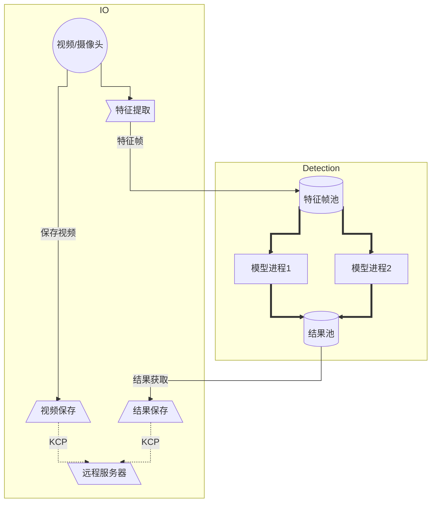

# 设计重点难点

## 优化模型效率

在系统架构设计中，我们为了达到高效率识别检测，采用了边缘计算的方式，将YOLOv7识别模型部署于无人机上，由于硬件因素的限制，我们难以提高无人机的无人机的实际算力，因此我们采用抽取关键帧的方式，将实时拍摄的画面与上一关键帧对比，检测是否为关键帧。再将关键帧进行缺陷检测。通过这种减少识别次数的方式，我们不仅提高了识别效率，同时也减轻了硬件上的高能耗，高发热的问题。

同时我们在实践中发现，识别业务属于计算密集型的业务，在初代的架构模型中，一旦进入识别业务，整个业务便会进入陷入阻塞，其他业务（如拍摄业务，保存业务，数据同步业务）便无法进行，最终导致产品的使用体验大大下降。

为此我们采用并行-并发结合的方式，将I/O密集型的业务，如拍摄、结果保存，数据同步使用多线程运行，防止由于；对于计算密集型的我们采用多进程+池化的技术运行，极大的利用率CPU/GPU算力，尤其是对于多核CPU，效率提升效果显著；线程、进程之间通过消息队列进行通信，实现了模块之间的解耦。

