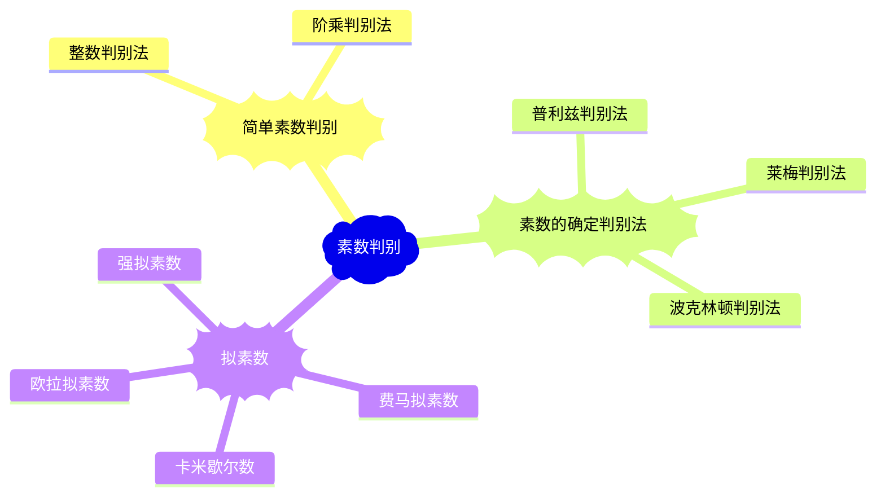

# 《素性检测》

## 简单素性检测

### 整数除法判别

> 如果$n$不能被小于等于$\sqrt{n}$的数整除，那么$n$是一个素数

### Wilson（阶乘）判别法

> 设整数$m \gt 1$，则当且仅当$(m-1)!\equiv -1\pmod m$ 时 $m$ 为素数

## 素数的确定判别法

### 莱梅判别法

> 对于**奇数**$m$，将$m-1$**素数分解**后的每一个素数$p_i$，都能找到一个数$a_i$，满足
> $$
> \begin{cases}
> (a_i,m)=1\\\\
> a_i^{m-1} \equiv 1\pmod m \\\\
> a_i^{m-1\over{p_i}}  \not\equiv  1\pmod m 
> \end{cases}
> $$
> 则该奇数为素数

### 普利兹判别法

> 设奇数$m \gt 1$，$m-1 = nq$，其中$q$是一**奇素数**且满足$2q+1 \gt \sqrt{m}$。如果能找到一个数$a$满足
> $$
> \begin{cases}
> a^{m-1} \equiv 1 \pmod m \\\\
> a^n \not\equiv 1 \pmod m
> \end{cases}
> $$
> 则$m$为素数

**推论**

> 设整数$m=2q+1$，其中，$q$为素数，则
> $$
> \begin{split}
> 2^{2q} &\equiv 1\pmod m \\\\
> &\Updownarrow \\\\
> m&是素数
> \end{split}
> $$

###          波克林顿判别法

> 设整数$\begin{cases}m>2\\m-1=FR\\(F,R)=1\end{cases}$。其中$F$是$m-1$**已分解**的一部分，$R$是$m-1$**未分解**的一部分。
>
> 如果对于$F$的每个素数因子$q_i$，都存在整数$a_i \gt 1$，满足
> $$
> \begin{cases}
> a_i^{m-1} \equiv 1 \pmod m \\\\
> (a_i^{{m-1}\over q_i}-1,m)=1
> \end{cases}
> $$
> 则$m$的每一个素因子都满足$p \equiv 1 \pmod F$，进一步，如果$F \gt R$，则$m$为素数

## 拟素数

> 一个**合数**$p$满足素数的**某个性质**，则我们称$p$是***关于此性质的*** **拟素数**
>
> **拟素数之间的关系**：强拟素数:arrow_right:欧拉拟素数:arrow_right:费马拟素数（其中:arrow_right:表示必要性的关系）

### 费马拟素数

**定义**

> 设合数$m$，如果存在整数$a$满足
> $$
> \begin{cases}
> (a,m)=1\\\\
> a^{m-1}\equiv 1 \pmod m
> \end{cases}
> $$
> 则称$m$为对于基$a$的（费马）拟素数
>
> ---
>
> > 费马定理是：当$m$是素数时，以上公式一定满足。这是*必要性*，而不是*充分性*

**推论**

> - 对于每一个整数$a>1$，均存在**无数**个基$a$的费马拟素数
>
> - 设$d,n \in Z^+$，则存在定理  $d\mid n \Rightarrow 2^{d-1}\mid 2^{n-1}$
>
> - 如果$n$是对于基$2$的费马拟素数，则$m=2^n-1$也是基$2$的费马拟素数
>
> - 设$m$是个奇合数，则
>
>   1. $m$是对于基$a$的费马拟素数，当且仅当$a$模$m$的阶整除$m-1$
>   2. 如果$m$是分别对基$a$和基$b$的费马拟素数，则$m$是对于基$ab$的费马拟素数
>   3. 如果$m$是对于基$a$的费马你拟素数，则$m$也是对于基$a^{-1}(a^{-1}\pmod m)$的费马拟素数
>   4. 如果存在一个整数，使得$a^{m-1}\equiv 1 \pmod m$不成立，则在模$m$的缩系中，至少有一半的数同样是的这个公式不成立

### 卡米歇尔数

**定义**

> 设合数$m$，如果对于所有的正整数$a$满足
> $$
> \begin{cases}
> (a,m)=1\\\\
> a^{m-1}\equiv 1 \pmod m
> \end{cases}
> $$
> 则称$m$为卡米歇尔数
>
> ---
>
> > 费马拟素数的条件是存在一个$\exists a\in Z^+$，而这里对于$\forall a\in Z^+$

### 欧拉拟素数

**定义**

> 设**奇合数**$m$，如果存在整数$a$满足
> $$
> \begin{cases}
> (a,m)=1\\\\
> a^{(m-1)\over2}\equiv ({a\over m}) \pmod m
> \end{cases}
> $$
> 则称$m$为对于基$a$的欧拉拟素数
>
> ---
>
> > 欧拉-勒让德定理：$(a,m)$的情况下
> >
> > $$
> > 欧拉定理
> > \begin{cases}
> > a^{(m-1)\over2}\equiv 1 \pmod m &m是素数\\
> > a^{(m-1)\over2}\equiv -1 \pmod m &m不是是素数
> > \end{cases}\\\\
> > $$
> 
> > $$
> > 勒让德定理
> > \begin{cases}
> > ({a\over m})\equiv 1 \pmod m &m是素数\\
> > ({a\over m})\equiv -1 \pmod m &m不是是素数
> > \end{cases}\\
> > $$
>

**推论**

> - 若$m$是对于基$a$的欧拉拟素数，则$m$也是对于基$a$的（费马）拟素数
> - 设$m$是一个奇合数，则$m$的缩系中至少有一半使得$a^{(m-1)\over2}\equiv ({a\over b}) \pmod m$不成立（同**费马拟素数**）

### 强拟素数

> 设**奇合数**$m$，**正整数**$s$和**奇数**$t$满足
> $$
> \begin{cases}
> m-1 = 2^st\\\\
> (a,p)=1\\\\
> a^{(m-1)\over2}\equiv ({a\over b}) \pmod m
> \end{cases}
> $$
> 如果有
> $$
> \begin{cases}
> a^t \equiv 1 \pmod p \\\\
> \quad或\\\\
> a^{2^rt} \equiv -1 \pmod m &(0\le r \lt s)
> \end{cases}
> $$
>
>
> 则称$m$为对于基$a$的**强拟素数**
>
> ---
>
> > 若**奇素数**$m$，正整数$s$和奇数$t$满足
> > $$
> > \begin{cases}
> > m-1 = 2^st\\\\
> > (a,p)=1\\\\
> > a^{(m-1)\over2}\equiv ({a\over b}) \pmod m
> > \end{cases}
> > $$
> > 则一定满足下列**两个公式之一**
> > $$
> > \begin{cases}
> > a^t \equiv 1 \pmod p \\\\
> > a^{2^rt} \equiv -1 \pmod m &(0\le r \lt s)
> > \end{cases}
> > $$
>

**推论**

> - 存在无穷多个对于基$2$的强拟素数
> - 如果$m$是对于基$a$的强拟素数，则m是对于基$a$的欧拉拟素数（也是费马拟素数）
> - 设$m$是一个奇合数，则$m$是对于基$a(2 \le a \le n-1,(a,n)=1)$的强拟素数的可能性至多为25%。

