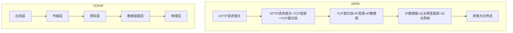
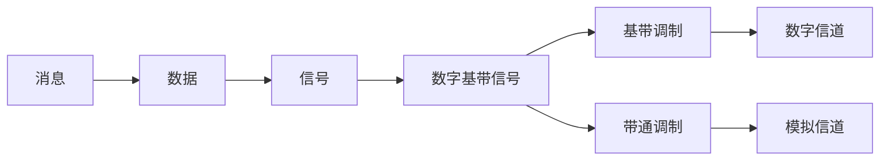

# 计算机网络

## TCP/IP模型

| 层级                               | 样例                                                         |
| ---------------------------------- | ------------------------------------------------------------ |
| 应用层                             | **基于TCP：[HTTP、HTTPS、SMTP、FTP、SSH] 基于UDP：[DNS、RTP]** |
| 传输层                             | **TCP、UDP、**(SCTP)                                         |
| 网际层（网络层）                   | **IPv4、IPv6、ARP、ICMP**                                    |
| 网络接口层 [数据链路层&物理层] | [以太网、网线LAN]  [光纤、双绞线电缆、无线设备]           |

在网络体系中，主机一般包含**完整的TCP/IP协议簇**，也就是完整的TCP/IP的4层结构；而对于网络网络中的交换节点来说，只需要包含**网际层**和**网络接口层**即可。

## 计算机网络的交换技术

- 电路交换技术

  交换前只进行一次连接，交换过程中持续占有通信资源，知道交换结束是释放资源此过程中，双方都无法与第三主机通信。

  这种通信方式安全性高，同时减少连接所需要的时间消耗（之连接一次）。但是多线程通信不可实现，难以和多台主机交互。在老式的电话通信中使用这种技术。

- ==**分组交换技术**==最常用

  交换前，发送端先根据要求将目标数据按一定大小分组，同时加上首部（表示目标主机信息）。

  没有建立连接和释放连接的过程，切对于网络具有较高的适用性，不会因为网络的波动导致数据全部重新发送；对于数据重发具有十分明显的优势，还可以可以实现多主机同时通信。具有较高的通信线路利用率。但是因为添加了首部，增加了额外的传输开销，交换节点的存储和转发会造成一定的延时，通信量大时，可能造成网络拥堵。分组可能出现失序和丢失的问题。

- **==报文交换技术==**

  报文交换时分组交换的前身，但是报文交换要求转发节点必须在全部接受完数据后才可以继续转发。

  报文交换技术对于交换节点的缓存要求比较高，但是对于数据的完整性有保障。对于主机资源有一定的节省。传输速度相对较慢，虽然省去了分组的时间和空间，但是由于其规则，转发节点的工作效率会十分低下。

## 计算机网络的性能指标

1. 速率
   1. 速率是指数据传输的速率（即每秒传送多少比特），也称为数据率或比特率。
   2. 速率的基本单位：`bit/s(b/s,bps)`；常用单位：`Kb/s`,`Mb/s`,`Gb/s`,`Tb/s`
   3. 数据量的单位中按2的指数递增，速率的单位中按10的指数递增。

2. 带宽
   1. 带宽在模拟信号系统中的意义：某个信号所包含的各种不同频率成分所占据的频率范围。单位：`Hz`(`kHz`,`mHz`,`GHz`).
   2. 带宽在计算机网络中的意义：用来表示网络的通行线路所能传输数据的能力，即在单位时间内从网络的某一节点到另一节点所能通过的最高速率。单位和速率的单位相同。

3. 吞吐量
   1. 吞吐量是指在单位时间内通过某个网络或接口的实际数据量。吞吐量常被用于实际网络的测量，一单位时间内到底有多少数据通过网络。
   2. 吞吐量受网络带宽的限制。

4. 时延

   1. 通信时延包括排队时延、处理时延、发送时延和传播时延

   2. 发送时延 = 分组长度(b) / 发送速率 (b/s)
   3. 传播时延 = 通信长度(m) / 信号传播速率 (m/s)
   4. 常见信号传播速率：自由空间（光速）> 铜线 > 光纤（*PS：光纤上网快是因为带宽大*）

5. 延时带宽积
   1. 延时带宽积是传播延时和带宽的乘积，反映的依旧是在传输链路中可能存在的最大的数据量。
   2. 链路的延时带宽积又称为以比特为单位的链路长度

6. 往返时间（RTT）
   1. 往返时间是指通信双方双向交互一次所耗费的时间
   2. 可以使用`ping`命令或者网络工具测试往返时间

7. 利用率
   1. 信道利用率：用来表示某信道有百分之积的时间有数据通过
   2. 网络利用率：全网络的信道利用率的加权平均值
   3. 利用率并非越高越好：信道利用率和信道时延成反相关：$D=D_0\over{1-U}$
   4. 一般运营商（ISP，Internet Service Provider）会将利用率控制在百分之50以下，以避免大规模的网络拥堵。

8. 丢包率
   1. 丢包率是在一定时间范围内，传输过程中对是的分组数量和总分组数量的比率
   2. 分组丢弃主要有两个原因：分组误码被节点交换机丢弃；节点交换机的主动丢包策略
   3. 丢包反应网络的拥塞程度。

## TCP/IP模型中各层的作用

1. 物理层

   - 主要负责网络传输中的物理接口、比特表示、传输介质等物理层面的基础问题；

   - 根本的决定了网络的质量

2. 数据链路层

   - 标识网络主机（*==主机编址==*，如MAC地址编码*）通常数据包前面会存在一段**源主机信息和目标主机信息**，这涉及到常用的 *ARP*协议，

   - 本层还要解决区分数据包中地址和数据（*==数据封装格式==*）

   - 协调各主机争用总线（*==媒体接入控制==*）[几乎被淘汰]| 以太网交换机的实现（*==自学习和转发帧==*）

   - 检测数据是否误码（==*差错检测*==）

   - 出现传输差错如何处理（*==可靠传输和不可靠传输==*）

   - 接收方控制发送方注入网络的数据量（*==流量控制==*）

3. 网际层

   - 标识网络和网络中各主机（*==网络和主机共同编址==*，如IP地址）

   - 路由器转发分组（*==路由选择协议、路由表和转发表==*）

4. 传输层

   - 进程之间基于网络的通信（*==进程标识==*，如端口号）

   - 出现传输差错如何处理（*==可靠传输和不可靠传输==*）

5. 应用层

   - 通过应用进程之间的网络交互完成特定的网络应用

   - 进行会话管理和数据表示

- 总结

| 层级       | 功能                                         |
| :--------- | -------------------------------------------- |
| 应用层     | 解决通过应用进程的交互实现特定网路应用的问题 |
| 传输层     | 解决进程之间基于网络的通信问题               |
| 网际层     | 解决数据包在多个网络之间传输和路由的问题     |
| 数据链路层 | 解决数据包在一个网络或一段链路上传输的问题   |
| 物理层     | 解决使用何种信号来表示比特流的问题           |

- 通信的具体过程

这是对于主机通信是所经历的过程，对于接收方则为其逆过程。

而对于交换机往往只有最下面三层，也就是只有**以太网首尾部、IP**解析和封装。这也同时保证了转发数据的安全性。

## 网络传输

### 传输方式

1. 串行传输：传输只有一条线路，结构简单，成本低，支持热拔插，适合长距离传输。常见的串行接口有：
   - **SATA接口**：计算机总线之一，相对于*PATA*有较强的数据纠错能力，可通过提高频率来提升传输效率，用于主板和大量存储设备（如硬盘、光驱等）之间的数据传输。
   - **PCI E接口**：计算机总线之一，速度比SATA接口快，常用于外接显卡，高频网卡等。
   - **USB接口**：计算机最常见的与外设连接的接口。
   - **COM串行接口**：这种接口现在基本已被USB接口代替，常用于老实显示器，老式打印机的连接。
2. 并行接口：传输；有多条线路，传输速度快，效率高，但是成本相对较高，且一般被限定频率，一般用于计算机内部的数据交换传输，常见的并行接口有：
   - **PATA接口**：并行高级技术附件接口，可用于连接硬盘、光驱、连接打印机、扫描仪等，虽然是是并行接口，但是速度上限远赶不上SATA。
   - **PCI接口**：*PCI E接口*的前生，用于插接外置网卡、声卡、显卡和调制解调器卡等。

3. 网卡的串并转换

   网卡和局域网之间的通信是通过电缆或双绞线以**串行传输**方式进行的(物理层)。而网卡和计算机之间的通信则是通过计算机主板上的I/O总线以**并行传输**方式进行(数据链路层)。因此，网卡的一个重要功能就是要进行**串行/并行转换**。
   
   > 串行和并行哪个速度更快，谁也说不准，这主要和技术的发展有关，而在计算机内部采用并行速度相对会更快一点，因为计算机内部的数据传输对检错的要求更少，而且计算机内部的数据往往是断断续续的，不想网络传输，一般都是连续的（即使是报文传输，每个报文的数据量也是相对比较大的）

### 同步传输和异步传输

1. 同步传输：在传输过程中，上一段的报文的结束紧接着下一段包文的开始，中间不间断，也就是网卡一直对外发送数据，知道数据发送完成。由于同步传输在传输过程中可能出现错误，也有可能应为收发双方时钟未同步，导致接收到错误信息，因此常常要求添加同步功能：
   - 内同步：在源数据中的每一段内加入时钟信息，如曼彻斯特编码和差分曼彻斯特编码；
   - 外同步：额外添加一条用于时钟同步的传输线路。
2. 异步传输：以字节为单位，每个字节内部采用同步传输的方式，而每个字节之间则相互独立，可以间隔时间不一。为了方便接收方式呗，一般要给每个字节添加起始位和结束位。

### 单向通信，双向交替通信，双向同时通信

1. 单向通信（广播通信）：只有一方发送，另一方接受，没有建立连接，发送方不知道接收方的存在。如收音机，电视广播等；

2. 双向交替通信（半双工通信）：发送和接受交替进行，也就是通信双方轮流收发，通信双方是可以知道对方的存在的。如对讲机，总线式以太网等；

3. 双向同时通信（全双工通信）：发送和接收可以同时进行，如交换式以太网的各主机之间，传统电话之间等。

   > 虽然HTTP是基于TCP的引用层传输协议，但是HTTP是半双工的，也就是双向交替通信，请求和响应异步传输。而后产生的WebSocket也是基于TCP的，但他是全双工，传输速度更快，网络利用率更高，而且兼容半双工，也就是可以当做半双工的HTTP使用。

## 编码和调制

### 编码过程

常见的基带调制有***曼彻斯特编码***，***差分曼彻斯特编码***等

常见的带通调制有WIFI的CCF编码

#### 基带调制

1. **曼彻斯特编码**：码元中的信号*高频到低频*和*低频到高频*的变化表示比特内容
2. **差分曼彻斯特编码**：在每个码元的开始是否有变化便是码元内容，码元内部的信号变化只表示时钟信息。

#### 带通调制

- 基本带通调制方法：

  

- 混合调制方法：

  由于频率和相位是相关的，不能混合调制。常用相位和振幅混合调制，如常见的正交振幅调制QAM。

### 封装成帧和透明传输

封装成帧：链路层的传输协议将上层的数据封装成帧，并交给物理层传输。

透明传输：链路层对于上层来讲没有任何条件限制，也就是无论上层传递个下层什么数据，下层都可以实现正确的传输（这在底层层级开发里面是很重要的，因为你永远也无法完全考虑上层未来的发展）

原理：

- 在上层交付的**PDU**（*Package Date Unite*）前后添加开始和结束的标志字段
- 如果在PDU中存在开始或结束的标志字段，就对其进行转义处理：
  - 字节填充：在PDU中的标志字段前添加特定的字段表示转义，对于PDU中和转义字段重复的，也同样在他前面添加转义字段。真是面向字节传输的常用手段
  - 比特填充：在PDU中的标志字段内部添加特定比特（0&1），使他在接收是不影响接收方的判断，而在接收方，又要使用逆向的方法对其进行解码。

### 误码检测

1. 奇偶校验：判断比特流中的0和1的奇偶性，从而检测出是否误码，但这种方法可用性差，也就是说，如果恰好同时改变了偶数个比特，这种方式是检测不出来的。
2. 循环冗余检验：

## 点对点协议PPP（Point-to-Point Protocol）

点对点协议是目前使用**最广泛**的点对点数据链路层协议

### 点对点协议的内容：

- **对下层**：对各种协议数据报的封装（**封装成帧**）
- **对自身**：链路控制协议LCP（用于建立、配置以及测试数据链路层的连接）
- **对上层**：一套网络控制协议族**NCPs**（其中的每一协议支持不同的网络层协议）

### 点对点协议的报文格式

 

#### 透明传输的具体实现

- 面向字节传输：转义时填充转义字借
- 面向比特传输：转义时填充转义比特、

## 共享式以太网

**MAC地址（Media Access Controller Address）**

IEEE802协议中的MAC地址格式：

一共有六个字节，前三个字节用来表示厂商，后三个字节用来标识不同的设备。MAC是付费的。

