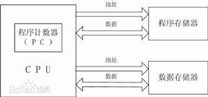

#  计算机组成原理

## 第1章 计算机系统概述

### 计算机结构

- 冯诺依曼结构

  

- 哈佛结构

  

### 计算机的工作过程

### 计算机的性能指标

- 字长
- 存储容量
- **运算速度**（这个要学会算）
  - 主频
  - 指令执行速度
  - CPI
  - FLOPS
- 可靠性

## 第2章 运算方法和运算器:star:

### 数据的表示

#### 计算机中常用的表示方法

- 原码：和真值对应。符号位`0`表示正数，`1`表示负数。表示范围是$[-(2^{n-1}-1),2^{n-1}-1]$

- **补码**：正数的补码等于原码，负数的补码可以将原码的出最后一位1开始（不包括），往前将所有位取反得到。表示范围是$[-2^{n-1},2^{n-1}-1]$

- 移码：移码的实质是将有符号数变成无符号数。经常用来比较两个数的大小。将原码的符号位取反即可（正负数一样处理）。处理完后可以当做无符号整数按位比较，表示范围是$[0,2^n-1]$

  > - $[X+Y]_补 = [X]_补+[Y]_补$
  > - $[X+Y]_移 = [X]_移+[Y]_补$

#### 定点数的表示

符号位固定，小数点位置固定。（常见的是纯整数或者纯小数）

#### 浮点数的表示

$$
N=M \times 2^{E}
$$
其中$N$是浮点数的真值，$M$是尾码，$E$是阶码

> - 符号由$M$的符号决定
> - 精度由$M$的位数决定
> - 范围由$E$的位数决定

#### IEEE-754格式

- IEEE-754中浮点数的表示的格式为$N=(-1)^S \times 2^{E'}\times(1+M)$，其中$S$表示符号位；$E'$表示阶码的移码，也可以表示为$E'=E-Bias$；$M$表示尾码。

- 符号位只有一位，$0$表示正数，$1$表示负数

- 单精度浮点数的结构：$S(1) + E(8) + M(23)$

- 双精度浮点数的结构：$S(1) + E(11) + M(52)$

- 特殊的一些浮点数

  | 阶码 | 尾码 | 数据     |
  | ---- | ---- | -------- |
  | 0    | 0    | 0        |
  | 0    | 非0  | 非规格数 |
  | 全1  | 0    | 无穷大   |
  | 全1  | 非0  | 非数     |

### 定点数的加减法

**补码加法公式**
$$
[A+B]_补=[A]_补+[B]_补
$$
**溢出判别**

> - 上溢：结果大于最大表示范围
> - 下溢：结果小于最小表示范围

- 运算符比较法：只有运算符相同时才可能溢出，才进行进位判断溢出情况
- 变形补码法（双符号位）：
  - 使用双符号位进行加法运算
  - 结果的符号位相异是表示溢出，$01$表示上溢出，$10$表示下溢出

**补码减法**
$$
[A-B]_补=[A]_补+[-B]_补
$$

### 定点数的乘法

$X=-0.1011,Y=0.1101$，计算$X\times Y$
$$
\begin{aligned}
&部分积 &&乘数 &&&操作说明\\
 &{\color{OliveGreen}00.0000}   &&0.11010 &&&初始化部分积P_0\\
+&{\color{Mahogany}00.1011}   &&  &&&{\color{Mahogany}判断y_ny_{n+1}=10，+[-X]_补}\\
--&-----\\
 &00.1011 && &&&求和\\
 &{\color{OliveGreen}00.0101}   &&1 \quad 0.1101 &&&右移一位\\
+&{\color{Mahogany}11.0101}   &&  &&&{\color{Mahogany}判断y_ny_{n+1}=01，+[X]_补}\\
--&-----\\
 &11.1010 && &&&求和\\
 &{\color{OliveGreen}11.1101}   &&01 \quad 0.110 &&&右移一位\\
+&{\color{Mahogany}00.1011}   &&  &&&{\color{Mahogany}判断y_ny_{n+1}=10，+[-X]_补}\\
--&-----\\
 &00.1000 && &&&求和\\
 &{\color{OliveGreen}00.0100}   &&001 \quad 0.11 &&&右移一位\\
+&{\color{Mahogany}00.0000}   &&  &&&{\color{Mahogany}判断y_ny_{n+1}=11，+0}\\
--&-----\\
 &00.0100 && &&&求和\\
 &{\color{OliveGreen}00.0010}   &&0001 \quad 0.1 &&&右移一位\\
+&{\color{Mahogany}11.0101}   &&  &&&{\color{Mahogany}判断y_ny_{n+1}=01，+[X]_补}\\
--&-----\\
 &{\color{NavyBlue}11.1011} &&0001 &&&求和，得到结果\\

\end{aligned}
$$

### 浮点数的加减法

## 第3章 存储系统

### 概述

#### 分类

$$
存储器\begin{cases}
    按存储介质&\begin{cases}
    半导体存储器(常用作主内存)\\
    磁表面存储器(常用作外存)\\
    光盘存储器(CD-ROM,WORM,可擦写光盘)
    \end{cases}\\\\
    按数据存取方式&\begin{cases}
    随机存取存储器(SRAM,DRAM)\\
    顺序存储存储器\\
    直接存取存储器
    \end{cases}\\\\
    按在计算机中的作用&\begin{cases}
    主存储器\\
    外存储器\\
    高速缓冲存储器
    \end{cases}
\end{cases}
$$

#### 性能指标

- 存储容量
  $$
  存储容量=存储单元格数\times 存储字长(bit)
  $$
- 存储速度
- 位价

#### **数据地址和存储顺序**

- 大端模式：高位低存（相反）
- 小端模式：高位高存（相同）

#### **半导体常用的扩展方法**

- **位扩展**
- **字扩展**

#### 体系结构

### RAM 

#### SRAM

**控制信号**

- $\overline{CS}$：**片选线**，低电平有效
- $\overline{WE}$：**写允许信号**，低电平写，高电平读
- $V_{CC}$和$GND$是电源和接地端

**特点**

- **优点**：访问速度快，常用语告诉数据存储应用中
- **缺点**：功耗大，成本高

#### DRAM

> **存储元采用的晶体管数量比SRAM更少，成本和功耗更低，但是容易漏电，需要刷新**

**控制信号**

- $\overline{RAS}$和$\overline{CAS}$分别表示行信号选择和列信号选择
- $\overline{WE}$是写允许信号
- $V_{CC}$、$V_{SS}$、$V_{SS}$提供DRAM工作和刷新时所需要的电平
- $GND$是接地端

**刷新策略**

- 集中刷新

  集中刷新方式是指在 4000 个存取周期中取连续的 128 个存取周期,对存储器进行逐行刷新,如下图所示。这种刷新的特点是芯片的刷新操作集中在 64 μ s 内,在这个时间段中, CPU 是不能访问 DRAM 的,这个时间又称为“死时间”,而 64 μs 对 CPU 来说是一个相当长的时间。集中刷新方式中 DRAM 的死时间率 =128 / 4000=3.2% 。

  

- 分散刷新

  分散刷新方式是指将 4000 个存取周期分为 2000 个基本周期,每个基本周期中包含两个存取周期时间段,其中一个供 CPU 访问存储器,另一个用于存储器自身的逐行刷新,如下图 所示。分散刷新虽然将死时间分散了,但是死时间率 =1 / 2=50% ,整个系统的效率降低了。

  

- 异步刷新

  异步刷 新 方 式 是 指 将 4000 个 存 储 周 期 分 为 128 个 时 间 段,每 个 时 间 段 15.5 μ s(2ms / 128=15. 6 μ s 取存取周期的最大整数倍),即 31 个存取周期,每个时间段中 30 个存取周期用于存储器的读取或保持, 1 个存取周期对 DRAM 中的一行执行刷新操作。这种刷新方式的死时间率 =1 / 31=3. 22% 。相较于前两种方式,异步刷新方式不但分散了死时间。

  

### ROM

#### 分类

- **MROM**：掩膜型只读存储器，一般用于存放固定程序和数据，如显示字符的模点阵代码
- **PROM**：可编程一次的的制度存储器
- **EPROM**：紫外线可擦除可编程只读存储器
- **EEPROM**：电可擦除可编程只读存储器
- **FLASH**：闪存

### 高速缓冲存储器

#### 工作原理

通过Cache技术提高CPU访问速度是基于程序局部性原理。

> **程序局部性原理**：是指程序在执行时呈现出局部性规律，即在一段时间内，整个程序的执行仅限于程序中的某一部分。相应地，执行所访问的存储空间也局限于某个内存区域，具体来说，局部性通常有两种形式：时间局部性和空间局部性。
>
> - **时间局部性：**被引用过一次的存储器位置在未来会被多次引用（通常在循环中）。
>
> - **空间局部性：**如果一个存储器的位置被引用，那么将来他附近的位置也会被引用。

**性能指标**

- 缓存命中率
- Cache-主存系统的平均访问时间和Cache效率

#### 架构图

#### Cache-主存的地址映射和变换

- 直接映射

  把主存中的A地址始终映射在Cache中的特定位置，比如对于主存地址进行取模运算然后映射缓存

  

- 全相联映射

  将主存和Cache任意映射。主存中A地址的数据放入后，A地址的主存块号会被标记，以用来映射Cache

- 组相联映射（目前使用最广泛）

  在全相联的基础上加上一个分组的策略，也就是分组映射。

#### Cache替换策略

- 随机算法
- LRU算法
- LFU算法

#### Cache和主存的一致性

> 可参考[2.4 CPU 缓存一致性 | 小林coding (xiaolincoding.com)](https://xiaolincoding.com/os/1_hardware/cpu_mesi.html#cpu-cache-的数据写入)

- **写回法**：只写Cache并标记，替换出去是根据标记决定是否写回磁盘。容易导致不一致问题

- **写直达**：写回缓存的同时写回主存。保证了一致，但是效率极低

- **写一次**：第一次写命中是采用写直达，之后采用写回。多核心下无法保证数据一致性。

- **MESI**：将写回算法和状态标记结合，保证了数据一致性，但是存在伪共享的问题

  

## 第4章 总线技术

### 概述

> 总线的特点：共享性和独立性
>
> - 共享性：总线系统内的所有设备可用
> - 独立性：同一时间内只能有一个设备使用总线

#### 分类

$$
总线\begin{cases}
    按总线的结构层次分类&\begin{cases}
    片内总线(芯片内部，如CPU的内部总线)\\
    局部总线(用于芯片一级的连接)\\
    系统总线(用于计算机部件一级的连接，如ISA,PCI)\\
    外部总线(连接多个计算机的总线，如网线,USB线)
    \end{cases}\\\\
    按功能分类&\begin{cases}
    数据总线(Data Bas)\\
    地址总线(Address Bas)\\
    控制总线(ControllBas)
    \end{cases}\\\\
    按数据传输格式分类&\begin{cases}
    并行总线\\
    串行总线
    \end{cases}\\\\
    按时序控制方式分类&\begin{cases}
    同步总线\\
    异步总线
    \end{cases}
\end{cases}
$$

#### 总线的性能指标

- 总线宽度：总线同时能传送的二进制数据的位数
- 总线工作频率：总线每秒传输数据的次数。常用$MHz$表示
- 总线带宽：总线数据传输速率，计算公式为：$总线带宽=总线宽度\times 总线工作频率$

### 系统总线结构

#### 单总线结构

**特点**

- 结构简单，灵活，易扩展
- 性能低

#### 双总线结构

**特点**

- 效率相比单总线有所提高
- 硬件复杂度相比单总线更复杂

#### 多总线结构

>  形式多种多样，不举例，可参考[第3章 系统总线 | MyBlog - GxkOrd](https://gxkord.github.io/2019/03/15/计算机基础/计算机组成原理/第3章 系统总线/#总线结构)

**共同特点**

- 兼容高速和低速的设备，性能高
- 复杂度大大增加

### 总线的通信方式

- **同步通信**：发送和接受双方都在同一时钟下进行操作。
  - 优点：时序简单，控制方便，适用于总线长度较短，各部件存取时间接近的情况。具有较高的传输频率
  - 缺点：如果各设备之间速度差别很大，会使得快速地设备等待慢速的设备。导致资源浪费
- **异步通信**：允许各设备有自己的时钟控制。数据传输采用答应模式（握手方式）
  - 优点：速度和可靠性都有所增强
  - 缺点：传输过程复杂，由于增加了答应时间，速度还是有所影响。
- **半同步控制方式**：结合同步和异步，采用公共时钟，对于速度相进的采用同步通信。速度较慢的增加一个***等待***的阶段

### 总线信息传送

- 串行传送：从低位到高位依次传送数据。速度较慢，成本低，适合远距离传送
- 并行传送：所有位同时发送，每一位都有各自的传输线。速度快，但是线数要求多，成本高。适合近距离传送
- 串并行传送：分组，组内并行传送，组与组串行传送。
- 分时传送

## 第5章 指令系统

### 指令系统的分类

#### CISC

> CISC(Complex Instruction Set Computer)
>
> 复杂指令集计算机，目的是强化指令功能，实现软件功能性硬件功能转移。更适用于通用机，我们日常使用的PC通常就是使用CISC架构。以**InterX86**为典型。

**特点**

- 具有庞大的指令系统
- 采用可变长度的指令格式
- 指令寻址方式多样
- 指令系统中包含一些特殊用途的指令

#### RISC

> **RISC**(Reduced Instruction Set Computer)
>
> 精简指令集计算机，目的是尽可能降低指令集的复杂度，已达到简化实现、提高性能的目的。更适用于专用机。如**MISP**、**Motorola**等微处理机。

**特点**

- 指令数量较少
- 指令长度固定
- 大多数指令都在一个机器周期内完成
- 通用寄存器数量多

#### 对比

| CISC                                  | RISC                                                        |
| ------------------------------------- | ----------------------------------------------------------- |
| 指令系统庞大，指令数目一般多达200多条 | 精简了指令系统，流水线以及常用指令均可用硬件执行            |
| 寻址方式多、代码长度不固定            | 所有指令长度均相同                                          |
| 访问存储器指令不加限制                | 只有`load`和`store`可以访问存储器，其他操作均在寄存器中执行 |
| 各指令执行时间相差很大                | 所有指令的功能单一，在一个机器周期内完成                    |

### 指令的格式

> 指令包含**操作码**和**地址码**两个部分。

#### 操作码的基本格式

- 固定长度操作码
  - 便于硬件规整，缩短指令的译码时间。
- 可变长度操作码
  - 增加指令译码部件的复杂度，增加译码的时间。

#### 地址码的基本格式

- 三地址指令（R型指令）
  $$
  OP \quad |\quad A_3 \quad | \quad A_2 \quad | \quad A_1\\
  (A_1)OP(A_2)\rightarrow A_3
  $$
  
- 二地址指令（最常用的指令格式）

  
  $$
  OP \quad | \quad A_2 \quad | \quad A_1\\
  (A_1)OP(A_2)\rightarrow A_2
  $$
  
- 一地址指令（自增，自减）

  
  $$
  OP \quad | \quad A_1\\
  OP(A_1)\rightarrow A_1\\
  或者\\
  (A_1)OP(ACC)\rightarrow ACC
  $$
  
- 零地址指令

$$
|\quad OP\quad |\\
$$

### 寻址方式

#### 指令寻址

- 顺序寻址：通过**PC**自增实现顺序寻址
- 跳跃寻址：类似于`goto`语句，将**PC**值直接改变

#### 数据寻址

- 立即寻址：操作数就在指令中。速度快，常用语对主存单元或者寄存器的初始化操作

- 寄存器寻址：在寄存器中访问数据，不用访问内存，执行速度快。

- 存储器寻址
  1. 直接寻址：指令字中直接存放目标数据的主存地址
  
  2. 间接寻址：由于指令字长度限制，可能无法完全表示主存中的所有部分，因此可以先映射到主存，再通过主存中的数据（地址）寻找目标地址。间接寻址通常利用最高位最为标志位，最高位为1是表示该地址是间接地址。类似于指针
  
  3. 寄存器间接寻址：与上面唯一不同的是，间接地址存放在寄存器中，效率稍微高一些
  
  4. 基址寻址和变址寻址：通过分段和偏移量来确定地址位置。其中基址寻址一般给操作系统使用，变址寻址一般用来方位数组中的元素。
  
  5. 相对寻址：常用于程序跳转，在程序计数器上加上偏移量，比如一些流程控制
  
  6. 组合寻址：将以上两种不同的寻址方式组合起来使用
  
  7. 堆栈寻址：通过栈帧中寻找数据。
  
     | OP     | I        | X        | A        |
     | ------ | -------- | -------- | -------- |
     | 操作码 | 间址特征 | 寻址模式 | 形式地址 |
  
     | 寻址方式         | I    | X    | 有效地址EA    |
     | ---------------- | ---- | ---- | ------------- |
     | 直接寻址         | 0    | 00   | $EA=A$        |
     | 相对寻址         | 0    | 01   | $EA=(PC)+A$   |
     | 变址寻址         | 0    | 10   | $EA=(R)  +A$  |
     | 寄存器直接寻址   | 0    | 11   | $EA=R$        |
     | 间接寻址         | 1    | 00   | $EA=(A)$      |
     | 先相对后间接寻址 | 1    | 01   | $EA=((PC)+A)$ |
     | 先变址后间接寻址 | 1    | 10   | $EA=((R)+A)$  |
     | 寄存器间接寻址   | 1    | 11   | $EA=(R)$      |

### 指令分类

$$
指令\begin{cases}
    数据传输类指令&\begin{cases}
        存数指令(STORE)\\
        取数指令(LOAD)\\
        数据交换指令\\
        数据块传送指令\\
        堆栈指令\\
    \end{cases}\\\\
    算数/逻辑运算类指令&\begin{cases}
        加减乘除\\
        增/减1\\
        求补/比较\\
        按位与/或/非/异或\\
    \end{cases}\\\\
    移位类指令&\begin{cases}
        算术移位指令(SAR,SAL)\\
        逻辑移位指令(SHL,SHR)\\
        循环移位指令(ROL,ROR;RCL,RCR)\\
    \end{cases}\\\\
    程序控制类指令&\begin{cases}
        转移类指令\\
        子程序调用和返回指令\\
    \end{cases}\\\\
    输入/输出类指令\\\\
    其他指令
\end{cases}
$$

### MIPS32指令简介

#### 寄存器组

##### 32个通用寄存器

| 编号      | 名称     | 使用规则                                                 |
| --------- | -------- | -------------------------------------------------------- |
| $0        | $zero    | **常数0**                                                |
| $1        | $at      | 汇编程序临时存储超出16位的数据                           |
| $2、\$3    | $v1、\$v2 | **函数返回值**，*不够用时使用堆栈*                               |
| $4~\$7     | $a0~\$a3  | **函数输入参数**，*不够用时使用堆栈*                           |
| $8~\$15    | $t0~\$t7  | **临时寄存器**（不受保护）                                 |
| $16~\$23  | $s0~\$s7  | **存储寄存器**，**变量**或者存储单元的起始地址（**基地址**） |
| $24、\$25 | $t8、\$t9 | **临时寄存器**                                           |
| $26、\$27 | $k0、\$k1 | 系统保留指针                                             |
| $28       | $gp      | 全局指针                                                 |
| $29       | $sp      | **堆栈指针**                                             |
| $30       | $fp      | 帧指针                                                   |
| $31       | $ra      | **函数调用返回地址**                                     |

##### 特殊功能寄存器

| 名称   | 功能                             |
| ------ | -------------------------------- |
| HI、LO | 用于存储整数*乘/除*和*乘/加*操作 |
| PC     | 程序计数器                       |

##### FPU寄存器

MIPS的CPU还有32个**浮点寄存器**($f0~\$f31)，每个都是*32*位，单精度浮点数占一个寄存器，双精度占两个字节。

#### MIPS指令格式

##### R型指令

> **R**egister型指令，数据来自三个寄存器

| Opcode[31:26]           | rs[25:21]           | rt[20:16]           | rd[15:11]            | Shamt[10:6]                           | Funct[5:0]                |
| ----------------------- | ------------------- | ------------------- | -------------------- | ------------------------------------- | ------------------------- |
| 6                       | 5                   | 5                   | 5                    | 5                                     | 6                         |
| 操作码，R型固定`000000` | 源操作数寄存器编号1 | 源操作数寄存器编号2 | 目的操作数寄存器编号 | 移位指令的移位次数，非移位指令的为`0` | 对于R型指令的子功能操作码 |

**常用R型指令Funct字段取值**

| 指令  | ADD     | ADDU    | SUB     | SUBU    | AND     | OR      | XOR     | NOR     | SLL     | SRL     | SLT     |
| ----- | ------- | ------- | ------- | ------- | ------- | ------- | ------- | ------- | ------- | ------- | ------- |
| Funct | **20**H | **21**H | **22**H | **23**H | **24**H | **25**H | **26**H | **27**H | **00**H | **02**H | **2A**H |

> 

##### I型指令

> **I**mmediate型指令，和立即数有关

| Opcode[31:26]            | rs[25:21]          | rt[20:16]            | rd[15:0]       |
| ------------------------ | ------------------ | -------------------- | -------------- |
| 6                        | 5                  | 5                    | 16             |
| 操作码，表明该指令的功能 | 源操作数寄存器编号 | 目的操作数寄存器编号 | 立即数或偏移量 |

> 

##### J型指令

> **J**ump型指令，和控制转移有关。为实现远距离程序转移而设置

| Opcode[31:26]            | rt[25:0]             |
| ------------------------ | -------------------- |
| 6                        | 26                   |
| 操作码，表明该指令的功能 | 目的操作数寄存器编号 |

> 
>
> - J指令无条件转移，将PC设置到一个新的32位地址
> - JAL指令转移前先保存下一条指令的地址到`$ra`中，然后再宠幸设置PC的值
>
> J型和JAL配合可实现函数的调用和返回。

## 第6章 中央处理器

### 处理器概述

#### CPU的主要功能

1. 指令控制：按顺序执行指令。
2. 操作控制：根据指令发出控制信号协助各部件完成指令
3. 时序控制：定时的给出各种操作信号。
4. 数据加工：对数据进行算术运算、逻辑运算等处理
5. 中断控制：计算机运行过程中突发事件的处理能力

#### CPU的内部结构

