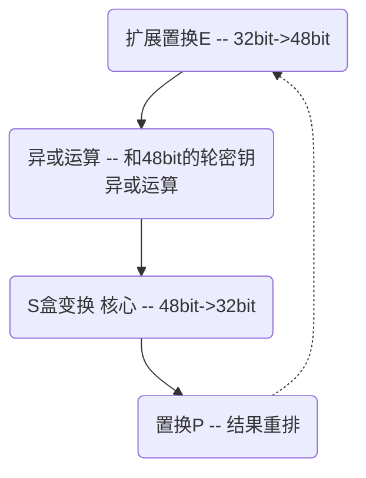
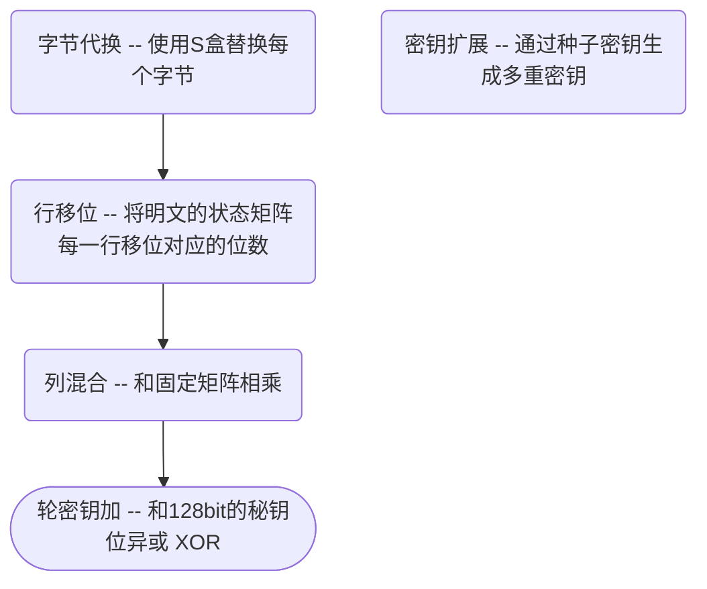

# 分组密码

## 分组密码概述

**特点**

- 安全性依赖密码
- 加密秘钥=解密密钥
- 速度快，易实现

**实现**

- DES
- Blowfish
- IDEA
- LOKI
- RC5
- AES

**分组密码和序列密码**

- 序列密码（流密码）：单独加密每个位     

- 分组密码：每次使用相同的密钥加密整个明文分组

**分组密码的基本原理**

- 代换

- 扩散

  使明文密文间的统计关系变 得复杂，使攻击者无法得到从密文推出明文

- 混淆

  使密文和密钥之间的统计关系变得尽可能 复杂，以使攻击者无法得到密钥

  

**分组密码结构**

1. Feistel分组密码的特点
   - 最后一轮没有进 行左右交换
   - 利用同一算法实现加解密
2. SP分组密码结构和特点
   - 代换S（代换）一般称为**混淆层**
   - 置换或可逆的线性变换P一般称为**扩散层**
   - SP网络可以看作Feistel网络的推广，但SP型 分组密码的加密过程与解密过程一般不相似

## DES

**加密流程**

1. 初始置换$IP$
2. 16轮迭代
3. 初始置换$IP^{-1}$

**轮密钥生成**

16轮迭代的每一轮秘钥都不相同。每一轮迭代使用的秘钥长度均为48bit。这48bit的轮密钥生成规则如下：

> 首先通过PC–1置换 将64bits变换成56bits， 然后再通过16轮的循环 移位和PC–2置换处理 就可以得到16个48bits 的轮密钥
>
> 

**加密函数**

加密函数$F$是整个DES算法的核xz心

## AES

**特点**

- 安全、高效、易实现、灵活

- AES中分组长度只能是128bit，但是密钥长度可以是128bit、192bit、256bit（依次增加64bit）

- 密钥长度不同，加密轮数不同

  | AES算法       | 密钥长度 | 分组长度 | 加密轮数 |
  | ------------- | -------- | -------- | -------- |
  | ***AES-128*** | 128bit   | 128bit   | 10       |
  | AES-192       | 192bit   | 128bit   | 12       |
  | AES-256       | 256bit   | 128bit   | 14       |

**算法过程**（以*AES-128*为例）

- AES处理的基本单位是字节（DES处理的基本单位是比特）

- 128bit的明文P和输入秘钥K都被分为16字节

- 加密过程和解密过程不一致（SP分组结构，区别Feistel结构的DES）

- 只有轮密钥加阶段使用了密钥

- 状态矩阵（*从上到下、从左至右*）

  

  

**每一轮的加密过程**

## 分组密码的工作模式

**DES的四种工作模式**

| 密码                    | 模式                                                         |
| ----------------------- | ------------------------------------------------------------ |
| **电子密码本（ECB）**   |  |
| **密文分组链接（CBC）** |  |
| **密文反馈（CFB）**     |  |
| **输出反馈（OFB）**     |  |
| **计数器模式（CTR）**   |  |

# 公钥密码

## 公钥密码体制概述

> 使用一对密钥（公钥和私钥），公钥和私钥不可互相求解

**公钥密码的设计要求**

- 生成密钥对容易
- 通过公钥求私钥是在计算上不可行的
- 加密和解密的***次序可换***
- 本质上是一个单项陷门函数

## RSA公钥密码体制

- 密钥的生成

  1. 选择连个较大的树$p$,$q$
  2. 计算$n=pq$，$\phi(n)=(p-1)(q-1)$
  3. 随机选取和$\phi(n)$互质的树$e（e \lt n）$
  4. 求解d，使得$ed \equiv 1 \pmod{\phi(n)}$
  5. 公钥$(n,e)$，私钥$(n,d)$

- 加密解密（明文是M）

  - 加密$C \equiv M^e \pmod n$

  - 解密$M \equiv C^d \pmod n$

- 安全性分析
  - 针对参数选择
    - 共模攻击
    - 低指数攻击
  - 循环攻击法
  - 因子分解法
  - 侧信道安全性分析(物理设备上的安全性）

# 密码哈希函数

## Hash函数的定义

> 把**任意长度的输入**通过散列算法变成**固定长度的输出**，输出值就是散列值。Hash算法又称散列算法

**哈希函数的性质**

- 压缩
- 高效
- 单向性
- 弱抗碰撞性
- 强抗碰撞性

## 生日攻击

**第一类生日攻击**

> 找出具有给定Hash值的一个消息需要执行$n/2$次运算

**第二类生日攻击**

> 找出相同的Hash值的两个消息需$\sqrt{n}$次运算

## HAMC算法描述

输入$b$-bit,输出$n$bit

## Hash函数的构造

**主要形式**

- 使用压缩函数迭代哈希【MD结构】

  > 大多数的结构。例如 MD5、SHA1、SM3等等

- 使用将输入转换成相同大小的输出的函数进行迭代哈希【海绵函数】

**Hash函数的迭代结构**

- 单向散列函数的工作模式

  

> 填充为还包括输入的长度，增加了复杂度

**MD5算法描述**

