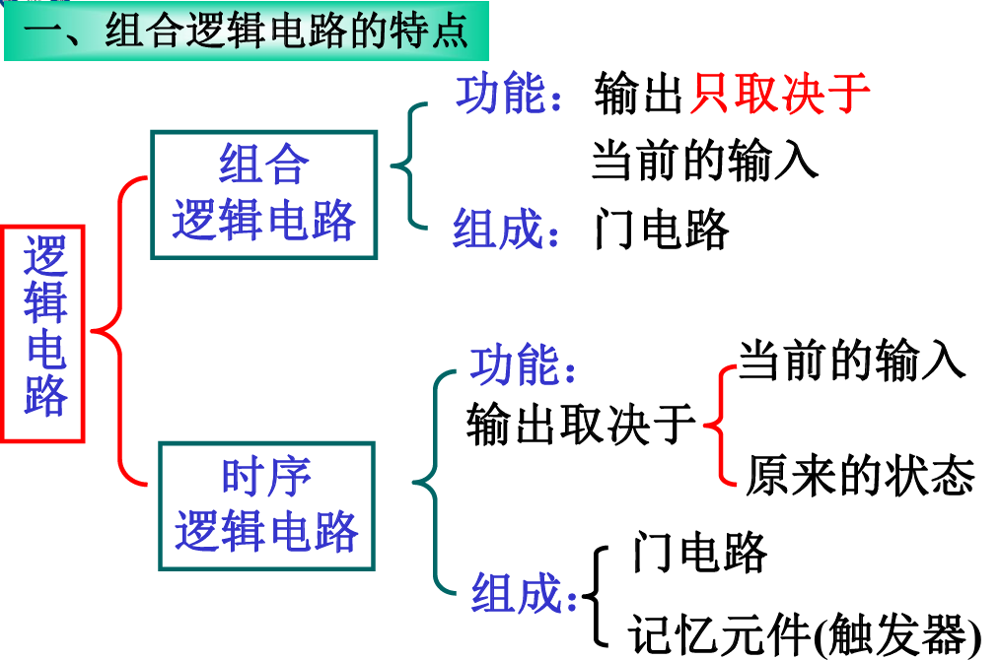
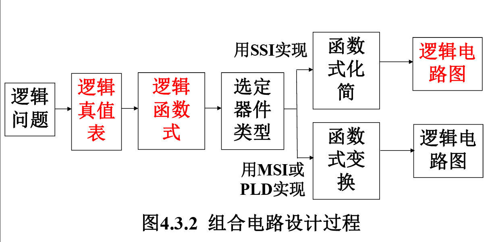

# 数电笔记

## 第二章 （15分）:star::star:

> - 逻辑代数的基本公式和常用公式；
> - n逻辑代数的基本定理； 
> - n逻辑函数的各种表示方法及相互转换；
> - n逻辑函数的化简方法；

### 基本概念

- 逻辑是指事物的因果关系
- 逻辑代数中的变量称为逻辑变量，用大写字母 表示。
- 0和1称为逻辑常量，**并不表示数量的大小**

### 基本逻辑运算

- 基本逻辑运算有与、或、非

  

- 复合逻辑运算种类较多，常见的如下

  

> 异或的特性：
>
> - 奇数个1相异或，结果为1
> - 偶数个1相异或，结果为0
> - 任何数异或0都不变

### 逻辑运算的基本公式


> 最常用的是第8条（**反演律**）和第17条（**分配律**）
>
> 这里的分配律可以理解为：乘法对加法也能分配，加法对乘法也能分配

### 推论公式


- 吸收律：**短项吸收长项**（长项包含短项的前提之下）

- 反变量抵消：两个项中含有反变量，则**反变量可以去除**（两个变量数目和种类相同）

- 混合变量吸收：**正负相对，余完全**

  

### 逻辑函数

> 事物之间的逻辑关系可以通过描述逻辑输 入变量和输出变量的变化关系来确定，这 是一种函数关系，称为逻辑函数。记作$Y = F(A,B,C,\cdots\cdots)$，
>
> 例如$Y = A\cdot B$就是一个**两输入一输出**的逻辑函数

**逻辑函数的表现形式**

> 举重比赛中有A、B、C三个裁判，A为 主裁，B、C为副裁，规定当主裁和至少一 个副裁认定成绩有效时，则运动员成绩Y有 效；否则无效
>
> 输入变量A、B、C分别代表主 裁和两个副裁，同意为1；输出变量Y代表 运动员成绩，有效为1

1. 真值表

   

2. 逻辑函数式

   

3. 逻辑图

   

4. 波形图

   

### 逻辑函数的化简

- 公式法：布尔代数
- 图形法：卡诺图

### 变形公式

- 反函数：全部取反
- 对偶式：除了变量本身，其余全部取反

## 第四章(35分)   :star::star::star::star::star::star:

> - 组合电路的分析
>
> - 组合电路的设计：
>
>   - 用门电路构成：
>
>     ```mermaid
>     graph LR
>     S(写真值表)--写式-->L(逻辑式)--化简-->E(最简与或式)
>     S--填图-->K(卡诺图)--化简-->E
>     ```
>
>   - 用中规模组件设计逻辑电路
>
> - 典型组件
>
>   - 编码器
>   - 译码器
>   - 数据选择器
>   - 加法器
>   - 数值比较器
>
> - 了解PLD的基本电路结构

### 概述



### 设计

